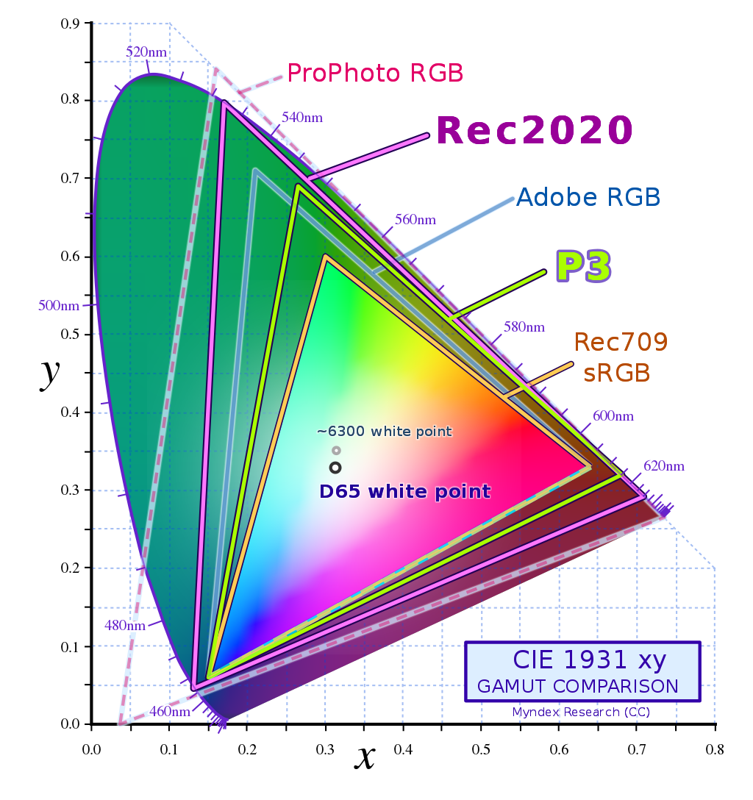
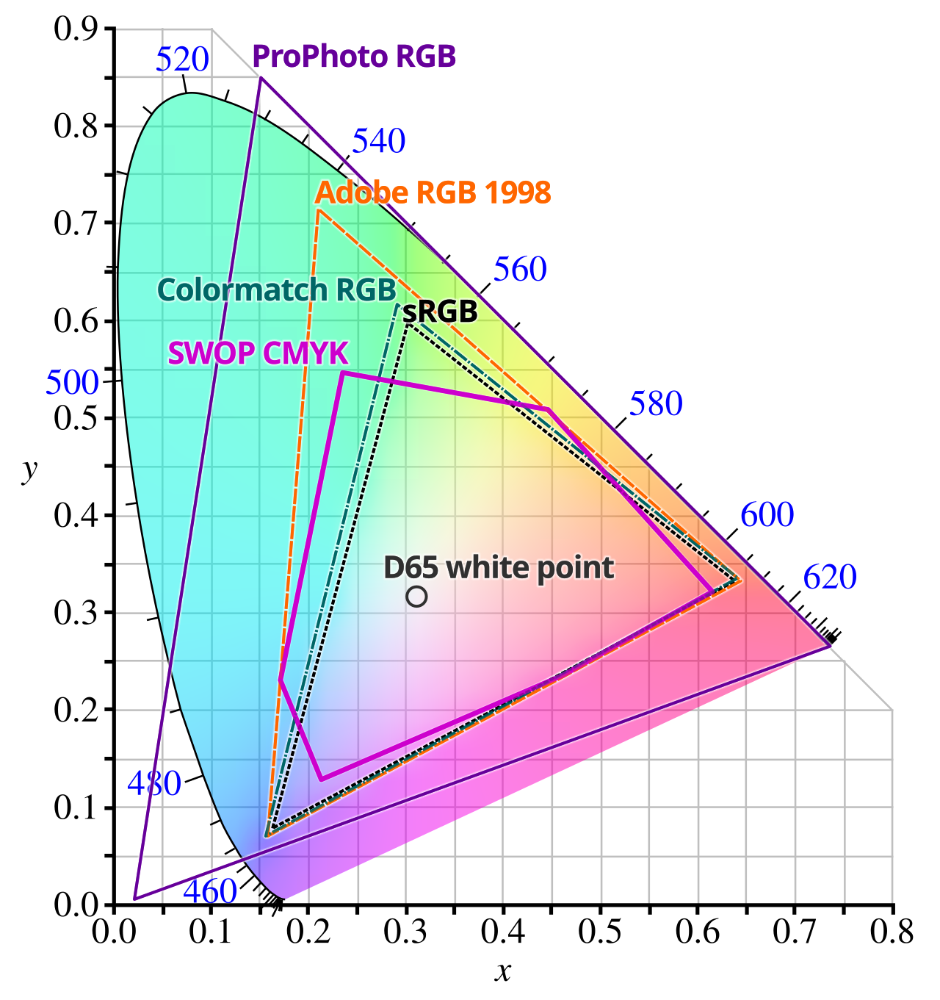
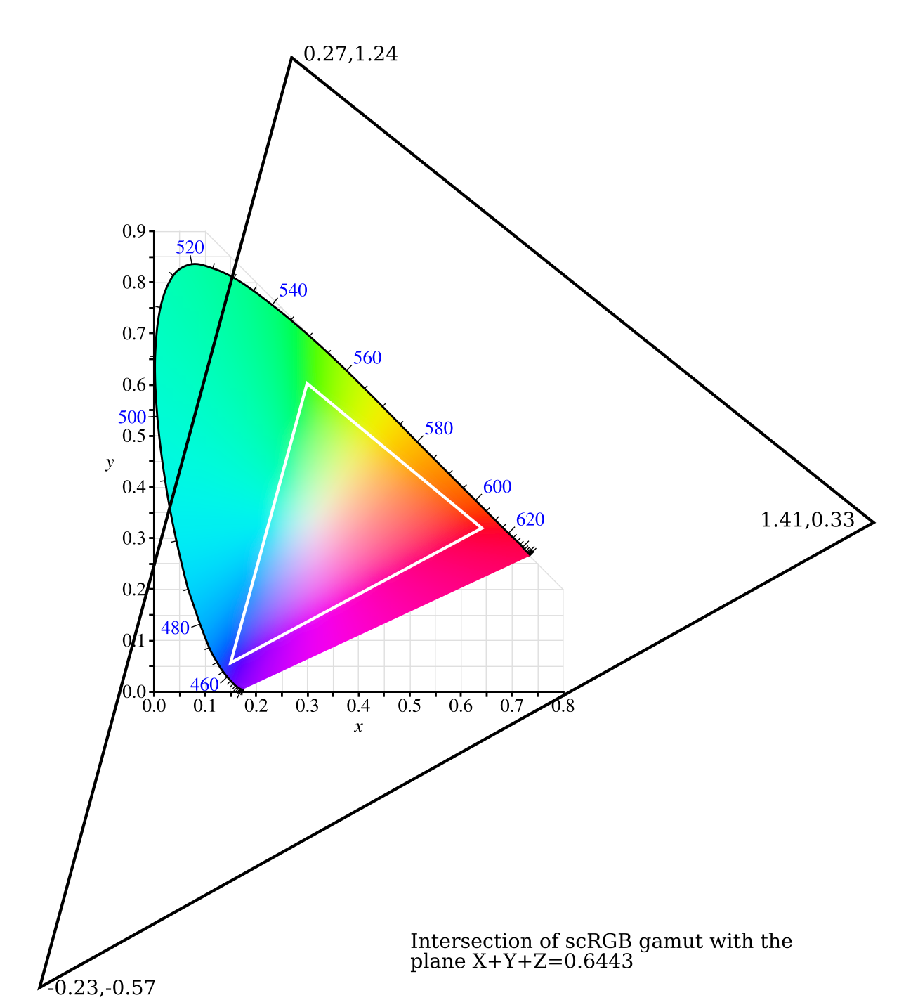

# OKLCH 与 色彩空间

## OKLCH 在线调色工具

- 直观: https://oklch.com/
- 转换方便: https://oklch.net/zh-CN

仅当前两个参数符合一定的要求，才可以无脑调整第三个参数取 `0~360` (还能符合屏幕色彩空间)

并不建议手动调整，很容易出现色相偏移 (如红变粉、黄变橙等)

R

Y

G

B

P

R

Y

G

B

P

## 色彩空间

### sRGB、P3

其中，RGB/HSL 用的是 sRGB，OKLCH 用的是 P3

### CMYK

CMYK的色域比我们常见的sRGB、Display P3等RGB色域窄很多。许多屏幕上看起来很鲜艳的颜色，尤其是荧光色和亮蓝色，都无法用油墨精确混合出来，转换后通常会变得黯淡。

### scRGB

拍照、HDR 图片/照片、raw 照片、64位图片、模型渲染中常用

### 常见的色彩空间与应用场景

| 色彩空间               | 色域大小（相对）          | 典型应用场景                                   |
| ------------------ | ----------------- | ---------------------------------------- |
| ProPhoto RGB       | 极大 (~90% 可视色域)    | RAW文件处理的“存档”空间，专业图像后期编辑                  |
| Rec.2020 / BT.2100 | 非常宽 (~75.8% 可视色域) | 现代 HDR 视频和 HDR 照片的标准，代表 HDR 内容最广泛的色域     |
| Adobe RGB          | 宽广 (~50-60% 可视色域) | 专业打印、出版，高端相机拍摄 JPEG 的可选设置                |
| Display P3         | 宽 (~53% 可视色域)     | 苹果设备和许多现代 HDR 显示器，介于 Adobe RGB 和 sRGB 之间 |
| sRGB               | 标准 (~35% 可视色域)    | 绝大多数普通显示器、网页和移动设备的通用标准                   |

### 存储大小比较

|表示方式|通道数|每通道格式|总存储（RGB）|总存储（RGBA）|
|---|---|---|---|---|
|RGB/HSL（8-bit 整数）|3 / 4|8-bit 整数|**24 bit / 3 B**|**32 bit / 4 B**|
|OKLCH（32-bit 浮点）|3 / 4|32-bit float|**96 bit / 12 B**|**128 bit / 16 B**|
|16-bit RGB（高精度整数）|3 / 4|16-bit 整数|**48 bit / 6 B**|**64 bit / 8 B**|
|64-bit 颜色（FP16 RGBA）|3 / 4|16-bit float|**48 bit / 6 B**|**64 bit / 8 B**|
|scRGB（16-bit 整数/浮点）|3 / 4|16-bit 整数/float|**48 bit / 6 B**|**64 bit / 8 B**|

## 使用建议 —— 不建议无脑转 OKLCH

### 缺点

不过 OKLCH 手写很容易写出超出屏幕显示/印刷显示限制的颜色 (超出后估计会降格找相似色)，当你拿到一个OKLCH颜色后，你不一定能保持另两个值且直接偏转色相获取新颜色（可能会超出屏幕限制）。基于这点，使用时找调色盘总是更稳妥的。
RGB/HSL则是无论写都不会超出屏幕限制，也刚好能够利用到所有的屏幕颜色。

并且既然使用 OKLCH 的过程中都使用色盘或色卡了，此时你复制 RGB 颜色出来还是 OKLCH 颜色出来已经无所谓了。甚至复制 RGB 还会更省内存（RGB/HSL 是每通道 8-bit，OKLCH 是每通道 32 bit (float)）和性能。
(当然，对于网页色来说，有限的颜色影响不大。除非是其他场景或特殊情况)

### 优点

一些现代化的顶尖显示器，已经提供了 P3 色域

当然，对于转 CYMK (印刷色) 或其他色域时，由于 OKLCH 的色彩空间更大，其转化后损失细节也许更小。或者从 CYMK 转过来损失更小。

然后可能还有别的浏览器特性支持，如聊天记录前面提到过的 from 语法。

其存在的指导作用很好。人眼感知色彩理论提供了一些能够更好地定义颜色组的调色方案。能帮助设计者设计出更好的颜色组

### 使用指导

首先理论和调色工具网站是可以用的，给调色提供了一些指导思想。

当前两个参数符合一定要求时，第三个参数才能无条件转。
所以更适合调制低亮度、低饱和度的颜色组

## 其他补充

### Gamma 校正

有点像 gamma 校正，gamma 校正也是校正物理亮度和人眼亮度之间的差异（人眼感知是物理每个指数增长，才体验到相同的差异）

目前这个主要是校正同亮度颜色，人眼的感知不同的问题。例如黄色是偏亮的。

### 色彩空间优势

其实一些优势还是基于这点 OKLCH 的优势部分是存储位置换来的。

如果是超出屏幕色彩空间的表示，还得是 HDR scRGB 那些，64bit 颜色暴力表示。
如果单纯冲着色彩空间优势去用，其实用处也不大。

### 未来屏幕

不过，90% 和 95% P3 的显示器价格好像也没那么高……算了，很普及再说，100%P3色域的显示器目前来看，有的人还是很少。

以前的电脑只能显示256色，甚至后来新电脑能显示更多色后，为了兼容性，为了让所有用户看起来的网页颜色一致，还有那种 216 种 WEB 安全色的说法。

