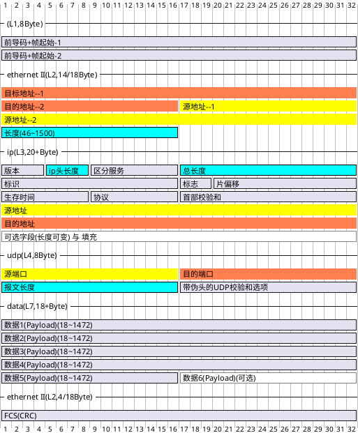
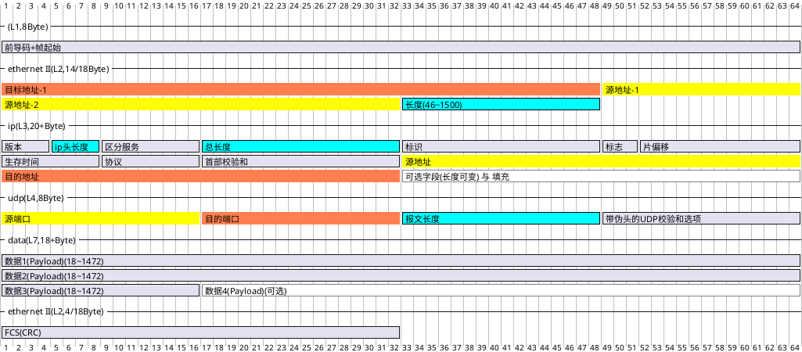
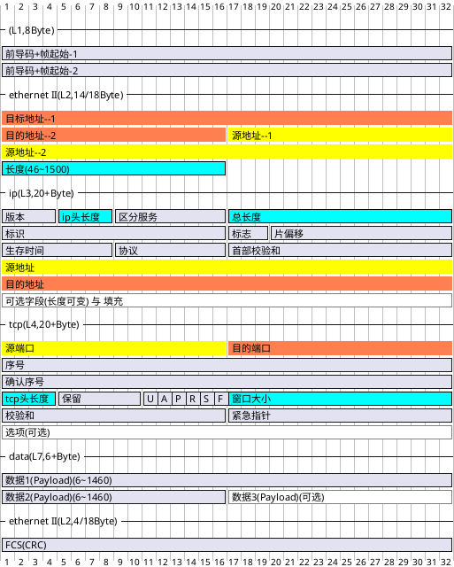
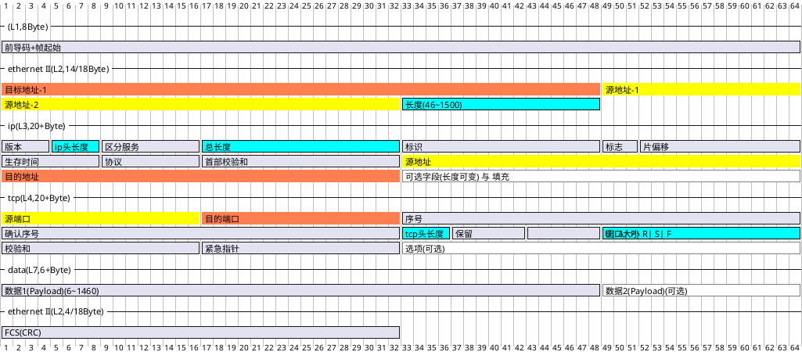
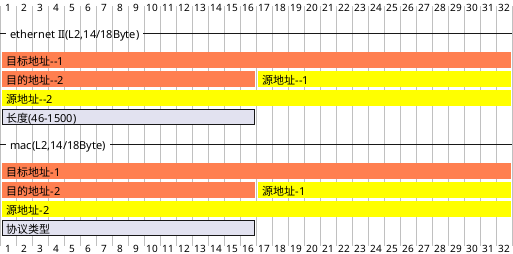

# 以太网帧协议(Gantt版)

tags: 网络协议、前导码、链路层协议、Gantt版、甘特图版

最近发现PlantUML的Gantt图可以较好地绘制网络协议格式，于是复习并绘制了一番

## 仅Gantt测试

```plantuml
@startgantt
[test1] starts D+0 and ends D+3
[test2] requires 4 days
[test3] starts D+0 and requires 4 days
@endgantt
```

## UDP完整以太网帧格式

UDP完整以太网帧格式（含前导码最小为 $72Byte = L1(8) + L2(14+4) + L3(20) + L4(8) + L7(18)$）

8Byte一行表示

## TCP完整以太网帧格式

TCP完整以太网帧格式（含前导码最小为 $72Byte = L1(8) + L2(14+4) + L3(20) + L4(20) + L7(18)$）

8Byte一行表示

## Ethernet II 与 MAC 802

### Ethernet II 和 IEEE 802.3 (MAC802) 协议

Ethernet II

- 用途：Ethernet II是**最常用**的以太网帧格式，广泛应用于现代网络，包括局域网（LAN）和广域网（WAN）。
- 常见应用：主要用于IP网络，尤其是IPv4和IPv6。大多数UDP和TCP通信使用Ethernet II帧格式。
- 特点：Ethernet II帧的以太类型（EtherType）字段用于指示上层协议（例如，0x0800表示IPv4，0x86DD表示IPv6）。

IEEE 802.3 (MAC802)

- 用途：IEEE 802.3是以太网的标准，定义了物理层和数据链路层的规范，包括帧格式。虽然它定义了一个不同的帧格式，但在实际应用中，**并不多见**，Ethernet II更为常见。
- 常见应用：较少单独使用，更多的是在特定的网络管理和控制系统中。
- 特点：IEEE 802.3帧格式包括一个长度字段，用于指示数据字段的长度，而不是EtherType。

