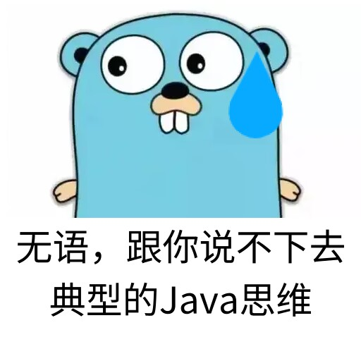

# 跨技术栈/通用的设计模式

Design Patterns Across Stacks（跨技术栈设计模式实现手册）

该笔记集合聚焦于跨编程语言、框架和技术架构的设计模式与核心概念，聚焦同一技术/设计在不同语言中的实现

用处：

- **更能理解设计模式的本质核心，这种核心与语言和语法是无关的**
  它通过对比不同技术栈（如 C/C++、Java、Python、TypeScript/JavaScript 等）对同一设计思想（如面向对象、信号槽、数据驱动、MVVM 等）的实现方式，揭示技术共性与差异，帮助开发者理解设计模式的本质，并快速在不同技术生态中迁移核心思想。
- **学习不同语言的倾向性/思维**
  一方面，不同语言由于自身的语言设计 (垃圾回收，编译/解释，是否静态类型等)、以及应用点 (网页，高性能等)。都会有一切倾向性，导致某些设计模式会用得更多。
  我们研究这种差异的同时，对各种语言的侧重点能有所学习
- **某语言没有另一语言的某某特性?**
  某些不擅长这种设计模式的语言，是否也能像其他语言那样做到某一点
  有时经常会说某语言没有另一语言的某某特性，然后可能借助某些第三方库去实现。例如C++没有反射，C没有面向对象的一些设计。
  - 有可能这是**实用的、很好的借鉴**（经常就会说某个语言弄了一个很好用的东西，其他语言纷纷跟进加入）
  - 也有可能这是没意义的（语言自身在某一领域缺陷太严重，强行模仿只能是邯郸学步、东施效颦），这能帮助我们体会到不同语言/框架/应用点上的**倾向性/设计缺陷**
  - 但哪怕没有意义，这也是一个对于要模拟的和被模拟的两种语言，以及设计模式本身都是**很好的学习**
  - 有时用A语言时总是会想念B语言的X特性，但其实A语言是用Y特性来代替X特性，也能得到一样的效果。**写法和解决方案是多样的**
- **更广泛的设计模式**
  我发现在实际开发当中，会碰到越来越多的以前没学到过的设计。我当初是特意去学习了设计模式的，然后过了很多种。但后来总会在其他语言/框架中碰到新的设计模式，或者说有时平常习以为常的写法突然多了个设计模式的名字

主要考察语言：

这里可能会经常比较的是：Vue 和 C系、前端和后端

## 内容特点

- 横向对比：同一设计模式在不同语言/框架中的代码示例与原理分析
- 技术本质：脱离具体框架/语言/语法，聚焦设计思路与适用场景
- 应用场景：结合实际案例（如 GUI 开发、Web 应用、系统架构）说明实现选择
- 扩展参考：附相关技术文档、开源项目链接与演进历史

## 来表情包点

[card]

- 
- 
- 
- 
- 
- 

