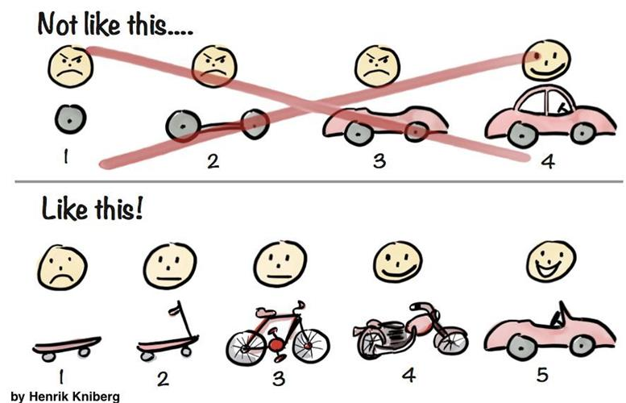
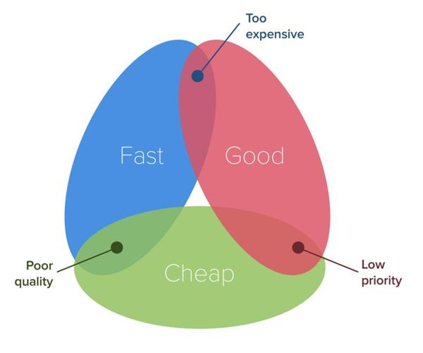
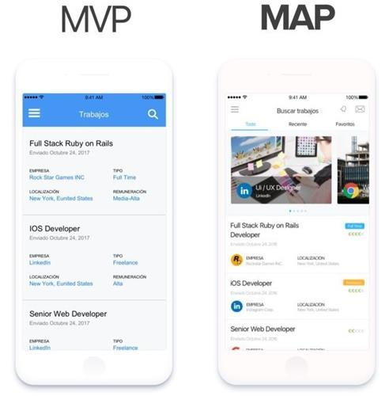

# MVP (Minimum Viable Product, 最小可行性) 版本

## 什么是MVP（最小可行性产品）？如何构建和验证MVP？

参考: https://zhuanlan.zhihu.com/p/258565534

本文所指的“[MVP](https://zhida.zhihu.com/search?content_id=145590089&content_type=Article&match_order=1&q=MVP&zhida_source=entity)”是 “Minimum Viable Product”的首字母缩写，即“最小可行性产品”。

MVP理念最早由[Eric Ries](https://zhida.zhihu.com/search?content_id=145590089&content_type=Article&match_order=1&q=Eric+Ries&zhida_source=entity)提出。在其所著的[《精益创业》](https://zhida.zhihu.com/search?content_id=145590089&content_type=Article&match_order=1&q=%E3%80%8A%E7%B2%BE%E7%9B%8A%E5%88%9B%E4%B8%9A%E3%80%8B&zhida_source=entity)一书中，Eric Ries对MVP进行了系统化讲解：MVP指的是企业用最小的成本开发出可用且能表达出核心理念的产品版本，使其功能极简但能够帮助企业快速验证对产品的构思，以便于企业在获取用户反馈后持续迭代优化产品、不断适应市场环境。MVP理念受到了很多硅谷创业者的认可，对很多硅谷企业进行产品创新都提供了有益指导。  
随着中国互联网的蓬勃发展，越来越多的从业人员也将MVP理论应用到产品设计的实践中来。

很多企业会通过 *"构建（Build）-测量（Measure）-迭代（Learn）“* 的操作流程，设计最小可行性产品，来验证产品设想。

## 产品理念：MVP已死，MAP当道

参考: https://www.woshipm.com/pd/978884.html

### MVP（minimum viable product）： 最小可行产品

mvp 在专家的口中就是可以在市场销售的成品

> 直到能够上市销售之前，都不能称为 MVP。「可行」意味着你可以销售它了。

下面这张很著名的图片是解释 MVP 产品最好的方式了：

这个过程会不会比之前更长呢？是的。但这个是不是可行性更高呢？当然！

### MVP -> MAP

我在这里并不想来讨论 MVP 产品的开发过程的一些细节。我们在这里是来宣布 MVP 的这个模式已经宣告死亡了，以及让我对此深信不疑的理由。

做任何东西都不可能同时做到又好又快又便宜。在开发 MVP 产品的过程中总要排一个优先级。开发的成本预算给的很低，到了开发截止日的时候总会有一个简单的「测试」，但是，潜在的用户真的会因为你给他的只是个测试产品，而不在意产品的品质问题么（或者说是看起来的品质）？

### MAP：最低完成度但足够能让人惊艳的产品3

重要的是整个市场一直在改变。在这之前，我们脑子里想的就是在产品上线前产品只能基本功能可以用就行。这在前几年，移动互联网刚刚兴起的时候是没有问题的，那时候的用户对各种互联网产品的了解和使用都很有限，要求也不高，但是现在不一样了，现在的用户接触了大量的互联网产品，对各种产品的要求越来越高，我们必须能给用户更多的惊喜，一些遵循用户的使用习惯但又让人眼前一亮的东西。

下面这个图就能说明这个问题：

这两个产品的界面有啥不一样呢？他们展示的都是一样的内容。两个都有：头部以及雇佣的各种信息（名称，日期，公司，类型，薪资）。

但是对用户和消费者来说，看起来 MAP 产品相对来说更可靠和更吸引人。

所以当你下次再思考  MVP 产品时，请思考 MAP 产品（除非你根本就没有竞争对手）：可以少做些功能，但是都要做的够好。

### 总结

评论区 *INTP* 用户: 
我的理解是先期资源调度决策。如果产品为新兴产品，且行业内没有先行者。mvp先跑起来小碎步迭代。如果是已成熟行业map先作出一两个有特色的点

评论区 *火鱼* 用户: 
我理解的是MAP是在MVP的基础上考虑了用户体验。同样都是先完成了核心功能设计，MAP在设计产品时考虑了ui界面和交互逻辑等用户体验。MVP追求的最快试错；MAP追求的是真实试错，避免用户体验影响到产品功能是否满足用户需求的验证。

