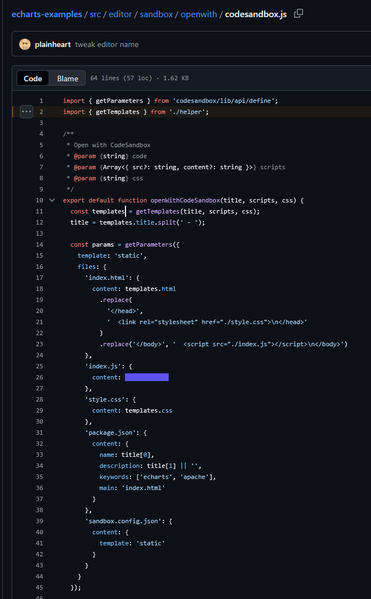

# ECharts Example 实现 —— sandbox

## ECharts Example 实现 —— sandbox

https://github.com/apache/echarts-examples/blob/5442d0d963ea072e8e1395f1f4da0ebe86abe5fd/src/editor/sandbox/openwith/helper.js#L50  
  
研究了一下ECharts官网的Examples页的做法，那边是沙箱不是AsyncFunction，更安全，也更耗性能，好像也不太好参考。放这里备忘一下  

(1) 先从js模板开始。myChart也是在模板内定义的。   

(2) 该模板通过 `helper.js::getTemplates` 返回给 editor/sandbox/openwith/codesandbox.js  
包括js模板 (作为沙箱中的 index.js 主入口)、html模板 (通过 `<script>` 提供 echarts 环境) 

## 比较 sandbox 和 AsyncFunction

(gemini 2.5 pro)

### 核心定义

- 沙箱 (Sandbox)
  - 是什么：一个隔离的、受限制的程序执行环境。它的核心目的是安全地运行不被信任的代码，防止这些代码访问或破坏主应用程序、操作系统或宿主环境。
  - 如何实现：沙箱的实现方式多种多样，从简单的上下文隔离到复杂的虚拟机技术。在 Node.js 中，常见的实现包括：
      - 使用 `vm` 模块创建一个隔离的 V8 上下文。
      - 使用独立的子进程 (`child_process`) 或工作线程 (`worker_threads`)。
      - 使用第三方库，如 `vm2` (尽管 `vm2` 曾被发现有多个严重漏洞，但其设计思想是值得参考的)。
      - 使用更重量级的容器技术（如 Docker）或微型虚拟机（如 Firecracker）。
  - 目标：**安全第一**。限制代码的权限，比如禁止文件系统访问、网络请求、访问全局变量等。
- AsyncFunction
  - 是什么：一个 JavaScript 的内置构造函数，与 `Function` 和 `eval` 类似。它允许你将一个字符串动态地编译成一个异步函数并执行。
  - 如何工作：`const myAsyncFunc = new AsyncFunction('a', 'b', 'return await someAsyncTask(a, b);');`
  - 执行上下文：与 `eval` 在局部作用域执行不同，`AsyncFunction` 创建的函数总是在全局作用域中执行。这意味着在 Node.js 环境中，它可以访问所有的全局对象，比如 `process`, `require`, `global`；在浏览器中，它可以访问 `window`, `document` 等。
  - 目标：**动态执行代码**。主要用于需要从字符串动态生成和运行异步逻辑的场景。

### 全方位比较

| 特性    | 沙箱 (Sandbox)                                                                               | `AsyncFunction`                                           | 结论                                   |
| ----- | ------------------------------------------------------------------------------------------ | --------------------------------------------------------- | ------------------------------------ |
| 核心目标  | **安全性**：隔离并限制不可信代码。                                                                        | **灵活性**：从字符串动态创建异步函数。                                     | 目标完全不同。                              |
| 隔离级别  | **高**。可以精细控制代码能访问的一切，包括全局变量、API、网络、文件系统。                                                   | **极低 (几乎为零)**。创建的函数在全局作用域运行，可以访问几乎所有全局对象和 API。            | 沙箱提供了真正的隔离，`AsyncFunction` 没有。       |
| 安全性   | **高** (如果正确实现)。其存在就是为了防止恶意行为。                                                              | **极低 (非常不安全)**。类似于 `eval`，执行任何来自用户或外部的字符串都存在巨大的安全风险。      | **永远不要用 `AsyncFunction` 执行不可信的代码。**  |
| 使用场景  | 1. 在线代码编辑器/判题系统。 2. 插件系统，安全地执行第三方插件。 3. 服务器端模板引擎，隔离模板渲染逻辑。 4. 数据分析平台，允许用户提交自定义脚本。 | 1. 动态代码生成器或解释器。 2. 某些需要高度动态性的配置或规则引擎（且代码来源完全可信）。       | 沙箱用于“保护自己”，`AsyncFunction` 用于“动态执行”。 |
| 资源控制  | **可以实现**。一个好的沙箱可以限制代码的 CPU 执行时间、内存使用量。                                                     | **无法实现**。`AsyncFunction` 本身不提供任何资源控制机制。无限循环或内存泄漏会直接影响主进程。 | 沙箱在稳定性和防滥用方面远超 `AsyncFunction`。      |
| 实现复杂度 | **高**。构建一个真正安全的沙箱非常困难，需要处理许多边界情况和逃逸漏洞。                                                     | **低**。只是一个简单的 API 调用。                                     | 沙箱是系统工程，`AsyncFunction` 是工具函数。       |
| 性能开销  | **有**。根据实现方式，开销可能从较小（`vm` 模块）到较大（子进程/容器）。上下文切换和权限检查都需要成本。                                  | **较低**。与直接编写的异步函数相比，有一次性的编译开销，但通常不大。                      | `AsyncFunction` 更快，但这是以牺牲所有安全性为代价的。  |

