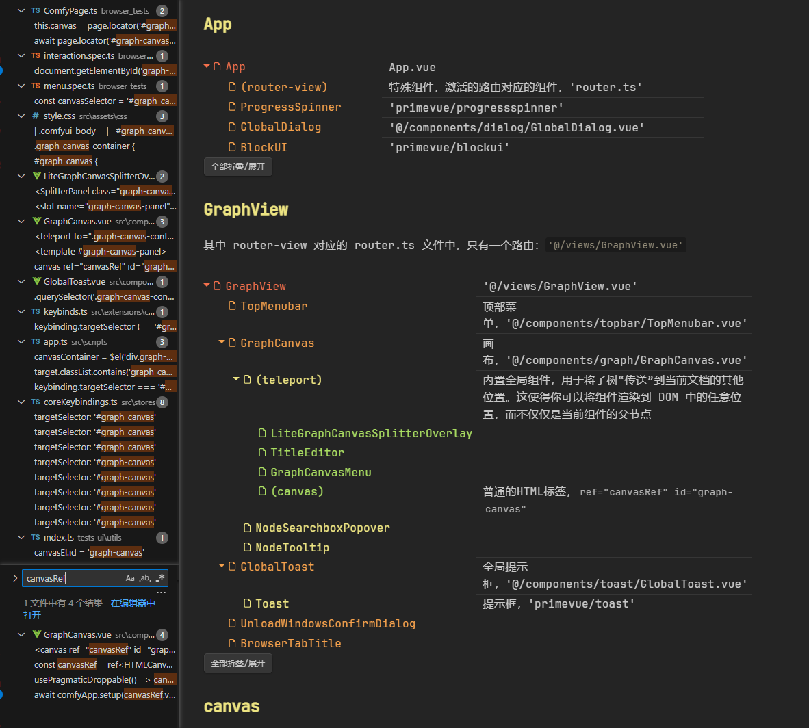

# 源码分析

## 项目目录

[dir]

- ComfyUI_forntend/
  - brwser_test/
  - public/
  - scripts/
    - deploy.js
    - main_repo_release.py
    - zipdist.js
  - src/
    - 详细见下面
  - test-ui/
    - ~~ComfyUI_examples~~/
    - ...
  - .env_example
  - .gitignore
  - .prettierrc
  - babel.config.json
  - eslint.config.js
  - global.d.ts
  - index.html
  - playwright.config.ts
  - postcss.config.js
  - tailwind.config.js
  - (项目管理类)/
    - .github/
    - .husky/
    - .gitattributes
  - (文档类)/
    - LICENSE
    - README.md
  - (包管理及编译配置类)/
    - jest.config.ts
    - package-lock.json
    - package.json
    - tsconfig.json
    - vite.config.mts
    - vitest.config.ts
    - vitest.setup.ts
    - ~~dist~~/
    - ~~node_modules~~/

其中，src路径：

[dir]

- src/
  - assets/
  - components/
    - actionbar/
    - common/               | 共用
    - dialog/               | 对话框
    - graph/                | 
      - GraphCanvas.vue     | 画布
      - GraphCanvasMenu.vue | 画布菜单
      - NodeTooltip.vue     | 节点工具栏
      - TitleEditor.vue     | 标题编辑器
    - node/                 | 节点
      - NodePreview.vue     | 节点预览
    - primevueOverride/
    - searchbox/            | 搜索
      - NodeSearchBox.vue
      - NodeSearchBoxPopover.vue
      - NodeSearchFilter.vue
      - NodeSearchItem.vue
    - sidebar/              | 侧边栏
    - templates/
    - toast/                | 全局提示框
    - topbar/               | 顶部工具栏
    - BrowserTabTitle.vue
    - LiteGraphCanvasSplitterOverlay.vue
  - extensions/core/
  - hooks/
  - scripts/
  - services/
  - stores/
  - types/
  - utils/
  - views/
  - App.vue
  - config.ts
  - i18n.ts
  - main.ts
  - router.ts
  - vite-env.d.ts

## 组件构成

### App

[dir]

- App               | App.vue
  - (router-view)   | 特殊组件，激活的路由对应的组件，`router.ts`
  - ProgressSpinner | `primevue/progressspinner`
  - GlobalDialog    | `@/components/dialog/GlobalDialog.vue` 
  - BlockUI         | `primevue/blockui`

### GraphView

其中 router-view 对应的 router.ts 文件中，只有一个路由：`@/views/GraphView.vue`

[dir]

- GraphView         | `@/views/GraphView.vue`
  - TopMenubar      | 顶部菜单，`@/components/topbar/TopMenubar.vue`
  - GraphCanvas     | 画布，`@/components/graph/GraphCanvas.vue`
    - (teleport)    | 内置全局组件，用于将子树“传送”到当前文档的其他位置。这使得你可以将组件渲染到 DOM 中的任意位置，而不仅仅是当前组件的父节点
      - LiteGraphCanvasSplitterOverlay
      - TitleEditor
      - GraphCanvasMenu
      - (canvas)    | 普通的HTML标签，`ref="canvasRef" id="graph-canvas`
    - NodeSearchboxPopover
    - NodeTooltip
  - GlobalToast     | 全局提示框，`@/components/toast/GlobalToast.vue`
    - Toast         | 提示框，`primevue/toast`
  - UnloadWindowsConfirmDialog| 
  - BrowserTabTitle | 

### canvas

canvas相关操作

### 00000

