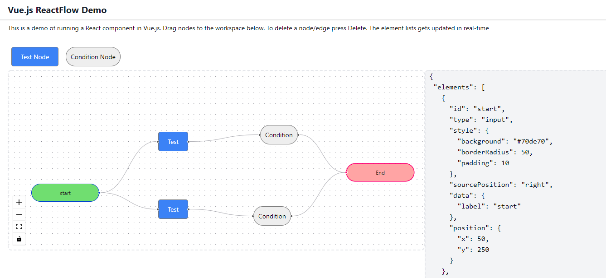
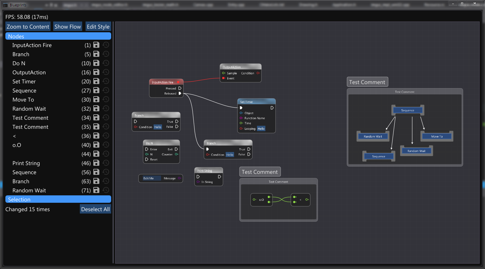
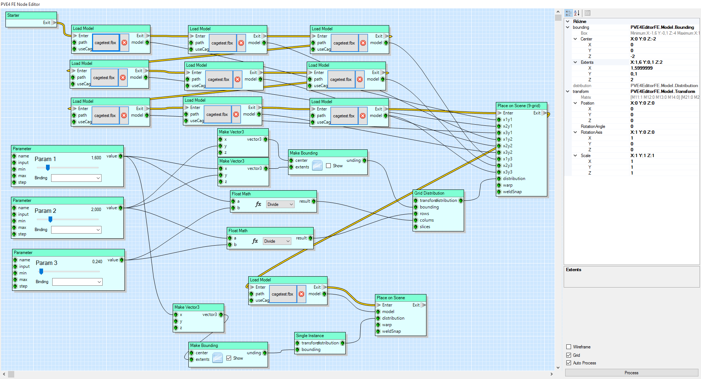
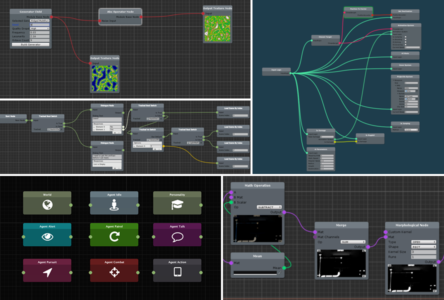
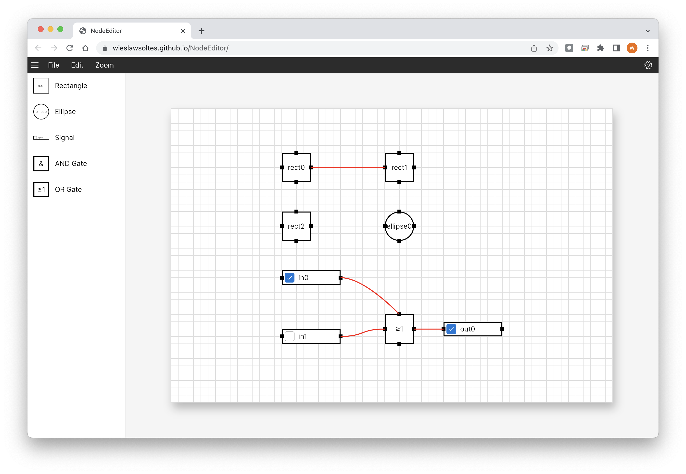

# NodeLibrary

该笔记旧文件名：NodeEditor_Web

## 节点编辑库调研 (2024-10-12)

### 开源调研

[list2ut|addClass(ab-super-width)]

- < url
  - Pic
  - Language
  - Star
- [xyflow](https://github.com/xyflow/xyflow)/[reactflow](https://reactflow.dev/)/[svelteflow](https://svelteflow.dev/)
  - 
  - TypeScript、Svelte、CSS、JavaScript 这个不错，同时支持react和svelte!
  - 25.2k
- [vueflow](https://github.com/bcakmakoglu/vue-flow)/[official website](https://vueflow.dev/)
  - 
  - TypeScript、Vue、CSS、Other
  - 3.9k
- [butterfly](https://github.com/alibaba/butterfly)
  - 
  - JavaScript、CSS、Less、Vue、HTML (国产，阿里出的，可以画类型更多的图)
  - 4.4k
- [X6](https://github.com/antvis/X6)
  - 
  - TypeScript、JavaScript、Other (国产，蚂蚁出的，可以画更多类型的图。然后蚂蚁集团这个群组下还有很多其他的系列，例如[G2-数据展示图表](https://github.com/antvis/G2)/[G6-可视化引擎](https://github.com/antvis/g6)/[F2-移动端可视化](https://github.com/antvis/F2)/[X6-节点定制和交互](https://github.com/antvis/X6)/L7-地理空间/S2-多维表格等）
  - 5.7k
- [vue-reactflow](https://github.com/akashgoswami/vue-reactflow)
  - 
  - JavaScript、Vue、HTML、CSS
  - 19
- [ComfyUI](https://github.com/Comfy-Org/ComfyUI_frontend)
  - ——
  - TypeScript、Vue、CSS、Other
  - 511
- [pipeline](https://github.com/poohlaha/pipeline)
  - 
  - TypeScript、Less、JavaScript
  - 2
- [logicflow-demo](https://github.com/hmilin/logicflow-demo)
  - 
  - TypeScript、Vue、JavaScript、Less、HTML、CSS
  - 6
- [topology](https://github.com/spicyboiledfish/topology?tab=readme-ov-file)
  - 
  - TypeScript、HTML、CSS 基于antv/G6库
  - 18
- [NodeEditor3-vue](https://github.com/cambridgejames/NodeEditor3-vue)
  - 
  - TypeScript、Vue、SCSS、JavaScript、HTML
  - 26
- [imgui-node-editor](https://github.com/thedmd/imgui-node-editor)
  - 
  - C++、CMake
  - 3.7k
- [Image-Processing-Node-Editor](https://github.com/Kazuhito00/Image-Processing-Node-Editor)
  - 
  - Python、JupyterNotebook、Dockerfile
  - 483
- [NodeEditorWinforms](https://github.com/komorra/NodeEditorWinforms)
  - 
  - C#
  - 511
- [xNode](https://github.com/Siccity/xNode)
  - 
  - C#
  - 3.3k
- [Node_Editor_Framework](https://github.com/Seneral/Node_Editor_Framework)
  - 
  - C#
  - 2k
- [NodeEditorJS](https://github.com/ZeppelinGames/NodeEditorJS)
  - 
  - JavaScript、CSS、HTML
  - 3
- [NodeEditor](https://github.com/wakewakame/NodeEditor)
  - 
  - JavaScript、HTML
  - 3
- [VisionFlowPro](https://github.com/susigo/VisionFlowPro)
  - 
  - C++、Other，Qt
  - 73
- [qtpynodeeditor](https://github.com/klauer/qtpynodeeditor)
  - 
  - Python，PyQt
  - 189
- [nodeeditor](https://github.com/paceholder/nodeeditor)
  - 
  - C++、CMake，Qt，**这是一个可复用的框架！**
  - 3k
- [NodeEditor](https://github.com/beyse/NodeEditor)
  - 
  - Python、Inno Setup、Other
  - 42
- [STNodeEditor](https://github.com/DebugST/STNodeEditor)
  - 
  - C#
  - 610
- [NodeEditor](https://github.com/microelly2/NodeEditor)
  - 
  - Python，Base PyFlow
  - 77
- [NodeEditor](https://github.com/wieslawsoltes/NodeEditor)
  - 
  - C#、PowerShell、Shell、Batchfile
- [nodezator](https://github.com/IndiePython/nodezator)
  - 
  - Python
  - 644

其中，有些可复用的节点库：

- https://github.com/antvis/g6 ，G6引擎相关的：
  - https://github.com/spicyboiledfish/topology?tab=readme-ov-file
  - https://github.com/Impress-semirding/g6-editor
- https://wonderworks-software.github.io/PyFlow/ ，PyFlow
  - [NodeEditor](https://github.com/microelly2/NodeEditor)
- https://github.com/paceholder/nodeeditor
- [xyflow](https://github.com/xyflow/xyflow)/[reactflow](https://reactflow.dev/)/[svelteflow](https://svelteflow.dev/)
  - TypeScript、Svelte、CSS、JavaScript，这个不错，同时支持react和svelte!
    那有没有Vue的？在该仓库的issue中有人提到过：X6、G6、butterfly、vueflow、[Rete.js](https://rete.js.org/)
- vueflow
  - 其中元素拖拽移动的底层引擎是[D3](https://d3js.org/)

### 非开源调研

使用节点编辑器的大规模软件：
- Blender、非常多的现代渲染器、UE、Houdini、达芬奇
- https://github.com/hoffstadt/DearPyGui
  - https://dearpygui.readthedocs.io/en/latest/documentation/node-editor.html

选型过程中的一些思考：

- https://github.com/Comfy-Org/ComfyUI_frontend/discussions/1246

在线节点编辑器：

- https://nme.babylonjs.com/
- https://github.com/bcakmakoglu/vue-flow
  - https://vueflow.dev/
  - https://vueflow.dev/examples/
- https://github.com/xyflow/xyflow
  - https://reactflow.dev/
  - https://reactflow.dev/examples/nodes/custom-node
- http://x6.antv.antgroup.com/zh/examples/showcase/practices/#er

### 工作流引擎调研

工作流只是节点图的其中一个应用

GPT：

> [!note]
> 工作流引擎（Workflow Engine）是一种软件组件，它负责自动化业务流程中的步骤。这些步骤可以包括任务分配、状态跟踪以及条件判断等，它按照预定的规则自动推进流程。工作流引擎通常遵循某种工作流定义，这个定义可以是一个流程图或者是一个结构化的文档，它描述了工作流中的各个步骤（节点）以及它们之间的关系。
> 
> 节点图（Node Diagram）是描述工作流的一种可视化方式，它通常包含以下几个要素：
> 
> 1. **节点（Nodes）**：代表工作流中的各个步骤或者任务。节点可以有不同的类型，比如开始节点、结束节点、活动节点、网关节点等。
>     
> 2. **边（Edges）**：连接不同节点的线段，表示一个节点完成之后执行流如何转移到另一个节点。
>     
> 3. **属性（Properties）**：每个节点可能有特定的属性来定义它的行为，例如执行的条件、执行的动作等。
>     
> 在工作流引擎中，节点图通常用来定义和展示工作流逻辑。当工作流引擎运行时，它会解析节点图，并根据图中的定义来决定下一步应该做什么。例如，如果当前节点是一个条件判断节点，那么工作流引擎会评估该条件，并决定是否转移到下一个节点，或者转移到另一个分支。
> 
> 总结来说，*节点图是描述工作流逻辑的一种方式，而工作流引擎则是实现这个逻辑的执行者*。工作流引擎依赖于节点图来指导其操作顺序和条件处理，从而实现自动化的工作流管理。

前司以前好像想弄一个CRM系统来着，好像选型用jBPM

### 最终选型

Github Star History Comparison

四选一：
- 就效果来说，ReactFlow/SvelteFlow/VueFlow 深得我心，特别是交互式文档！太爽了！最近更新：几天前
- X6的效果感觉有点差，而且本职不是专门做节点图的。最近更新：昨天
- butterfly虽然本职不是专做节点图，但效果感觉还行。只是他那个网站502了。最近更新：23年8月了，没维护了，怪不得Star增长这么慢

二选一：
- 社区
  - ReactFlow/SvelteFlow，需要注意的是，这里有可选的Pro版本，Pro版本新增的功能可以在Examples页面中看到。例如我非常想要的 Group 功能
  - VueFlow，能用Vue不错。但ReactFlow的用户数是增长率非常高……
  - 都有Discord群，都没中文文档
- 功能上
  - 我大致阅读了两边的使用文档
    （https://vueflow.dev/examples/math.html 和 https://reactflow.dev/examples/nodes/custom-node）
    功能感觉相差不多，在我的需求中，ReactFlow多了个Group功能，但那个要Pro版本
    （后来我看了下https://github.com/bcakmakoglu/vue-flow/issues/15，Vue的版本似乎也能有该功能？）
  - 用法区别（待研究）
- 联系
  - VueFlow的作者 `@backmakoglu` 也是ReactFlow的主要贡献者之一，似乎是react-flow项目的迁移。两者在网站主页和Example页面中的展示，都非常相似

最后选定，使用VueFlow了

## 开发

### 核心功能

1. 节点编辑器的基础功能
2. 必须实现无pos的自动定位（记得Houdini有这个功能）
3. 必须实现在json中进行定义的自定义节点

### json设计

