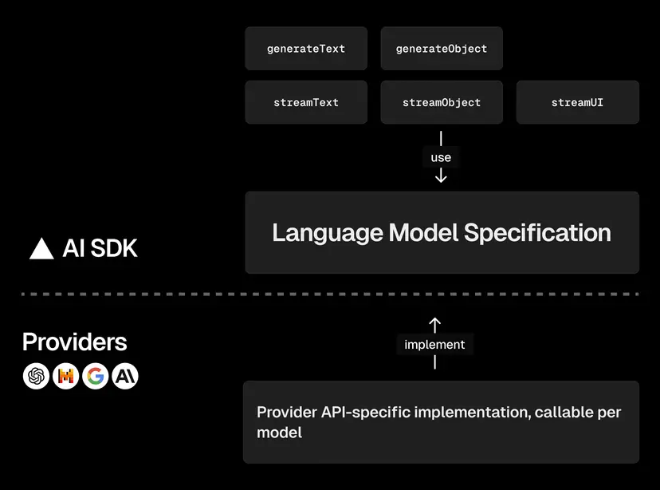

# 02-vercal_ai基础

## 目录

- 概述
  了解人工智能和 LLM (大语言模型) 的基本概念
- 提供商量和模型
  了解可与 AI SDK 一起使用的提供商程序和模型
- Prompts
  了解如何在 AI SDK 中使用和定义提示
- 工具
  了解 AI SDK 中的工具
- 流式 UI
  了解为什么流式 UI 用于 AI 应用程序
- 提供商选项
  了解如何使用特定于特供者的选项进行推理、缓存等
- 代理商 (Agent)
  了解如何使用 AI SDK 构建 Agent

## 概述

> 本页面是对高级人工智能 (AI) 概念的适合初学者的介绍。要直接实施 AI SDK，请随时跳到我们的快速入门或了解我们支持的模型和提供商。

AI SDK 标准化了支持的 [提供商](https://ai-sdk.dev/docs/foundations/providers-and-models) 之间的人工智能 (AI) 模型集成。这使得开发人员能够专注于构建出色的人工智能应用程序，而不是在技术细节上浪费时间。

例如，以下是使用 AI SDK 使用各种模型生成文本的方法：

::: tabs

@tab Gateway

```js
import { generateText } from "ai";

const { text } = await generateText({
  model: "anthropic/claude-sonnet-4.5",
  prompt: "What is love?",
});
```

@tab Provider

```js
import { generateText } from "ai";
import { anthropic } from "@ai-sdk/anthropic";

const { text } = await generateText({
  model: anthropic("claude-sonnet-4-5"),
  prompt: "What is love?",
});
```

@tab custom

```js
import { generateText } from "ai";
import { yourProvider } from "your-custom-provider";

const { text } = await generateText({
  model: yourProvider("your-model-id"),
  prompt: "What is love?",
});
```

:::

为了有效地利用 AI SDK，熟悉以下概念会有所帮助：

### 生成人工智能

生成式人工智能是指根据统计上的可能性，从训练数据中学到的模式来预测和生成各种类型的输出（例如文本、图像或音频）的模型。例如：

- 给定一张照片，生成模型可以生成标题。
- 给定一个音频文件，生成模型可以生成转录。
- 给定文本描述，生成模型可以生成图像。

### 大型语言模型

大型语言模型 (LLM) 是主要关注文本的生成模型的子集。 LLM 将单词序列作为输入，旨在预测最可能遵循的序列。它将概率分配给潜在的下一个序列，然后选择一个。模型继续生成序列，直到满足指定的停止标准。

LLM 通过对大量书面文本进行培训来学习，这意味着他们比其他用例更适合某些用例。例如，在 GitHub 数据上训练的模型可以很好地理解源代码中序列的概率。

然而，了解 LLM 的局限性至关重要。当被问及鲜为人知或不存在的信息时，例如私人亲戚的生日，LLM 可能会“产生幻觉”或编造信息。必须考虑模型中所需信息的代表性程度。

### 嵌入模型

嵌入模型用于将复杂数据（如单词或图像）转换为密集向量（数字列表）表示形式，称为嵌入。与生成模型不同，嵌入模型不会生成新的文本或数据。相反，它们提供实体之间语义和句法关系的表示，可用作其他模型或其他自然语言处理任务的输入。

在下一节中，您将了解模型提供者和模型之间的区别，以及 AI SDK 中提供了哪些模型提供者和模型。

## 提供商和模型

OpenAI 和 Anthropic（提供商）等公司通过自己的 API 提供对一系列具有不同优势和功能的大型语言模型 (LLM) 的访问。

每个提供商通常都有自己独特的方法来与其模型交互，这使得更换提供商的过程变得复杂，并增加了供应商锁定的风险。

为了解决这些挑战，AI SDK Core 提供了一种通过 [语言模型规范](https://github.com/vercel/ai/tree/main/packages/provider/src/language-model/v3) 与 LLM 交互的标准化方法 抽象化了提供商之间的差异。这个统一的界面允许您轻松地在提供商之间切换，同时为所有提供商使用相同的 API。

以下是 AI SDK 提供商架构的概述：



### AI SDK 提供商

AI SDK 配备了多种服务提供商,可用于与不同语言模型进行交互:

- [xAI Grok](https://ai-sdk.dev/providers/ai-sdk-providers/xai) 提供商`@ai-sdk/xai`)
- [OpenAI](https://ai-sdk.dev/providers/ai-sdk-providers/openai) 服务提供商`@ai-sdk/openai`)
- [Azure OpenAI 提供程序](https://ai-sdk.dev/providers/ai-sdk-providers/azure)`@ai-sdk/azure`)
- [人类提供者](https://ai-sdk.dev/providers/ai-sdk-providers/anthropic)`@ai-sdk/anthropic`)
- [Amazon Bedrock Provider](https://ai-sdk.dev/providers/ai-sdk-providers/amazon-bedrock)亚马逊卧铺供应商`@ai-sdk/amazon-bedrock`)
- [谷歌生成式人工智能提供商](https://ai-sdk.dev/providers/ai-sdk-providers/google-generative-ai)`@ai-sdk/google`)
- [Google Vertex Provider](https://ai-sdk.dev/providers/ai-sdk-providers/google-vertex)谷歌Vertex服务提供商`@ai-sdk/google-vertex`)
- [矿物质供应商](https://ai-sdk.dev/providers/ai-sdk-providers/mistral)`@ai-sdk/mistral`)
- [携手合作(](https://ai-sdk.dev/providers/ai-sdk-providers/togetherai)提供者)`@ai-sdk/togetherai`)
- [Cohere Provider](https://ai-sdk.dev/providers/ai-sdk-providers/cohere)科赫尔供应商`@ai-sdk/cohere`)
- [烟花爆竹供应商](https://ai-sdk.dev/providers/ai-sdk-providers/fireworks)`@ai-sdk/fireworks`)
- [深度基础设施提供商](https://ai-sdk.dev/providers/ai-sdk-providers/deepinfra)`@ai-sdk/deepinfra`)
- [深度搜索提供程序](https://ai-sdk.dev/providers/ai-sdk-providers/deepseek)`@ai-sdk/deepseek`)
- [脑膜供应商](https://ai-sdk.dev/providers/ai-sdk-providers/cerebras)(`@ai-sdk/cerebras`)
- [杂货供应商](https://ai-sdk.dev/providers/ai-sdk-providers/groq)`@ai-sdk/groq`)
- [复杂性提供者](https://ai-sdk.dev/providers/ai-sdk-providers/perplexity)(`@ai-sdk/perplexity`)
- [十一实验室服务提供商](https://ai-sdk.dev/providers/ai-sdk-providers/elevenlabs)`@ai-sdk/elevenlabs`)
- [LMNT 提供程序](https://ai-sdk.dev/providers/ai-sdk-providers/lmnt)`@ai-sdk/lmnt`)
- [休谟供应商](https://ai-sdk.dev/providers/ai-sdk-providers/hume)(`@ai-sdk/hume`)
- [Rev.ai 服务提供商](https://ai-sdk.dev/providers/ai-sdk-providers/revai)`@ai-sdk/revai`)
- [深度测量提供程序](https://ai-sdk.dev/providers/ai-sdk-providers/deepgram)`@ai-sdk/deepgram`)
- [格拉迪娅供应商](https://ai-sdk.dev/providers/ai-sdk-providers/gladia)`@ai-sdk/gladia`)
- [AssemblyAI](https://ai-sdk.dev/providers/ai-sdk-providers/assemblyai) 服务提供商`@ai-sdk/assemblyai`)
- [基础供应商](https://ai-sdk.dev/providers/ai-sdk-providers/baseten)(`@ai-sdk/baseten`)

您还可以使用 [OpenAI 兼容](https://ai-sdk.dev/providers/openai-compatible-providers) API [的 OpenAI](https://ai-sdk.dev/providers/openai-compatible-providers) 兼容服务提供商:

- [LM工作室](https://ai-sdk.dev/providers/openai-compatible-providers/lmstudio)
- [赫罗库](https://ai-sdk.dev/providers/openai-compatible-providers/heroku)

我们 [语言模型规范](https://github.com/vercel/ai/tree/main/packages/provider/src/language-model/v3) 以开源包形式发布,可用于创建 [定制供应商](https://ai-sdk.dev/providers/community-providers/custom-providers)。

开源社区已创建了以下服务提供商:

- [奥拉马供应商](https://ai-sdk.dev/providers/community-providers/ollama)`ollama-ai-provider`)
- [FriendliAI](https://ai-sdk.dev/providers/community-providers/friendliai) 服务提供商`@friendliai/ai-provider`)
- [门键供应商](https://ai-sdk.dev/providers/community-providers/portkey)`@portkey-ai/vercel-provider`)
- [Cloudflare 员工人工智能服务提供商](https://ai-sdk.dev/providers/community-providers/cloudflare-workers-ai)`workers-ai-provider`)
- [OpenRouter](https://ai-sdk.dev/providers/community-providers/openrouter) 服务提供商`@openrouter/ai-sdk-provider`)
- [阿珀蒂斯供应商](https://ai-sdk.dev/providers/community-providers/apertis)`@apertis/ai-sdk-provider`)
- [Aihubmix](https://ai-sdk.dev/providers/community-providers/aihubmix) 供应商`@aihubmix/ai-sdk-provider`)
- [请求提供程序](https://ai-sdk.dev/providers/community-providers/requesty)(`@requesty/ai-sdk`)
- [交叉触控提供器](https://ai-sdk.dev/providers/community-providers/crosshatch)`@crosshatch/ai-provider`)
- [混合面包供应商](https://ai-sdk.dev/providers/community-providers/mixedbread)`mixedbread-ai-provider`)
- [语音AI提供商](https://ai-sdk.dev/providers/community-providers/voyage-ai)(`voyage-ai-provider`)
- [Mem0](https://ai-sdk.dev/providers/community-providers/mem0) 提供程序`@mem0/vercel-ai-provider`)
- [利塔供应商](https://ai-sdk.dev/providers/community-providers/letta)`@letta-ai/vercel-ai-sdk-provider`)
- [后见之明服务提供商](https://ai-sdk.dev/providers/community-providers/hindsight)`@vectorize-io/hindsight-ai-sdk`)
- [超内存提供程序](https://ai-sdk.dev/providers/community-providers/supermemory)`@supermemory/tools`)
- [火花供应商](https://ai-sdk.dev/providers/community-providers/spark)(`spark-ai-provider`)
- [AnthropicVertex](https://ai-sdk.dev/providers/community-providers/anthropic-vertex-ai) 提供程序`anthropic-vertex-ai`)
- [朗德银行服务提供商](https://ai-sdk.dev/providers/community-providers/langdb)`@langdb/vercel-provider`)
- [Dify](https://ai-sdk.dev/providers/community-providers/dify) 提供程序`dify-ai-provider`)
- [萨瓦姆供应商](https://ai-sdk.dev/providers/community-providers/sarvam)`sarvam-ai-provider`)
- [克劳德代码提供商](https://ai-sdk.dev/providers/community-providers/claude-code)`ai-sdk-provider-claude-code`)
- [浏览器AI提供程序](https://ai-sdk.dev/providers/community-providers/browser-ai)`browser-ai`)
- [双子座临床服务提供商](https://ai-sdk.dev/providers/community-providers/gemini-cli)`ai-sdk-provider-gemini-cli`)
- [A2A 服务提供商](https://ai-sdk.dev/providers/community-providers/a2a)`a2a-ai-provider`)
- [SAP-AI 提供商](https://ai-sdk.dev/providers/community-providers/sap-ai)`@mymediset/sap-ai-provider`)
- [人工智能/机器学习API提供程序](https://ai-sdk.dev/providers/community-providers/aimlapi)(`@ai-ml.api/aimlapi-vercel-ai`)
- [MCP Sampling Provider](https://ai-sdk.dev/providers/community-providers/mcp-sampling)MCP采样提供方(`@mcpc-tech/mcp-sampling-ai-provider`)
- [ACP](https://ai-sdk.dev/providers/community-providers/acp) 提供方`@mcpc-tech/acp-ai-provider`)
- [OpenCode 服务提供商](https://ai-sdk.dev/providers/community-providers/opencode-sdk)`ai-sdk-provider-opencode-sdk`)
- [Codex CLI](https://ai-sdk.dev/providers/community-providers/codex-cli) 提供程序(`ai-sdk-provider-codex-cli`)
- [索尼克斯供应商](https://ai-sdk.dev/providers/community-providers/soniox)`@soniox/vercel-ai-sdk-provider`)
- [智浦(Z.AI)供应商](https://ai-sdk.dev/providers/community-providers/zhipu)`zhipu-ai-provider`)
- [OLLM 提供者](https://ai-sdk.dev/providers/community-providers/ollm)`@ofoundation/ollm`)

### 自托管模型

您可以使用以下服务提供商访问自托管模型:

- [奥拉马供应商](https://ai-sdk.dev/providers/community-providers/ollama)
- [LM工作室](https://ai-sdk.dev/providers/openai-compatible-providers/lmstudio)
- [基础](https://ai-sdk.dev/providers/ai-sdk-providers/baseten)
- [浏览器AI](https://ai-sdk.dev/providers/community-providers/browser-ai)

此外,任何支持OpenAI规范的自托管服务提供商都可以与 [OpenAI 兼容提供商](https://ai-sdk.dev/providers/openai-compatible-providers)。

### 模型功能

人工智能提供商支持具有多种功能的不同语言模型。 以下是流行模型的功能:

| 供应商 | 模型 | 图像输入 | 对象生成 | 工具使用 | 工具流 |
|---|---|---|---|---|---|
|[xAI Grok](https://ai-sdk.dev/providers/ai-sdk-providers/xai)|`grok-4`|||||
|[xAI Grok](https://ai-sdk.dev/providers/ai-sdk-providers/xai)|`grok-3`|||||
|[xAI Grok](https://ai-sdk.dev/providers/ai-sdk-providers/xai)|`grok-3-mini`|||||
|[Vercel](https://ai-sdk.dev/providers/ai-sdk-providers/vercel)|`v0-1.0-md`|||||
|[OpenAI](https://ai-sdk.dev/providers/ai-sdk-providers/openai)|`gpt-5.4-pro`|||||
|[OpenAI](https://ai-sdk.dev/providers/ai-sdk-providers/openai)|`gpt-5.4`|||||
|[OpenAI](https://ai-sdk.dev/providers/ai-sdk-providers/openai)|`gpt-5.4-mini`|||||
|[OpenAI](https://ai-sdk.dev/providers/ai-sdk-providers/openai)|`gpt-5.4-nano`|||||
|[OpenAI](https://ai-sdk.dev/providers/ai-sdk-providers/openai)|`gpt-5.3-chat-latest`|||||
|[OpenAI](https://ai-sdk.dev/providers/ai-sdk-providers/openai)|`gpt-5.2-pro`|||||
|[OpenAI](https://ai-sdk.dev/providers/ai-sdk-providers/openai)|`gpt-5.2-chat-latest`|||||
|[OpenAI](https://ai-sdk.dev/providers/ai-sdk-providers/openai)|`gpt-5.2`|||||
|[OpenAI](https://ai-sdk.dev/providers/ai-sdk-providers/openai)|`gpt-5`|||||
|[OpenAI](https://ai-sdk.dev/providers/ai-sdk-providers/openai)|`gpt-5-mini`|||||
|[OpenAI](https://ai-sdk.dev/providers/ai-sdk-providers/openai)|`gpt-5-nano`|||||
|[OpenAI](https://ai-sdk.dev/providers/ai-sdk-providers/openai)|`gpt-5.1-chat-latest`|||||
|[OpenAI](https://ai-sdk.dev/providers/ai-sdk-providers/openai)|`gpt-5.1-codex-mini`|||||
|[OpenAI](https://ai-sdk.dev/providers/ai-sdk-providers/openai)|`gpt-5.1-codex`|||||
|[OpenAI](https://ai-sdk.dev/providers/ai-sdk-providers/openai)|`gpt-5.1`|||||
|[OpenAI](https://ai-sdk.dev/providers/ai-sdk-providers/openai)|`gpt-5-codex`|||||
|[OpenAI](https://ai-sdk.dev/providers/ai-sdk-providers/openai)|`gpt-5-chat-latest`|||||
|[Anthropic](https://ai-sdk.dev/providers/ai-sdk-providers/anthropic)|`claude-opus-4-6`|||||
|[Anthropic](https://ai-sdk.dev/providers/ai-sdk-providers/anthropic)|`claude-sonnet-4-6`|||||
|[Anthropic](https://ai-sdk.dev/providers/ai-sdk-providers/anthropic)|`claude-opus-4-5`|||||
|[Anthropic](https://ai-sdk.dev/providers/ai-sdk-providers/anthropic)|`claude-opus-4-1`|||||
|[Anthropic](https://ai-sdk.dev/providers/ai-sdk-providers/anthropic)|`claude-opus-4-0`|||||
|[Anthropic](https://ai-sdk.dev/providers/ai-sdk-providers/anthropic)|`claude-sonnet-4-0`|||||
|[Mistral](https://ai-sdk.dev/providers/ai-sdk-providers/mistral)|`pixtral-large-latest`|||||
|[Mistral](https://ai-sdk.dev/providers/ai-sdk-providers/mistral)|`mistral-large-latest`|||||
|[Mistral](https://ai-sdk.dev/providers/ai-sdk-providers/mistral)|`mistral-medium-latest`|||||
|[Mistral](https://ai-sdk.dev/providers/ai-sdk-providers/mistral)|`mistral-medium-2505`|||||
|[Mistral](https://ai-sdk.dev/providers/ai-sdk-providers/mistral)|`mistral-small-latest`|||||
|[Mistral](https://ai-sdk.dev/providers/ai-sdk-providers/mistral)|`pixtral-12b-2409`|||||
|[DeepSeek](https://ai-sdk.dev/providers/ai-sdk-providers/deepseek)|`deepseek-chat`|||||
|[DeepSeek](https://ai-sdk.dev/providers/ai-sdk-providers/deepseek)|`deepseek-reasoner`|||||
|[Cerebras](https://ai-sdk.dev/providers/ai-sdk-providers/cerebras)|`llama3.1-8b`|||||
|[Cerebras](https://ai-sdk.dev/providers/ai-sdk-providers/cerebras)|`llama3.1-70b`|||||
|[Cerebras](https://ai-sdk.dev/providers/ai-sdk-providers/cerebras)|`llama3.3-70b`|||||
|[Groq](https://ai-sdk.dev/providers/ai-sdk-providers/groq)|`meta-llama/llama-4-scout-17b-16e-instruct`|||||
|[Groq](https://ai-sdk.dev/providers/ai-sdk-providers/groq)|`llama-3.3-70b-versatile`|||||
|[Groq](https://ai-sdk.dev/providers/ai-sdk-providers/groq)|`llama-3.1-8b-instant`|||||
|[Groq](https://ai-sdk.dev/providers/ai-sdk-providers/groq)|`mixtral-8x7b-32768`|||||
|[Groq](https://ai-sdk.dev/providers/ai-sdk-providers/groq)|`gemma2-9b-it`|||||

> 此表格并非详尽无遗。其他型号可在提供商处找到 文档页面及提供商网站上的文档。

## Prompt

提示符是指示，[你给出一个大型语言模型(LLM)](https://ai-sdk.dev/docs/foundations/overview#large-language-models) 来告诉它该做什么。 就像你向别人问路一；问题越清晰，你得到的方向就越好。

许多LLM服务商提供复杂的接口，用于指定提示。它们涉及不同的角色和信息类型。尽管这些接口功能强大，但它们可能难以使用和理解。

为了简化提示，AI SDK 支持文本、消息和系统提示。

### 文字提示

文本提示是字符串。它们非常适合简单的生成用例，例如重复生成同一提示文本的变体内容。

您可以使用AI SDK函数（如streamText或generateText）提供的提示属性来设置文本提示。您可以以任何方式构造文本并注入变量，例如使用模板文字。

::: tabs

@tab Gateway

```js
const result = await generateText({
  model: "anthropic/claude-sonnet-4.5",
  prompt: 'Invent a new holiday and describe its traditions.',
});
```

@tab Provider

```js
const result = await generateText({
  model: anthropic("claude-sonnet-4-5"),
  prompt: 'Invent a new holiday and describe its traditions.',
});
```

@tab custom

```js
const result = await generateText({
  model: yourProvider("your-model-id"),
  prompt: 'Invent a new holiday and describe its traditions.',
});
```

:::

您还可以使用模板文字为提示提供动态数据。

::: tabs

@tab Gateway

```js
const result = await generateText({
  model: "anthropic/claude-sonnet-4.5",
  prompt:
    `I am planning a trip to ${destination} for ${lengthOfStay} days. ` +
    `Please suggest the best tourist activities for me to do.`,
});
```

@tab Provider

```js
const result = await generateText({
  model: anthropic("claude-sonnet-4-5"),
  prompt:
    `I am planning a trip to ${destination} for ${lengthOfStay} days. ` +
    `Please suggest the best tourist activities for me to do.`,
});
```

@tab custom

```js
const result = await generateText({
  model: yourProvider("your-model-id"),
  prompt:
    `I am planning a trip to ${destination} for ${lengthOfStay} days. ` +
    `Please suggest the best tourist activities for me to do.`,
});
```

:::

### 系统提示

系统提示是给予模型的初始指令集，有助于指导和约束模型的行为和响应。您可以使用系统属性设置系统提示。系统提示与提示和消息属性一起使用。

::: tabs

@tab Gateway

```js
const result = await generateText({
  model: "anthropic/claude-sonnet-4.5",
  system:
    `You help planning travel itineraries. ` +
    `Respond to the users' request with a list ` +
    `of the best stops to make in their destination.`,
  prompt:
    `I am planning a trip to ${destination} for ${lengthOfStay} days. ` +
    `Please suggest the best tourist activities for me to do.`,
});
```

@tab Provider

```js
const result = await generateText({
  model: anthropic("claude-sonnet-4-5"),
  system:
    `You help planning travel itineraries. ` +
    `Respond to the users' request with a list ` +
    `of the best stops to make in their destination.`,
  prompt:
    `I am planning a trip to ${destination} for ${lengthOfStay} days. ` +
    `Please suggest the best tourist activities for me to do.`,
});
```

@tab custom

```js
const result = await generateText({
  model: yourProvider("your-model-id"),
  system:
    `You help planning travel itineraries. ` +
    `Respond to the users' request with a list ` +
    `of the best stops to make in their destination.`,
  prompt:
    `I am planning a trip to ${destination} for ${lengthOfStay} days. ` +
    `Please suggest the best tourist activities for me to do.`,
});
```

:::

> 当您使用消息提示时，您还可以使用系统消息来代替系统提示。

### 消息提示

消息提示是一组用户、助手和工具消息。它们非常适合聊天界面和更复杂的多模式提示。您可以使用 messages 属性来设置消息提示。

每条消息都有一个角色和一个内容属性。内容可以是文本（用于用户和助理消息），也可以是该消息类型的相关部分（数据）的数组。

用。

::: tabs

@tab Gateway

```js
const result = await generateText({
  model: "anthropic/claude-sonnet-4.5",
  messages: [
    { role: 'user', content: 'Hi!' },
    { role: 'assistant', content: 'Hello, how can I help?' },
    { role: 'user', content: 'Where can I buy the best Currywurst in Berlin?' },
  ],
});
```

@tab Provider

```js
const result = await generateText({
  model: anthropic("claude-sonnet-4-5"),
  messages: [
    { role: 'user', content: 'Hi!' },
    { role: 'assistant', content: 'Hello, how can I help?' },
    { role: 'user', content: 'Where can I buy the best Currywurst in Berlin?' },
  ],
});
```

@tab custom

```js
const result = await generateText({
  model: yourProvider("your-model-id"),
  messages: [
    { role: 'user', content: 'Hi!' },
    { role: 'assistant', content: 'Hello, how can I help?' },
    { role: 'user', content: 'Where can I buy the best Currywurst in Berlin?' },
  ],
});
```

:::

您可以发送包含文本和其他内容部分混合的部分数组，而不是在内容属性中发送文本。

> [!warning]
> 并非所有语言模型都支持所有消息和内容类型。例如，某些模型可能无法处理多模式输入或工具消息。详细了解所选型号的功能。

#### 提供商选项

#### 用户留言

#### 助理消息

#### 工具消息

#### 系统消息

## 工具

虽然 [大型语言模型 (LLM)](https://ai-sdk.dev/docs/foundations/overview#large-language-models) 具有令人难以置信的生成能力，但它们在处理离散任务（例如数学）和与外界交互（例如获取天气）方面遇到了困难。

工具是 LLM 可以调用的操作。这些行动的结果可以报告给 LLM，以便在下一次响应中考虑。

例如，当您向 LLM 询问“伦敦的天气”时，并且有可用的天气工具，它可以调用以伦敦为参数的工具。然后，该工具将获取天气数据并将其返回给 LLM。然后，LLM 可以在其回复中使用此信息。

### 什么是工具

### 工具类型

### Schemas (模式)

### Tool Packages (工具包)

### Toolsets (工具集)

### 了解更多

## 流式 UI

流式会话文本 UI（例如 ChatGPT）在过去几个月中获得了广泛的欢迎。本节探讨流式接口和阻塞式接口的优点和缺点。

[大型语言模型 (LLM)](https://ai-sdk.dev/docs/foundations/overview#large-language-models) 非常强大。但是，当生成长输出时，与您可能习惯的延迟相比，它们可能非常慢。如果您尝试构建传统的阻塞 UI，您的用户可能会很容易发现自己盯着加载旋转器 5 秒、10 秒，甚至长达 40 秒，等待生成整个 LLM 响应。这可能会导致糟糕的用户体验，尤其是在聊天机器人等会话应用程序中。流式 UI 可以通过在部分响应可用时显示它们来帮助缓解此问题。

- Blocking UI
- Streaming UI

### 现实世界的例子

以下两个示例说明了流式 UI 如何在现实环境中改善用户体验 - 第一个使用阻塞式 UI，而第二个则使用流式 UI。

(UI略，见 https://ai-sdk.dev/docs/foundations/streaming#real-world-examples)

## 提供商选项

提供程序选项允许您传递特定于提供程序的配置，该配置超出了所有提供程序共享的 [标准设置](https://ai-sdk.dev/docs/ai-sdk-core/settings)。它们是通过 `generateText` 和 `streamText` 等函数的 `providerOptions` 属性设置的。

```js
const result = await generateText({
  model: openai('gpt-5.2'),
  prompt: 'Explain quantum entanglement.',
  providerOptions: {
    openai: {
      reasoningEffort: 'low',
    },
  },
});
```

提供程序选项由提供程序名称命名（例如 openai、anthropic），因此您甚至可以在同一调用中包含多个提供程序的选项 - 仅使用与活动提供程序匹配的选项。有关在消息和消息部分级别应用选项的详细信息，请参阅提示：[提供程序选项](https://ai-sdk.dev/docs/foundations/prompts#provider-options)。

### 常见的提供商选项

以下部分涵盖最常用的提供程序选项，重点关注 OpenAI 和 Anthropic 的推理和输出控制。有关完整参考，请参阅各个提供商页面：

- [OpenAI 提供商选项](https://ai-sdk.dev/providers/ai-sdk-providers/openai)
- [Anthropic 提供者选项](https://ai-sdk.dev/providers/ai-sdk-providers/anthropic)

### OpenAI

### Anthropic

### 组合选项

### 将 Provider Options 与 AI Gateway 结合使用

### 类型安全


