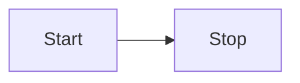

# 编辑器接口

## 编辑器接口

### 【总结】

不同的扩展

- Markdown后处理
  - 使用方法：`registerMarkdownPostProcessor()`
  - 运行次序：**在 Markdown 被处理成 HTML ==之后== 运行**
  - 使用场景：如果您想改变**阅读视图下如何将 Markdown 转换为 HTML**，可以考虑构建一个 [Markdown post processor](https://luhaifeng666.github.io/obsidian-plugin-docs-zh/zh2.0/editor/markdown-post-processing.html)（Markdown后处理器）
- 编辑器扩展
  - 使用方法：`registerEditorExtension()`
  - 使用场景：如果您想改变**文档在实时预览时的外观和感觉**，您需要构建一个编辑器扩展。包含 [View plugins](https://luhaifeng666.github.io/obsidian-plugin-docs-zh/zh2.0/editor/extensions/view-plugins.html) 以及 [State fields](https://luhaifeng666.github.io/obsidian-plugin-docs-zh/zh2.0/editor/extensions/state-fields.html)
- 视图插件（`CodeMirror`相关）
  - 使用方法：需要创建一个继承自 [`PluginValue`](https://codemirror.net/docs/ref/#view.PluginValue) 的类，并将它传给 [`ViewPlugin.fromClass()`](https://codemirror.net/docs/ref/#view.ViewPlugin^fromClass) 方法
  - 运行次序：**在视窗被重新计算 ==之后== 运行**
- 状态字段
  - 使用方法：`StateEffect `与`StateField`
  - 使用场景：让您管理自定义编辑器状态的 [编辑器扩展](https://luhaifeng666.github.io/obsidian-plugin-docs-zh/zh2.0/editor/extensions/)（不是很懂）


其他辅助手段

- 状态管理


### 编辑器 `Editor`

```tsx
const view = this.app.workspace.getActiveViewOfType(MarkdownView);
const editor = view.editor;			  // 注意这里的this不能为plugin_this。view的类型分别Any和View|null
const cursor = editor.getCursor();
```

#### 编辑器

[`Editor`](https://luhaifeng666.github.io/obsidian-plugin-docs-zh/zh2.0/reference/typescript/classes/Editor.html) 类透出在编辑模式下读取以及操作 Markdown 文档的操作。

如果您想在命令中访问编辑器，可以使用 [editorCallback](https://luhaifeng666.github.io/obsidian-plugin-docs-zh/zh2.0/user-interface/commands.html#editor-commands)。

如果您想在其他地方使用编辑器，您可以通过 `view` 访问到它。

```tsx
const view = this.app.workspace.getActiveViewOfType(MarkdownView);

// Make sure the user is editing a Markdown file.
if (view) {
  // highlight-next-line
  const cursor = view.editor.getCursor();

  // ...
}

```


> TIP
>
> Obsidian 使用 [CodeMirror](https://codemirror.net/) (CM) 作为底层文本编辑器，并且将 CodeMirror 作为 API 的一部分暴露出来。
> `Editor` 作为CM5（桌面端）和 CM6（移动端）中的桥接功能而被抽象出来。使用 `Editor` 而不是直接访问 CodeMirror，那么您的插件就可以在两个平台上都可以运行。


#### 在光标处插入文本

[`replaceRange()`](https://luhaifeng666.github.io/obsidian-plugin-docs-zh/zh2.0/reference/typescript/classes/Editor.html#replacerange) 方法用于替换选中的文本。如果您没有选中文本，那么文本将会在光标处被插入。

下例中的指令会将当前日期插入光标所在位置：

```tsx
import { Editor, moment, Plugin } from "obsidian";

export default class ExamplePlugin extends Plugin {
  async onload() {
    this.addCommand({
      id: "insert-todays-date",
      name: "Insert today's date",
      editorCallback: (editor: Editor) => {
        // highlight-next-line
        editor.replaceRange(moment().format("YYYY-MM-DD"), editor.getCursor());
      },
    });
  }
}

```


#### 替换当前选中的内容

如果您想编辑选中的文本，使用 [`replaceSelection()`](https://luhaifeng666.github.io/obsidian-plugin-docs-zh/zh2.0/reference/typescript/classes/Editor.html#replaceselection) 方法去替换选中的文本。

下例中的指令读取当前选中的内容并替换成大写：

```tsx
import { Editor, Plugin } from "obsidian";

export default class ExamplePlugin extends Plugin {
  async onload() {
    this.addCommand({
      id: "convert-to-uppercase",
      name: "Convert to uppercase",
      editorCallback: (editor: Editor) => {
        // highlight-start
        const selection = editor.getSelection();
        editor.replaceSelection(selection.toUpperCase());
        // highlight-end
      },
    });
  }
}

```


### Markdown后处理 `registerMarkdownPostProcessor()`

英语：这里的post有 在……之后 的意思

#### Markdown后处理

您知道么，您可以通过类似以下文本创建 `mermaid` 代码块，以在在 Obsidian 中创建 [Mermaid](https://mermaid-js.github.io/) 图表？

如果您想要改变 Markdown 文档在**预览模式下**的渲染方式，您可以添加自己的 **Markdown 后处理器**。
见名知意，该后处理器**在 Markdown 被处理成 HTML ==之后== 运行**。它可以让您添加，删除，或者替换渲染后的文档中的[HTML 元素](https://luhaifeng666.github.io/obsidian-plugin-docs-zh/zh2.0/user-interface/html-elements.html)。

区别

- 后处理器：**在 Markdown 被处理成 HTML ==之后== 运行**
- 视图插件：**在视窗被重新计算 ==之后== 运行**

下例搜索包含在两个冒号 `:` 之间的内容，并将其替换为恰当的 emoji 表情：

```js
import { Plugin } from "obsidian";
import { Emoji } from "./emoji";

export default class ExamplePlugin extends Plugin {
  async onload() {
    // highlight-next-line
    this.registerMarkdownPostProcessor((element, context) => {
      const codeblocks = element.querySelectorAll("code");

      for (let index = 0; index < codeblocks.length; index++) {
        const codeblock = codeblocks.item(index);
        const text = codeblock.innerText.trim();
        const isEmoji = text[0] === ":" && text[text.length - 1] === ":";

        if (isEmoji) {
          // highlight-next-line
          context.addChild(new Emoji(codeblock, text));
        }
      }
    });
  }
}

```

`Emoji` 类继承自 [`MarkdownRenderChild`](https://luhaifeng666.github.io/obsidian-plugin-docs-zh/zh2.0/reference/typescript/classes/MarkdownRenderChild.html), 并用带有表情符号的 `span` 元素替换代码块:

```js
import { MarkdownRenderChild } from "obsidian";

// highlight-next-line
export class Emoji extends MarkdownRenderChild {
  static ALL_EMOJIS: Record<string, string> = {
    ":+1:": "👍",
    ":sunglasses:": "😎",
    ":smile:": "😄",
  };

  text: string;

  constructor(containerEl: HTMLElement, text: string) {
    super(containerEl);

    this.text = text;
  }

  onload() {
    // highlight-start
    const emojiEl = this.containerEl.createSpan({
      text: Emoji.ALL_EMOJIS[this.text] ?? this.text,
    });
    this.containerEl.replaceWith(emojiEl);
    // highlight-end
  }
}

```


#### 后处理 Markdown 代码块

您知道么，您可以通过类似以下文本创建 `mermaid` 代码块，以在在 Obsidian 中创建 [Mermaid](https://mermaid-js.github.io/) 图表？

~~~md

~~~

如果更改为预览模式，代码块中的文本变为下图：

【Mermaid效果】

如果您想添加自己的类似以下 Mermaid 的自定义代码块，您可以使用 [`registerMarkdownCodeBlockProcessor`](https://luhaifeng666.github.io/obsidian-plugin-docs-zh/zh2.0/reference/typescript/classes/Plugin_2.html#registermarkdowncodeblockprocessor)。
以下示例**将包含 CSV 数据的代码块呈现为表格**

```js
import { Plugin } from "obsidian";

export default class ExamplePlugin extends Plugin {
  async onload() {
    this.registerMarkdownCodeBlockProcessor("csv", (source, el, ctx) => { // registerMarkdownCodeBlockProcessor
      const rows = source.split("\n").filter((row) => row.length > 0);

      const table = el.createEl("table");
      const body = table.createEl("tbody");

      for (let i = 0; i < rows.length; i++) {
        const cols = rows[i].split(",");

        const row = body.createEl("tr");

        for (let j = 0; j < cols.length; j++) {
          row.createEl("td", { text: cols[j] });
        }
      }
    });
  }
}

```

