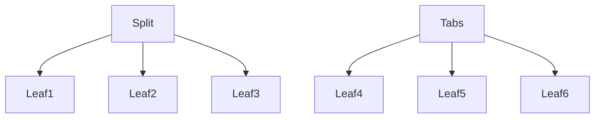
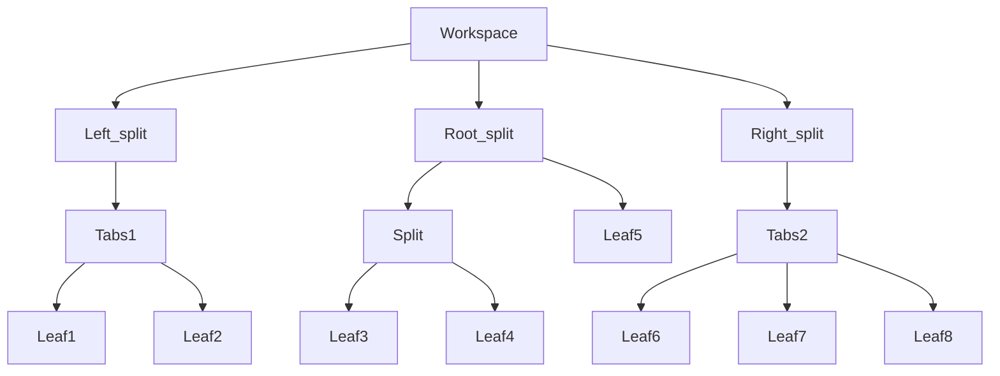
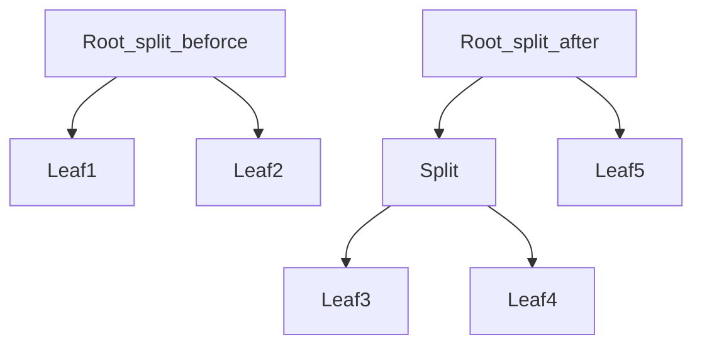
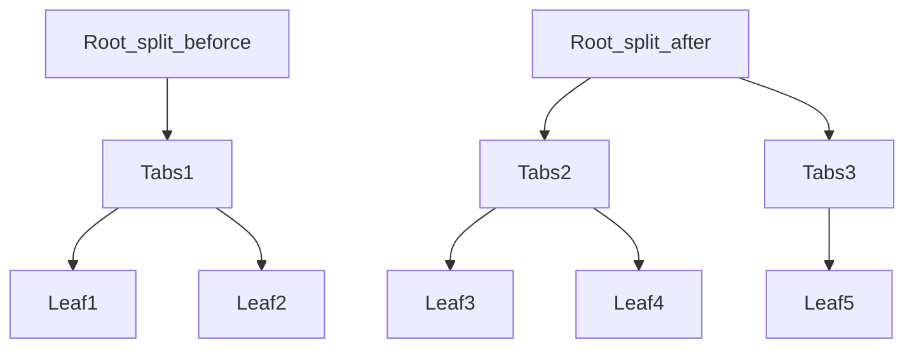

# 用户界面接口

## 用户界面接口

### 指令


### 快捷菜单

多种菜单

- **右键菜单**，通过`registerEvent`注册事件获取menu，使用`menu.addItem`方法
- `addRibbonIcon`，向**功能区**中添加一个项，并且可以展开子菜单
- 订阅 `file-menu` workspace 事件的方式，向**文件菜单**中添加一个菜单项
- 订阅 `editor-menu` workspace 事件的方式，向**编辑菜单**中添加一个菜单项

#### 右键菜单

这个文档里没有，我学习参考了Table Enhance的代码

```typescript
async onload() {
    // 创建右键菜单
    this.registerEvent(
        this.app.workspace.on("editor-menu", (menu: Menu, editor: Editor, view: MarkdownView) =>
            this.handleCreateTableGeneratorInMenu(menu, editor, view)
        )
    );
}

// 创建TG项，在右键菜单里
handleCreateTableGeneratorInMenu(menu: Menu, editor: Editor, view: MarkdownView) {
    menu.addItem((item) => {
        const itemDom = (item as any).dom as HTMLElement;
        itemDom.addClass("type-enhance-menu");
        item
            .setTitle("Type Enhance")
            .setIcon("table")
        	.onClick(async () => {
                this.createTableGeneratorMenu(editor, this);
                this.showTableGeneratorView(editor, this.tableGeneratorEl);
        	});
    });
}
```

另外还有段代码，但好像没什么用

```typescript
async onload() {
    // 在0.15.0等新版本中使用时，在多个窗口中处理相同的mouseevent
    if (requireApiVersion("0.15.0")) {
    	this.registerTableGeneratorMenu();
    }
}

// 注册TG菜单
registerTableGeneratorMenu() {
    this.app.workspace.on('window-open', (leaf) => {
        this.registerDomEvent(leaf.doc, 'click', (evt: MouseEvent) => {
            const target = evt.target as HTMLElement;

            if (!this.tableGeneratorEl || !target) return;
            if (target.classList.contains("typora-enhance-menu") 
                || target.parentElement?.classList.contains("typora-enhance-menu") 
                || target.tagName == "BUTTON") return;
            if (this.tableGeneratorEl?.contains(target)) return;
            if (!activeDocument.body.contains(this.tableGeneratorEl)) return;

            this.tableGeneratorEl.detach();
        });
    });
}
```

子菜单（）

```typescript
async onload() {
    // 选中单击并取消菜单，如果单击在菜单之外
	this.registerDomEvent(window, 'click', (evt: MouseEvent) => this.handleHideTableGeneratorMenu(evt));
}

// 创建TG菜单
createTableGeneratorMenu(editor: Editor, plugin: TyporaPlugin) {
    // 检查这个tableGeneratorEl是否已经创建，如果已经创建，则删除它
    // 用于多弹窗
    if (this.tableGeneratorEl && !activeDocument.body.contains(this.tableGeneratorEl)) this.tableGeneratorEl.detach();

    this.tableGeneratorEl = (requireApiVersion("0.15.0") ? activeDocument : document)?.body.createEl("div", { cls: "table-generator-view" });

    this.tableGeneratorEl.hide();
	// 注意这里的 TableGenerator 是 `import TableGenerator from "./ui/TableGenerator.svelte";`  导入的
    this.tableGeneratorComponent = new TableGenerator({
        target: this.tableGeneratorEl,
        props: { editor: editor, plugin: plugin }
    });
}

// 展示TG菜单
showTableGeneratorView(editor: Editor, tableGeneratorBoard: HTMLElement | null) {
    if (!tableGeneratorBoard) return;

    const cursor = editor.getCursor('from');
    let coords: Coords;

    // 使用适当的CM5或CM6接口获取光标位置
    if ((editor as any).cursorCoords) {
        coords = (editor as any).cursorCoords(true, 'window');
    } else if ((editor as any).coordsAtPos) {
        const offset = editor.posToOffset(cursor);
        coords = (editor as any).cm.coordsAtPos?.(offset) ?? (editor as any).coordsAtPos(offset);
    } else {
        return;
    }

    const calculateTop = (requireApiVersion("0.15.0") ?
                          activeDocument : document)?.body.getBoundingClientRect().height - coords.top - coords.height;
    tableGeneratorBoard.style.transform = "translate(" + (coords.left) + "px, " + "-" + (calculateTop) + "px" + ")";
    tableGeneratorBoard.style.display = 'unset';
}

// 隐藏TG菜单
handleHideTableGeneratorMenu(evt: MouseEvent) {
    const target = evt.target as HTMLElement;

    if (!this.tableGeneratorEl || !target) return;
    if (target.classList.contains("typora-enhance-menu") ||
        target.parentElement?.classList.contains("typora-enhance-menu") ||
        target.tagName == "BUTTON") return;
    if (this.tableGeneratorEl?.contains(target)) return;
    if (!document.body.contains(this.tableGeneratorEl)) return;

    this.tableGeneratorEl.detach();
}
```

#### 功能区菜单（context menu，其实应该叫ribbon menu才对）

简易版

```typescript
const ribbonIconEl = this.addRibbonIcon('dice', 'TyporaEnhance', (evt: MouseEvent) => {
    new Notice('This is a TyporaEnhance notice!');
});
```

示例版（图标菜单）

```typescript
import { Menu, Notice, Plugin } from "obsidian";

export default class ExamplePlugin extends Plugin {
  async onload() {
    // 快捷菜单
	this.addRibbonIcon("dice", "Open menu", (event) => {
      const menu = new Menu(this.app);	// 会报错：应有 0 个参数，但获得 1 个。可以不管

      menu.addItem((item) =>
        item
          .setTitle("Copy")
          .setIcon("documents")
          .onClick(() => {
            new Notice("Copied");
          })
      );

      menu.addItem((item) =>
        item
          .setTitle("Paste")
          .setIcon("paste")
          .onClick(() => {
            new Notice("Pasted");
          })
      );

      menu.showAtMouseEvent(event);		// 打开鼠标点击的菜单
    });
  }
}

```

> [!tip]
>
> 如果您需要控制菜单出现的位置，您可以使用 `menu.showAtPosition({ x: 20, y: 20 })` 去打开相对 Obsidian 窗口左上角相应位置的菜单。

#### 文件菜单（file-menu）

```typescript
this.registerEvent(
    this.app.workspace.on("file-menu", (menu, file) => {
        menu.addItem((item) => {
            item
                .setTitle("Print file path 👈")
                .setIcon("document")
                .onClick(async () => {
                new Notice(file.path);
            });
        });
    })
);
```

#### 编辑菜单（editor-menu）

```typescript
this.registerEvent(
    this.app.workspace.on("editor-menu", (menu, editor, view) => {
        menu.addItem((item) => {
            item
                .setTitle("Print file path 👈")
                .setIcon("document")
                .onClick(async () => {
                new Notice(view.file.path);
            });
        });
    })
);
```

### HTML元素

Obsidian API 中的几个组件，例如 [设置选项卡 ](https://marcus.se.net/obsidian-plugin-docs/user-interface/settings)，公开 *了容器元素* ：

```tsx
import { App, PluginSettingTab } from "obsidian";

class ExampleSettingTab extends PluginSettingTab {
  plugin: ExamplePlugin;

  constructor(app: App, plugin: ExamplePlugin) {
    super(app, plugin);
    this.plugin = plugin;
  }

  display(): void {
    let { containerEl } = this;

    // ...
  }
}
```

容器元素是 `HTMLElement`使在 Obsidian 中创建自定义界面成为可能的对象

#### 使用创建 HTML 元素 `createEl()`

每一个 `HTMLElement`，包括容器元素，公开了一个 `createEl()`创建一个方法 `HTMLElement`在原始元素下。 

例如，您可以通过以下方式添加 `<h1>`容器元素内的标题元素： 

```ts
containerEl.createEl("h1", { text: "Heading 1" });
```

`createEl()`返回对新元素的引用： 

```ts
const book = containerEl.createEl("div");
book.createEl("div", { text: "How to Take Smart Notes" });
book.createEl("small", { text: "Sönke Ahrens" });
```

注意这个是OB接口提供的快捷接口，原生js的不是这样的。

```js
// 原生js方式
const div = document.createElement("div");
div.addClass("abReplace")
div.setAttribute("style", "background-color: #272e3a")
div.innerText = "👉" + this.text;

// Obsidian.d.ts里的方法
const div = document.createDiv({	// createEl
    cls: ["abReplace"],
    attr: {style: "background-color: #272e3a"}
})

// 【区别】他们不同的
Document.createElement
HTMLElement.createEl		// 继承树：Node-->Element-->HTMLElement/HTML{Div}Element
```

#### 元素样式

您可以通过添加一个自定义 CSS 样式到您的插件 `styles.css`插件根目录下的文件。  为上一本书示例添加一些样式

```css
.book {
  border: 1px solid var(--background-modifier-border);
  padding: 10px;
}

.book__title {
  font-weight: 600;
}

.book__author {
  color: var(--text-muted);
}
```

要使 HTML 元素使用样式，请设置 `cls`HTML 元素的属性： 

```ts
const book = containerEl.createEl("div", { cls: "book" });
book.createEl("div", { text: "How to Take Smart Notes", cls: "book__title" });
book.createEl("small", { text: "Sönke Ahrens", cls: "book__author" });
```

#### 条件格式

如果你想根据用户的设置或其他值来改变一个元素的风格，使用 `toggleClass` 方法:

```ts
element.toggleClass("danger", status === "error");
```

### 图标

Obsidian API 中的一些 UI 组件允许您配置与之对应的icon。您可以从内置的 icon 中选择一个，或者添加自定义的icon。

#### 浏览可用的 icon

浏览 [lucide.dev](https://lucide.dev/) 站点以查看所有可用的图标以及对应的名称。

#### 绘制 icons


#### 添加您自己的 ico


### 用户界面


### 对话框

#### 创建对话框

```js
import { App, Modal } from "obsidian";

export class ExampleModal extends Modal {
  constructor(app: App) {
    super(app);
  }

  onOpen() {	// onOpen() 方法在对话框打开时被调用，它负责创建对话框中的内容。想要获取更多信息，可以查阅 HTML elements。
    let { contentEl } = this;
    contentEl.setText("Look at me, I'm a modal! 👀");
  }

  onClose() {	// onClose() 方法在对话框被关闭时调用，它负责清理对话框所占用的资源。
    let { contentEl } = this;
    contentEl.empty();
  }
}

```

#### 打开对话框

要想打开一个对话框，需要创建一个 `ExampleModal` 的实例并调用其上的 [`open()`](https://luhaifeng666.github.io/obsidian-plugin-docs-zh/zh2.0/reference/typescript/classes/Modal.html#open) 方法:

```js
import { Plugin } from "obsidian";
import { ExampleModal } from "./modal";

export default class ExamplePlugin extends Plugin {
  async onload() {
    this.addCommand({
      id: "display-modal",
      name: "Display modal",
      callback: () => {
        new ExampleModal(this.app).open();
      },
    });
  }
}

```

#### 接受用户输入

```js
import { App, Modal, Setting } from "obsidian";

// 定义输入框
export class ExampleModal extends Modal {
  result: string;
  onSubmit: (result: string) => void;

  constructor(app: App, onSubmit: (result: string) => void) {	// 传入回调函数
    super(app);
    this.onSubmit = onSubmit;
  }

  onOpen() {
    const { contentEl } = this;

    contentEl.createEl("h1", { text: "What's your name?" });

    new Setting(contentEl)										// 输入框
      .setName("Name")
      .addText((text) =>
        text.onChange((value) => {
          this.result = value
        }));

    new Setting(contentEl)										// 提交按钮
      .addButton((btn) =>
        btn
          .setButtonText("Submit")
          .setCta()
          .onClick(() => {
            this.close();											// 关闭窗口
            this.onSubmit(this.result);
          }));
  }

  onClose() {
    let { contentEl } = this;
    contentEl.empty();
  }
}

// 打开输入框和获取返回
new ExampleModal(this.app, (result) => {
  new Notice(`Hello, ${result}!`);
}).open();
```

#### 从建议列表中选择

[`SuggestModal`](https://luhaifeng666.github.io/obsidian-plugin-docs-zh/zh2.0/reference/typescript/classes/SuggestModal.html) 是一个比较特殊的对话框，用于展示一个列表供用户选择

……

### 功能区操作


### 设置


### 状态栏


### 视图 View

#### 基本用法

视图决定 Obsidian 如何去展示内容。比如 file explorer, graph view, 以及 Markdown view 等都是视图。当然，您也可以为自己的插件创建一个可以更好的展示其内容的自定义视图。

要想创建一个自定义视图，需要创建一个继承自 [`ItemView`](https://luhaifeng666.github.io/obsidian-plugin-docs-zh/zh2.0/reference/typescript/classes/ItemView.html) 的类:

```typescript
import { ItemView, WorkspaceLeaf } from "obsidian";

export const VIEW_TYPE_EXAMPLE = "example-view";

export class ExampleView extends ItemView {
  constructor(leaf: WorkspaceLeaf) {
    super(leaf);
  }

  getViewType() {
    return VIEW_TYPE_EXAMPLE;
  }

  getDisplayText() {
    return "Example view";
  }

  async onOpen() {
    const container = this.containerEl.children[1];
    container.empty();
    container.createEl("h4", { text: "Example view" });
  }

  async onClose() {
    // Nothing to clean up.
  }
}

```

每个视图都由一个唯一的名称来标识，并且有几个操作需要您指定要使用的视图。
把它抽成一个常量，`VIEW_TYPE_EXAMPLE`，这是一个不错的方式。稍后您将在本指南中看到它。

- `getViewType()` 用于返回当前视图的唯一标识。必须override
- `getDisplayText()` 用于返回一个更加人性化的视图名称。必须override
- `onOpen()` 在视图打开时调用，它负责构建视图的内容。
- `onClose()` 在视图需要被关闭时调用，它负责释放视图占用的资源。

自定义视图需要在插件被启用时注册，并且在插件被禁用时释放。

```js
import { Plugin } from "obsidian";
import { ExampleView, VIEW_TYPE_EXAMPLE } from "./view";

export default class ExamplePlugin extends Plugin {
  async onload() {
    this.registerView(
      VIEW_TYPE_EXAMPLE,
      (leaf) => new ExampleView(leaf)
    );

    this.addRibbonIcon("dice", "Activate view", () => {
      this.activateView();
    });
  }

  async onunload() {
    this.app.workspace.detachLeavesOfType(VIEW_TYPE_EXAMPLE);
  }

  async activateView() {
    this.app.workspace.detachLeavesOfType(VIEW_TYPE_EXAMPLE);

    await this.app.workspace.getRightLeaf(false).setViewState({
      type: VIEW_TYPE_EXAMPLE,
      active: true,
    });

    this.app.workspace.revealLeaf(
      this.app.workspace.getLeavesOfType(VIEW_TYPE_EXAMPLE)[0]
    );
  }
}

```

[`registerView()`](https://luhaifeng666.github.io/obsidian-plugin-docs-zh/zh2.0/reference/typescript/classes/Plugin_2.html#registerview) 的第二个参数是一个工厂函数，用于返回您想注册的视图实例。

#### 其他补充

> [!warning]
>
> 永远不要在插件中管理对视图的引用，因为 Obsidian 可能会调用视图工厂函数多次。
> 为了避免视图中的副作用，在需要访问视图实例时使用 `getLeavesOfType()`。（和`getActiveViewOfType`有所不同）
>
> ```typescript
> this.app.workspace.getLeavesOfType(VIEW_TYPE_EXAMPLE).forEach((leaf) => {
>   if (leaf.view instanceof ExampleView) {
>     // Access your view instance.
>   }
> });
> ```

在 `onunload()` 方法中，确保在插件被禁用时清理视图：

- 通过调用 `close()` 方法允许视图自行清理。
- 分离使用视图的所有节点。

在您为插件注册了一个自定义视图后，您需要为用户提供一个激活它的方式。`activateView()` 是个很实用的方法，它做了以下三件事情：

- 使用自定义视图分离所有节点。
- 将自定义视图添加到正确的节点上。
- 显示包含自定义视图的节点。

> [!tip]
> 
> `activateView()` 方法限制您的插件一次最多显示一个视图。尝试注释掉对 `detachLeavesOfType()` 的调用，以允许用户创建多个视图。每次调用 `activateView()`。

用户如何激活视图的方式取决于您。这是使用 [ribbon action](https://luhaifeng666.github.io/obsidian-plugin-docs-zh/zh2.0/user-interface/ribbon-actions.html) 的例子，当然您也可以使用 [指令](https://luhaifeng666.github.io/obsidian-plugin-docs-zh/zh2.0/user-interface/commands.html)。

### 工作区

#### 工作区

Obsidian 允许您配置在任何指定的时间对您可见的内容。当您不需要文件搜索的时候隐藏它、并列显示多个文档、或者在您编辑文档的时候显示文档大纲。关于应用内的可见内容配置窗口在 *workspace* 配置项中。

workspace 是[树形结构](https://en.wikipedia.org/wiki/Tree_(data_structure))的, 树上的每一个节点都是一个 [工作区项](https://luhaifeng666.github.io/obsidian-plugin-docs-zh/zh2.0/reference/typescript/classes/WorkspaceItem.html)。 有两种类型的工作区项： [*父节点*](https://luhaifeng666.github.io/obsidian-plugin-docs-zh/zh2.0/reference/typescript/classes/WorkspaceParent.html) and [*叶子节点*](https://luhaifeng666.github.io/obsidian-plugin-docs-zh/zh2.0/reference/typescript/classes/WorkspaceLeaf.html)。 两者之间的主要区别在于 *parents* 可以包含 *leaves* 以及其他 *parents* ，而 *leaves* 不可以包含任何其他项。

*parents* 也存在两种类型， [*splits*](https://luhaifeng666.github.io/obsidian-plugin-docs-zh/zh2.0/reference/typescript/classes/WorkspaceSplit.html) 以及 [*tabs*](https://luhaifeng666.github.io/obsidian-plugin-docs-zh/zh2.0/reference/typescript/classes/WorkspaceTabs.html), 用来决定其中的子项如何呈现给用户:



-   split 沿垂直或水平方向依次排列其子项。
-   tabs 每次只显示一个子项。

在 workspace 下面有三种特殊的 split: *left*, *right*, and *root* 。下图是典型的 workspace 示例：



leaf 是一个能以不同形式展示内容的窗口。leaf 的类型决定了内容该要如何展示，以及对应哪个具体的 *view*。举个例子，一个 `graph` 类型的 leaf 对应显示 [graph view](https://help.obsidian.md/Plugins/Graph+view)。

#### Splits

默认情况下，root split 按照垂直方向排列。当您创建了一个新的 leaf，Obsidian 在用户界面中创建一个新列。当您拆分一个 leaf，被拆分出来的 leaves 会被添加到新的 split 中去。当没有限制 root split 的层级时，实际上每个层级的实用性会降低。



左右的 splits 的工作方式略有不同。当您拆分一个 leaf 到侧边栏，Obsidian 会生成一个新的 tabs，并将新的 leaf 插入到其中。事实上，这意味着它们在任何时候只能拥有三层的 workpace，并且直接子级必须是 tabs 。



#### 检查工作区

您可以通过 [App](https://luhaifeng666.github.io/obsidian-plugin-docs-zh/zh2.0/reference/typescript/classes/App.html) 对象访问工作区。下例中打印了在工作区中每个 leaf 的类型:

```js
import { Plugin } from "obsidian";

export default class ExamplePlugin extends Plugin {
  async onload() {
    this.addRibbonIcon("dice", "Print leaf types", () => {
      this.app.workspace.iterateAllLeaves((leaf) => {
        console.log(leaf.getViewState().type);
      });
    });
  }
}
```

#### Leaf lifecycle

插件可以向 workspace 中添加任意类型的 leaf，也可以通过 [自定义视图][custom views](https://luhaifeng666.github.io/obsidian-plugin-docs-zh/zh2.0/user-interface/views.html)。以下是一些添加 leaf 到 workspace 的方式。想要了解更多，可以查阅 [`Workspace`](https://luhaifeng666.github.io/obsidian-plugin-docs-zh/zh2.0/reference/typescript/classes/Workspace.html) 这篇文档。

- 如果您想在根 split 中添加一个新的 leaf， 使用 [`workspace.getLeaf(true)`](https://luhaifeng666.github.io/obsidian-plugin-docs-zh/zh2.0/reference/typescript/classes/Workspace.html#getleaf) 方法.
- 如果您想在侧边栏中添加任意一个新的 leaf，可以使用 [`workspace.getLeftLeaf()`](https://luhaifeng666.github.io/obsidian-plugin-docs-zh/zh2.0/reference/typescript/classes/Workspace.html#getleftleaf) 以及 [`workspace.getRightLeaf()`](https://luhaifeng666.github.io/obsidian-plugin-docs-zh/zh2.0/reference/typescript/classes/Workspace.html#getrightleaf)方法。两者都可以让您决定是否需要将 leaf 添加到新的 split 上。

您也可以使用 [`createLeafInParent()`](https://luhaifeng666.github.io/obsidian-plugin-docs-zh/zh2.0/reference/typescript/classes/Workspace.html#createleafinparent)方法在您选择的 split 中显式的添加 leaf。

除非明确删除，否则即使在插件被禁用后，插件添加到工作区上的任何 leaf 依旧会被保留。插件负责删除它们添加到 工作区的任何叶子节点。

要想从 workspace 中删除一个 leaf，在您想要删除的 leaf 上调用 [`detach()`](https://luhaifeng666.github.io/obsidian-plugin-docs-zh/zh2.0/reference/typescript/classes/WorkspaceLeaf.html#detach)方法。您也可以通过使用 [`detachLeavesOfType()`](https://luhaifeng666.github.io/obsidian-plugin-docs-zh/zh2.0/reference/typescript/classes/Workspace.html#detachleavesoftype).

#### Leaf 组

您可以使用 [linked panes](https://help.obsidian.md/User+interface/Workspace/Panes/Linked+pane) 方法来分配多个 leaf 到同一个组中以创建 [`setGroup()`](https://luhaifeng666.github.io/obsidian-plugin-docs-zh/zh2.0/reference/typescript/classes/WorkspaceLeaf.html#setgroup).

```js
leaves.forEach((leaf) => leaf.setGroup("group1");
```

