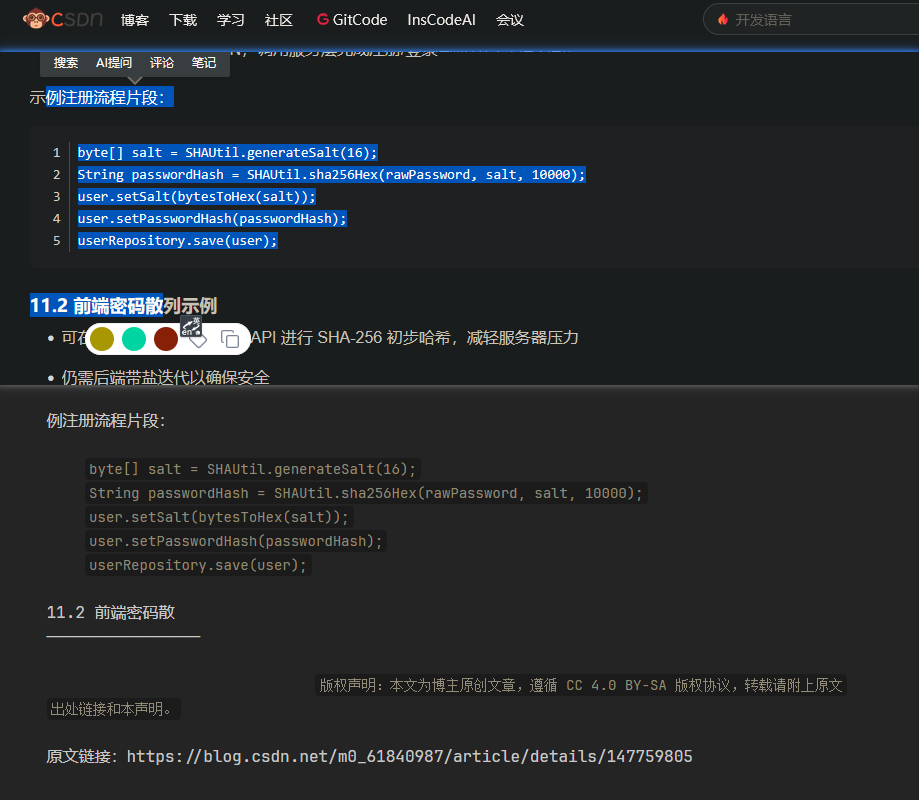

# 对于文章复制黏贴的优化

（注意，该篇内容主要适用于对文章的html进行优化，而不是优化html2md）

## 先来讨论代码块  

### 不同网站的优化性

一般代码块都会提供复制按钮，可以通过复制按钮轻松复制。但有时我们希望记笔记时，更倾向于连同代码块上下的文章部分一起复制。

而不同的网站对此的优化有所不同：  

(1) CSDN，屎  


  
(2) 博客园，完美  
  

  
(3) MdBook，屎  


(4) VuePress，对于代码块类型存在缺失  


### 不同高亮器的调研

- [highlightjs](https://highlightjs.org/)： 行为不对。其pre里直接不包code标签，复制出来是内联代码
- [cnblog 的 highlighter-hljs demo](https://www.cnblogs.com/vvital/p/18877128): 行为正确。pre包含带type class的code
- [prism](https://shiki.tmrs.site/guide/install)： 行为不对。pre包含不带type class的code

### 原理

然后我尝试追踪他们的区别，是有什么代码，影响了复制黏贴的内容。是有额外的js控制，还是纯属由dom结构决定。调试后发现是后者，只要给code加一个 `language-xxxx` 的class就可以了  
  


而之前在 Html2Md 笔记中，我们提到了，这种行为是由 Html2Md 来解析的。然后我侧了许多md环境：github typora obsidian 加浏览搜的两个在线md arya bejson。除了github，其他几个 md 编辑器都有相同的解析结果。

有可能他们都用相似的 html2md 库。而这种行为，确实也存在对应的规范，见commonmark: https://spec.commonmark.org/0.31.2/#fenced-code-blocks

该规范中，md2html时，是需要在code标签去标注 `language-codeType` 的

### 改善措施

一是查看我前面所说提到的不同高亮器的调研，去选用、反馈、魔改。有些我在反馈了，不知道读者阅读到这的时候，问题是否已经得到解决。

## 标题锚点的优化

### 问题

同理。简单来说就是：vuepress及很多博客系统都是 `hX` 标签下面放了一个 `a` 标签。所以复制出来会是这样的：


而有些不会，像博客园单纯是加了个id，没有加a标签，一样能满足锚点跳转的需求。

### 不同网站的标题链接风格

- 无链接风格: [cnblogs](https://www.cnblogs.com/vvital/p/18877128), [juejin](https://juejin.cn/post/7156565703716405255#heading-1), [segmentfault](https://segmentfault.com/a/1190000046534134#item-1) (其中cnblogs是用了一个button onclick)
- linkAfterHeader风格: github
- linkInsideHeader风格: vuepress
- ...

而 [markdown-it-anchor README](github.com/valeriangalliat/markdown-it-anchor) 也有相关的选项来控制风格的：

- 不启用，即只生成标题，不生成a链接
- linkInsideHeader
- linkAfterHeader
  - 又分为: `['visually-hidden', 'aria-label', 'aria-describedby', 'aria-labelledby']`
- ariaHidden
- headerLink
- ...

### 改善措施

我之前是部署vuepress网站遇到这个问题，还以为是anchor插件的问题。后来发现anchor那边默认标题是不带`a`的，vuepress改过默认行为：

https://github.com/vuepress/core/blob/769f8cf2ee12d68b678b1ff7fdab305df6cfe45b/packages/markdown/src/markdown.ts#L65-L76

如果有同需求的，在vuepress中把anchor的permalink选项换回默认值就行，即

```ts
markdown: {
  anchor: {
    permalink: () => {},
  }
}
```


