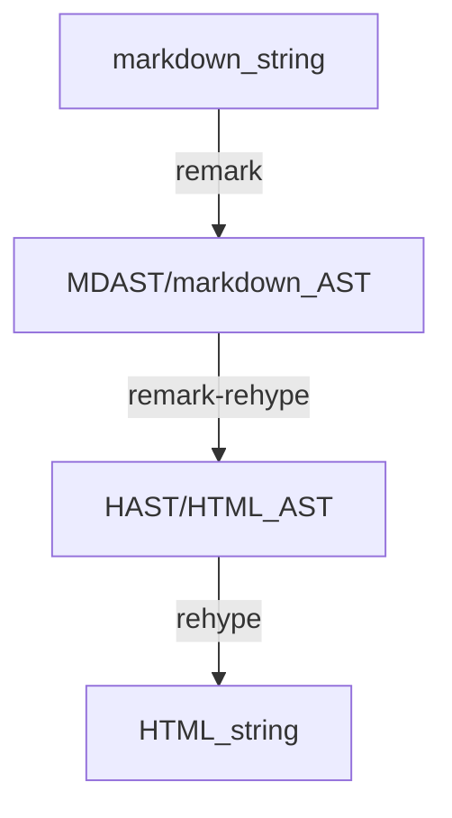

# Quartz Plugin Dev

> [!warning]
> 在此之前，你应该先阅读完 [官方文档-制作自己的插件](https://quartz.jzhao.xyz/advanced/making-plugins) 或 [译-制作自己的插件](译-制作自己的插件.md) 中的内容

## 官方文档

https://quartz.jzhao.xyz/advanced/making-plugins

制作

## 插件类别

插件接口类别有:

- transformers
  - name
  - textTransform
  - markdownPlugins
  - htmlPlugins
  - externalResource
- filters
- emitters

### 数据流程



### 代码示例

插件类别 OFM 插件为示例

quartz/quartz.config.ts

```typescript
const config: QuartzConfig = {
  configuration: {...}
  plugins: {
    transformers: [
      Plugin.ObsidianFlavoredMarkdown({ enableInHtmlEmbed: false }),
      Plugin.CrawlLinks({ markdownLinkResolution: "shortest" }),
    ],
    filters: [...],
    emitters: [...],
  }
}
export default config
```

quartz/plugins/transformers/ofm.ts

```typescript
export const ObsidianFlavoredMarkdown: QuartzTransformerPlugin<Partial<Options>> = (userOpts) => {
  ...
  return {
    name: "ObsidianFlavoredMarkdown",
    textTransform(_ctx, src) {
      // 预转换wiki链接（将锚点固定到可能包含非法语法（如代码块、LaTeX）的内容上）
      if (opts.wikilinks) {
        // 首先替换表格内的所有维基链接
        // 再将所有其他维基链接替换掉
      }
    },
    markdownPlugins(ctx) {
      const plugins: PluggableList = []
      plugins.push(() => {
        return (tree: Root, file) => {
          if (opts.wikilinks) {
            //
          }
          // ... 填充plugins
          mdastFindReplace(tree, replacements)
        }
      })
      // ... 填充plugins
      return plugins
    },
    htmlPlugins() {
      const plugins: PluggableList = [rehypeRaw]
      // ... 填充plugins
      return plugins
    },
    externalResources() {
      const js: JSResource[] = []
      const css: CSSResource[] = []
      // ... 填充 js 和 css
      return { js, css }
    },
  }
}
```

## GPT 分别解释各种类别

by gpt-5.1-codex-max

> 请补充文章，讲述各种插件类别(quartz4的三种主类别，和transformers的几种插件子类别)，他们分别的作用、负责什么。 并且尝试于 remark 插件进行对应。remark 插件相当于作用在哪个区域？其 mdast-util- 和 micromark-extension- 类别的部分又对应哪个区域？

Quartz 4 的插件分为三大类，它们按照「数据→结构→输出」的顺序协作：

1. transformers（转换器）
    - 作用：在 Markdown 源文档被解析、构建语法树（MDAST/HAST）以及最终渲染前，对文本或语法树进行转换与增强。
    - 责任：处理文本预转换、为 remark/rehype 提供插件、注入额外的 JS/CSS 资源等。
    - 输出：返回可能修改过的字符串、MDAST/HAST，或额外的资源清单。
2. filters（过滤器）
    - 作用：对已解析的页面/节点进行过滤，决定哪些内容继续进入后续流程。
    - 责任：根据路径、标签、Frontmatter、日期等条件筛选文档或节点。
    - 输出：保留下来的页面/节点集合。
3. emitters（发射器/生成器）
    - 作用：负责最终输出阶段，将处理过的页面/节点写出到目标形式。
    - 责任：生成静态文件（HTML、RSS/Atom、sitemap、assets 等），控制路径结构与生成策略。
    - 输出：最终的站点产物（静态文件）。

### transformers 的子接口与典型职责

每个 transformer 插件可以提供以下接口字段，用于在不同阶段介入处理：

- name：插件名称（用于标识与调试）。
- textTransform(ctx, src)：**纯文本级预处理**。在 Markdown 进入语法解析前运行，适合做快捷语法的预转换、批量替换（如 wiki 链接预处理）。
- markdownPlugins(ctx)：返回 remark 兼容的 MDAST 插件列表（PluggableList），在 **remark 阶段** 运行，处理 Markdown 语法树（MDAST）。
- htmlPlugins(ctx)：返回 rehype 兼容的 HAST 插件列表，在 **rehype 阶段** 运行，处理 HTML 语法树（HAST）；常见于添加属性、转换节点、支持原始 HTML。
- externalResources()：声明额外需要注入的 JS/CSS 资源（用于前端交互、样式补充等）。

> OFM（ObsidianFlavoredMarkdown）是一个 transformer 示例：  
> - 在 `textTransform` 里先预处理 wiki 链接；  
> - 在 `markdownPlugins` 里用 remark 插件对 MDAST 做进一步替换；  
> - 在 `htmlPlugins` 里用 rehype 插件处理 HTML AST；  
> - 在 `externalResources` 中声明所需的 JS/CSS。

### remark / rehype / micromark / mdast-util 的对应关系

- remark 插件：作用于 **remark 管线**，处理 **MDAST (Markdown AST)**。Quartz 的 `markdownPlugins` 即放入 remark 插件列表。
- rehype 插件：作用于 **rehype 管线**，处理 **HAST (HTML AST)**。Quartz 的 `htmlPlugins` 即放入 rehype 插件列表。
- micromark-extension-*：属于 **解析扩展**，影响 Markdown **词法/语法解析阶段**（tokenization）。通常与 remark 一起，用于自定义语法（如 wiki 链接、任务列表、表格等）。它在「解析前端」扩展语法，使得新的记号可以被解析进 MDAST。
- mdast-util-*：属于 **MDAST 转换/构建工具**，负责把 micromark 产生的 tokens 映射或处理成 **MDAST 节点**，或在 MDAST 上进行转换。这些工具通常配合 micromark-extension-* 使用。

#### 对应到 Quartz transformers 的“区域”比对

- textTransform：纯文本预处理层，尚未进入 remark/micromark。适合做字符串级替换、占位符展开等。
- micromark-extension-*：解析层扩展（tokenization）。在 remark 解析 Markdown 时介入，定义新语法记号。
- mdast-util-*：语法树构建/转换层（MDAST）。在 remark 构建或处理 MDAST 时介入，定义或操作节点形态。
- markdownPlugins（remark 插件）：在 **MDAST 层** 运行，可组合 mdast-util-*，消费 micromark 扩展的节点，或做树变换。
- htmlPlugins（rehype 插件）：在 **HAST 层/HTML AST** 运行，用于 HTML 级别的属性、结构、危险 HTML 解析（rehype-raw）等。
- externalResources：与 AST 无关，负责声明产出页面需要的前端资源。

### 小结：选用何处扩展？

- 需要新语法（如自定义标记、wiki 链接）：用 micromark-extension-* + mdast-util-*，并作为 remark 插件放入 `markdownPlugins`。
- 需要在解析前做大规模文本替换：用 transformer 的 `textTransform`。
- 需要对 Markdown 语法树做结构化改写（如批量插入节点、改属性）：用 remark 插件（`markdownPlugins`）。
- 需要对 HTML 语法树做处理或允许原始 HTML：用 rehype 插件（`htmlPlugins`），常配合 `rehype-raw`。
- 需要前端脚本/样式支持：在 `externalResources` 中声明 JS/CSS。


