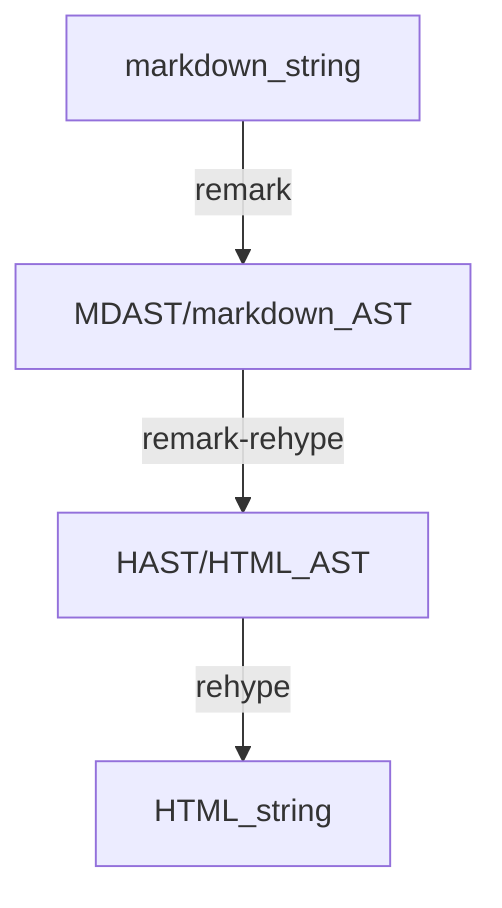

# 编写 remark 插件实现自定义扩展语法

(take from: http://garden.songxingguo.com/Web-Clip/@%E7%BC%96%E5%86%99-remark-%E6%8F%92%E4%BB%B6%E5%AE%9E%E7%8E%B0%E8%87%AA%E5%AE%9A%E4%B9%89%E6%89%A9%E5%B1%95%E8%AF%AD%E6%B3%95, 且带笔者 (LincZero) 补充)

## Unified，Remark 和 Rehype

之前搞旧版网站的时候，我研究过 用 markdown-it 写插件，它是一个 markdown 文件解析器，给它输入一个 markdown 格式的字符串，它可以输出编译后的 html。现在新版网站使用 Astro 作为框架，而 Astro 使用的是基于 unified 生态的 remark 和 rehype 来把 markdown 文本转化为 html 输出的。

### (1) Unified

简单来说，unified 提供了一个「用语法树来解析、检查、转化，以及序列化」文本内容的接口。这里我们的主题是 markdown，因此我们用 markdown 文本作为例子进行分析。具体到 markdown，基于 unified 的接口，我们可以实现

1. markdown 文本解析到 markdown 语法树 mdast；
2. 对 mdast 进行修改；
3. 把 mdast 序列化回 markdown；或转化为 html 语法树 hast，然后再把 hast 序列化为 html，从而实现 markdown 到 html 的转换。

下面的一个框图拷贝自 unified 的文档，它描述了 unified 中的 processor 的整个工作过程。Processor 下面有：

- Parser       | 负责把输入解析为语法树
- Transformers | 负责对语法树进行更改
- Compiler     | 负责序列化语法树得到输出

因为 unified 仅仅是一个接口，我们需要对其添加插件来让其具备具体的功能。插件可以通过修改 parser、transformer 或者 compiler，来实现不同的功能。

### (2) Remark

Remark 可以理解为给 unified 添加插件后的实例。Remark 对应两个不同的插件，分别是

- [remark-parse](http://garden.songxingguo.com/C-Knowledge/前端/博客/remark-parse)
  实例化 parser，使 parser 的输出为 mdast
  ?即: 解析, markdown_str -> mdast
- [remark-stringify](http://garden.songxingguo.com/Web-Clip/remark-stringify)
  实例化 compiler，使 compiler 的输出为 markdown
  ?即: 反序列化, mdast -> markdown_str

### (3) Rehype

Rehype 和 remark 一样，也是 unified 实例化后的结果，只不过 rehype 面向的是 html 文本。Rehype 也对应两个不同的插件，分别是

- rehype-parse
  实例化 parser，使 parser 的输出为 hast
  ?即: 解析, html_str -> hast
- rehype-stringify
  实例化 compiler，使 compiler 的输出为 html
  ?即: 反序列化, hast -> html_str

### 举例

有了 remark 和 rehype 这两个实现，我们就可以把 markdown 文本转化为 html 了：

```js
import {unified} from 'unified'
import remarkParse from 'remark-parse'
import remarkRehype from 'remark-rehype'
import rehypeStringify from 'rehype-stringify'
 
const file = await unified()
  .use(remarkParse)      // markdown_str -> mdast
  .use(remarkRehype)     // mdast -> hast
  .use(rehypeStringify)  // hast -> html_str
  .process('# Hello world!')
 
console.log(String(file))
```

这个代码用到了 3 个插件，分别是:

- remark-parse
- remark-rehype (把 mdast 转化为 hast，属于 transformer)
- rehype-stringify

### 数据流程




### **总结** (核心)

by LincZero

- unified 插件分类
  - (按转换过程分类)
    - Parser       | 负责把输入解析为语法树
      (通常在 micromark 组织，库名 `micromark-extension-xxx`)
    - Transformers | 负责对语法树进行更改
      (通常在 syntax-tree 组织，库名 `mdast-utils-xxx`)
    - Compiler     | 负责序列化语法树得到输出
  - (按格式类型分类)
    - Remark | Markdown string 相关
      (通常在 remarkjs 组织)
    - Rehype | Html string 相关
    - Retext | 自然语言 string 相关
    - (其他)
  - (两种分类互不干扰)
    - remark-parse     | 类别 2-1 + 1-1
    - remark-stringify | 类别 2-1 + 1-3
    - rehype-parse     | 类别 2-2 + 1-1
    - rehype-stringify | 类别 2-2 + 1-3
    - remark-rehype    | 类别 2-4 + 1-2

其中 parse 类别的插件开发很难，99% 的插件使用 str -> str 或 ast -> ast 来代替

## 增加新的语法：obsidian wikilink

上面所述的是一个标准的 markdown 到 html 的流程。但是，我们往往并不由此止步，比如，我们希望使用的 markdown 解析器支持更多的语法。如 Obsidian 的 wikilink：`[[target#heading|alias]]`，其中 target 是目标文件的路径，heading 是想要链接的对应文件中的 heading，而 alias 则是这个 wikilink 的别名。这就需要给 unified 添加额外的插件来实现对应的功能。

首先是需求分析：给 markdown 新增一个语法，我们需要

1. 对 parser 进行改变，让其解析 wikilink 并生成对应的 wikilink 语法树节点。
    remark-parse 已经实例化了 unified 接口的 parser，但是它只能处理标准的 markdown 语法，我们需要额外添加修改这个 parser 的插件，给这个 parser **加上处理 [wikilink](http://garden.songxingguo.com/Web-Clip/wikilink) 的能力**。
2. 对 transformer 进行必要的更改。我们还需要在 mdast 转化为 hast 的过程中，让我们生成的 mdast wikilink 节点转化成对应的 html `<a>` 标签对应的 hast 节点。
    一般我们通过 `remark-rehype` 实现 mdast 到 hast 的转变。我们需要让 `remark-rehype` 识别到我们自定义的 wikilink mdast 节点，让后将其转化为 html 的链接节点。

### Parser：在 remark 中加入 wikilink 功能

插件 remark-parse 底层使用的是 `mdast-util-from-markdown` 中的 `fromMarkdown` 函数来做 parser 的。而 `mdast-util-from-markdown` 又使用了 `micomark`。[micromark](http://garden.songxingguo.com/Web-Clip/micromark) 是一个轻量的 markdown 到 html 转化工具。它首先把 markdown 文本转化成各个对应的 token，然后基于这些 token 来生成 html。`mdast-util-from-markdown` 只使用了 `micromark` 的前半部分，并实现了 `micromark` 的 token 到 mdast 的转化。

所以，我们

1. 需要让 `micromark` 支持 wikilink 语法并生成对应的 wikilink token。
    这一步我们需要写 `micromark` 的插件。`micromark` 的插件分为两种，一种是 syntax extension，一种是 html extension。因为我们不需要 `micromark` 的 html 环节，所以只需写对应的 syntax extension 即可。如何写 syntax extension 可以参考 [creating a micromark extension](https://github.com/micromark/micromark#creating-a-micromark-extension)。
2. 让 `mdast-util-from-markdown` 支持 wikilink token 并生成对应的 mdast 的 wikilink 节点。
    有了 syntax extension 之后，micromark 将会输出新的我们自定的 wikilink token。这一步，我们需要写一个 `mdast-util-from-markdown` 的插件，来增加对 wikilink token 的处理功能。

### Transformer：wikilink 节点转化为 html 链接节点

幸运的是，`remark-rehype` 提供了一个便捷的功能：如果 mdast 节点的 `data` 属性下有 `h` 开头的属性，`remark-rehype` 会自动识别这些属性，并把它们转化为对应的 hast 节点。因此，我们可以把自定义的 mdast wikilink 节点的 `data` 属性中加入 `hName`、`hProperties` 和 `hChildren` 来直接实现转化。

### 代码

假设已经写好了 `micromark` 和 `mdast-util-from-markdown` 的插件，我们的 unified 插件就可以写成

```js
function remarkWikiLink() {
  const data = this.data(); // this is a reference to the processor
 
  function add(field, value) {
    if (data[field]) data[field].push(value);
    else data[field] = [value];
  }
 
  // add extensions to packages used by remark-parse
  // micromark extensions
  add("micromarkExtensions", myMicromarkPlugin);
  // mdast-util-from-markdown extensions
  add("fromMarkdownExtensions", myMdastUtilFromMarkdownPlugin);
}
 
export default remarkWikiLink;
```

使用的时候，

```js
import {unified} from 'unified'
import remarkParse from 'remark-parse'
import remarkRehype from 'remark-rehype'
import rehypeStringify from 'rehype-stringify'
 
import remarkWikiLink from 'yourfile'
 
const file = await unified()
  .use(remarkParse)
  .use(remarkWikilink)
  .use(remarkRehype)
  .use(rehypeStringify)
  .process('# Hello world, [[target#heading|alias]]')
 
console.log(String(file))
```

前面讲述的内容，有一个现成的插件可以参考：[remark-wiki-link](http://garden.songxingguo.com/Web-Clip/remark-wiki-link)，我的这篇文章也是基于这个插件写的。

## 增加新的语法：obsidian callout

Obsidian callout 语法的写法大体过程类似。我写的 `remark-callout` 插件已经开源于 GitHub，点击 [这里](https://github.com/rk-terence/gz-remark-callout) 直达仓库。


