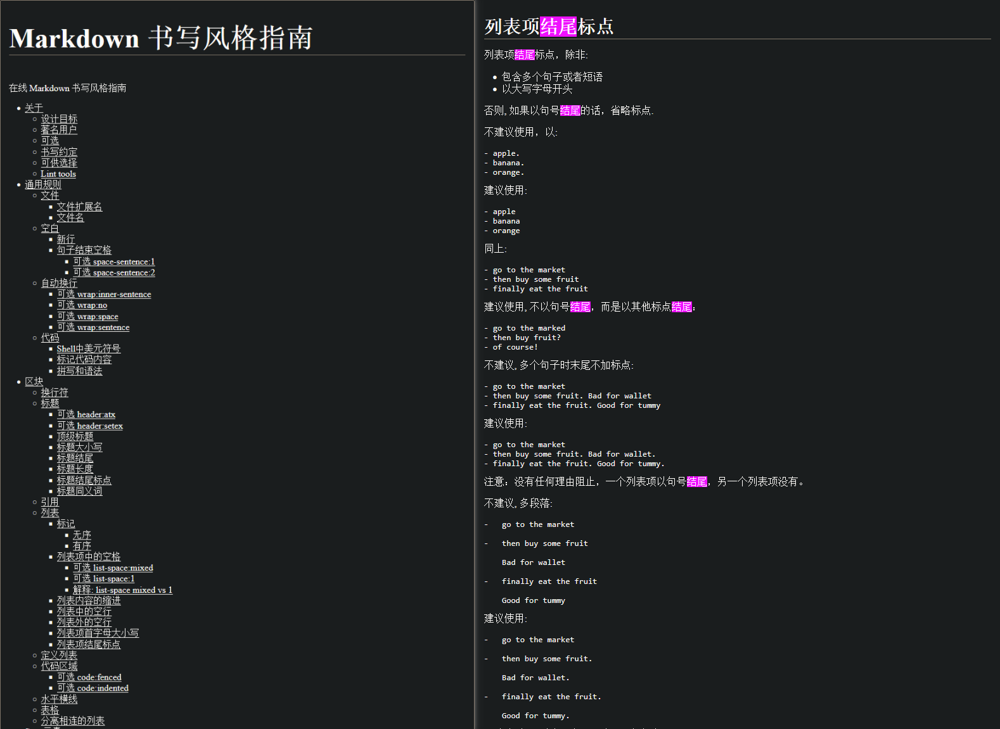

# Markdown书写风格

## 引言，列表末尾是否带句号

引言：你们的列表末尾习惯带句号吗？ 我个人时带时不带，但我通常来说很少一个列表项内有很多个句子，一般就一两个，不带末尾符号。 但最近看文章发现很多文章都喜欢带（哪怕是短句）  

## 书写风格是什么

今天好奇这个问题然后去搜了下，还有书写风格指南这东西

> [!warning]
> 
> 注意区分风格 Markdown 和书写风格
> 
> - 风格 Markdwon: 详见 [Markdown规范](./Markdown规范.md)
> - Markdwon 书写风格: 因为Markdown本身约束较低，写法多样 (如标题就有两种不同的定义方法)，旨在使用更严格的规范来统一风格

## 书写风格举例

[Markdown 书写风格指南](https://einverne.github.io/markdown-style-guide/zh.html) 提出: 包含多个句子或短语，或以大写字母开头，才加，否则不加

除了一开始引言提出的问题外，还约束了许多其他情况。例如应该用 Atx 而非 Setex (下划线定义) 标题等

## 更多书写风格参考

一些其他的书写风格

- [Markdown 书写风格指南](https://einverne.github.io/markdown-style-guide/zh.html) einverne
- [Markdown 风格指南](https://github.com/kenpusney/markdown-style-guide) kenpusney
- [Markdown 风格指南](https://stdrc.cc/style-guides/markdown) stdrc
- [Markdown 编写规范](https://github.com/fex-team/styleguide/blob/master/markdown.md)  fex-team
- [markdown书写风格(整理后)](https://blog.csdn.net/seling_you/article/details/118675461)
- [英语技术文档中如何正确使用无序列表和有序列表？](https://zhuanlan.zhihu.com/p/61673634)

## 启发

**启发1**: 多人协同 Markdown 文档可以尝试定义一篇书写风格用于更严格的约束

像编程语言中的风格文件那样，如 `.eslintrc` `.clang-format`

**启发2**: 在 obsidian 中可以借助 linter 插件更好地规范书写风格。多人协作时可以共享 linter 的配置，从而更好地规范书写统一性

**启发3**: 不同人写的风格指南我看有一些是冲突的，仅抛砖引玉，不适合无脑遵循。可以根据个人习惯调整

**启发4**: 额外约束并不一定适合所有人，像一些人喜欢更自由更宽松的写法，或者一些人喜欢摘录文章并不想去手动调整或用 linter 插件去调整

例如我更倾向于让整个列表的所有列表项保持相同的风格（或单篇文章使用相同风格），但不同的列表项由于有是复制过来或直接摘录文章下来的，有时我确实也懒得调

**启发5**: 可以参考 Obsidian 的 [obsidian-skill](https://github.com/kepano/obsidian-skills)，他把 OFM 写成了 Skill，可以让 ai 书写出带 OFM 的 Markdwon。同理，我们也可以将自己的 Markdown 书写风格写成 Skill，让 AI 书写带自己书写风格的 Markdown

