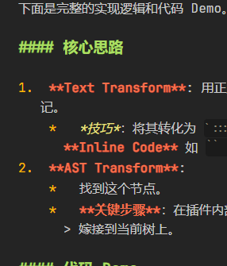
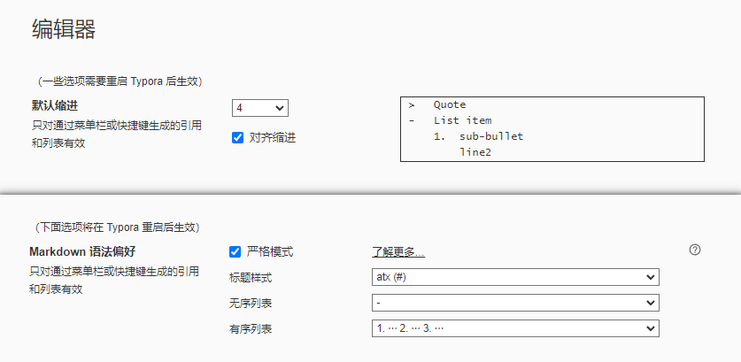
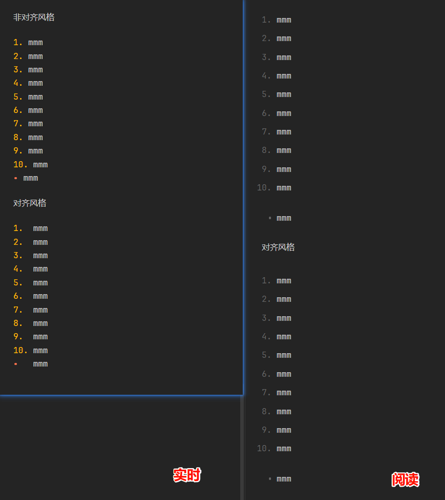

# Markdown风格之对齐缩进

take from LincZero 2025-12-21 在 Obsidian 群中的发言

## 问题背景

> 

话说列表的 `-` 后面接着三个空格是哪些软件会这样做的 (一般一个空格比较多吧)，怎么好像我 gemini 源码形式复制出来的都这样。还喜欢用 `*`

## 场景

前面提到的 gpt 有时会生成这种风格的 Markdown。然后 Typora 也能用这种风格:



typora设置中，如果开启默认缩进数为4+开启对齐缩进，也是这种

## 优点

(1) 好处是是主要针对**有序列表数>9**的情况，以及有序列表和无序列表**混用**的情况

```markdown
1,  aaa
10, aaa
-    aaa
```

让这里的aaa对是对齐状态

否则：

```markdown
- aaa
1, aaa
10, aaa
```

(2) 并且**如果你的缩进数**是4空格或宽度为4空格的tab时，则对齐度更好

例如:

```markdown
-   缩进对齐风格
    这里前面有四个空格的宽度，刚好与上一行的文本开始位置进行对齐
    
- 非缩进对齐风格
    这里前面有四个空格的宽度，无法与上一行的文本开始位置进行对齐
    
- 非缩进对齐风格
  这里前面有两个空格的宽度。如果你的设置中的缩进数是2空格或宽度为2空格的tab时，反过来。
  非缩进对齐风格能更好地与上一行文本对齐
```

感觉是这两个原因

## 缺点

反正我不喜欢这种写法。原因是**没那么所见即所得**，**还占地方**。如在 Obsidian 编辑器中:



在obsidian的环境下：
像这里，实时模式中的 `-` 和他后面的内容隔得太远了，丑陋至极

而我使用的无序列表是远多于有序列表的，也很少混用。
牺牲无序列表体验去优化有序列表的体验我觉得不妥

但typora或一些软件可能会使用这种方法也是可以理解的，因为typora那边无论使用哪种对齐格式，看起来都是一样的（所见即所得更好），他的实时编辑模式会消除这种源码上的细节

## 为什么AI喜欢生成对齐缩进风格的Markdown?

ai 的训练数据分两种情况，一种是 Markdown，一种是 HTML2Markdown

### Markdwon 源

对于前者。如果是个人书写的话我还是更喜欢 `- xxx`，书写更方便，源码看着也更整洁舒服。不过也不排除有人的书写笔记有类似的排版 (如开启了缩进对齐的 Typora)

### HTML to markdown 源

第二种则比较多。ai 训练资料主要是爬网站 html，有源码的情况 (如 github 上一些 markdown 库) 比较少，更多的是很多博客文章的私域文章

所以占比相当大一部分训练所使用的 Markdwon 文章比较依赖于 HTML2Markdown 库的行为。如 LincZero 开发的 AnyMenu 之前版本中的 html2md 库 —— turndown 的默认行为就是生成 `*  ` 这种缩进对齐风格的 Markdown

```js
import TurndownService from 'turndown'
// html2md(clipboard_selectedText_html) // html2md 库太老了，使用更现代的html2md库: turndown

const turndownService = new TurndownService()

selectedText = turndownService.turndown(clipboard_selectedText_html)
```

而这也极大程度影响了 GPT 生成的 Markdown 的风格

喜欢标题/列表头/表格头额外进行加粗的，大概率也是这种原因

以表格头为例，正常的做法应该是使用 css 来进行表头的加粗，但很多老 html 都选择使用了 `strong` `bord` `b` 等加粗标签的形式来进行加粗

### html2md 库补充

还是以 turndown 为例，他里面有很多默认配置我个人认为都比较糟糕。以下是需要修改的配置:

```js
// html2md 库的配置
const turndownService = new TurndownService({
  // option docs: https://github.com/mixmark-io/turndown#options
  headingStyle: 'atx',      // 标题样式 (默认setext，会用 === 和 --- 表示h1和h2)
  hr: '---',                // 水平线样式 (默认 * * *)
  bulletListMarker: '-',    // 列表符号 (默认*)
  codeBlockStyle: 'fenced', // 代码围栏风格 (默认 indented 缩进)
  fence: '```',             // 代码块围栏标识 (默认值)
  emDelimiter: '*',         // 斜体标识 (默认_)
  strongDelimiter: '**',    // 加粗标识 (默认值)
  linkStyle: 'inlined',     // 链接样式 (默认值，`[]()` 形式而非注脚形式)
  linkReferenceStyle: 'full', // 注脚形式 (默认值)
  preformattedCode: false,  // 代码中折叠还是保留空格 (默认值，没看懂)
})

// 取消 "缩进对齐"。即 `-   aa` 变成 `- aa`
turndownService.addRule('listItemNoIndent', {
  filter: 'li',
  replacement(content) {
    return '- ' + content.trim() + '\n'
  }
})
```


