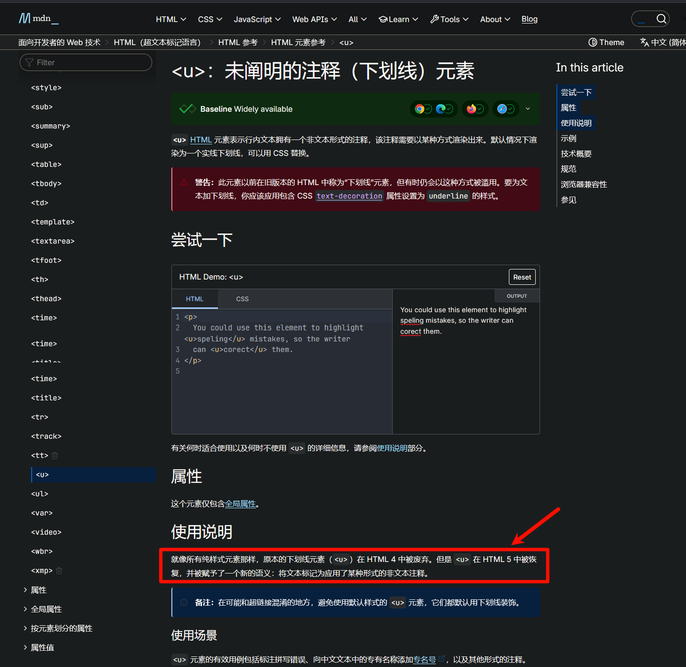

# Md实用标签3

取自 2025-10-31 Obsidian 群 LincZero 发言

## 下划线问题

`s` 标签这东西，其实差点被弃用了，或者说已经被半弃用了，现在这东西的语义其实不是下划线了

ins比u好，但其实他们的含义也不同。ins不完全表示下划线

但语义上，HTML `<ins>` 元素定义已经被插入文档中的文本
和 `<del>` 元素是一对的。del 标签用来代替被弃用的 s 标签

u 是 underline 的意思，ins 是 insert 的意思

总结下他们的含义：(新表示html5，旧表示html4)

- 旧u: 下划线，纯样式声明，被弃用
- 旧s：删除线，纯样式声明，被弃用
- 新u: 将文本标记为应用了某种形式的非文本注释
- 新ins: 被插入文档中的文本
- 新del: 被从文档中删除的文字内容

这里就牵扯到了一个问题：你应用的是格式还是语义

像删除线，他的样式和标签含义是一致的，就是删除，这点大家都没有歧义对吧

但像旧u，他只是下划线，他本身没有标签含义。
而ins，虽然他的样式可能表现为下划线，但他的含义是新增的文本

那么如果你只想表示下划线，而不想表示这个标签含义……或反过来……感觉有点怪……

## 标签的语义和样式问题

emmm，所以HTML5的思想应该是，标签不表示任何样式，只表示含义
含义是含义、样式是样式

如果我们想表示重点，可能会加粗、可能会斜体、可能会下滑线……
我们想表示新增，你可以是下滑线、也可以是绿色的背景 (diff，绿红分别表示添加和删除)

我感觉这种设计有点道理……因为斜体可能在不同国家中，可能是加重，也可能是减弱。例如勾选和划掉，我们国内勾是的的，但日本的勾是错的，圈才是对的

像英语没有书名号，他们表示这种书名引用，使用的是斜体。而我们国内其实一般不用斜体，对欧美国家的斜体表示，其实也读不出什么含义。
我们可能就会把他作为一种额外的文本着重或减弱来使用

