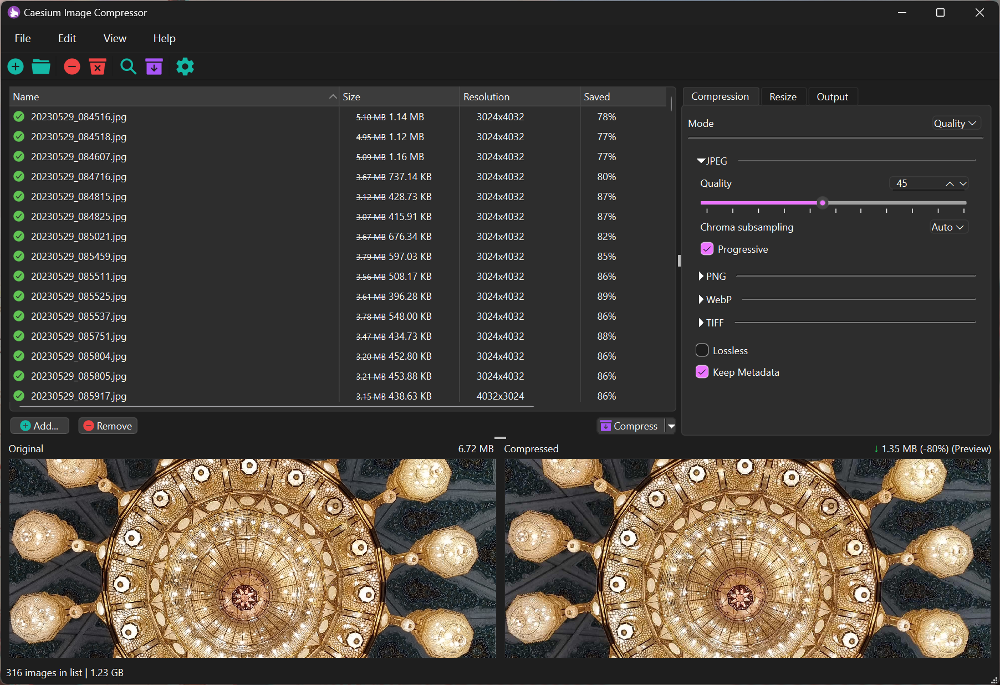
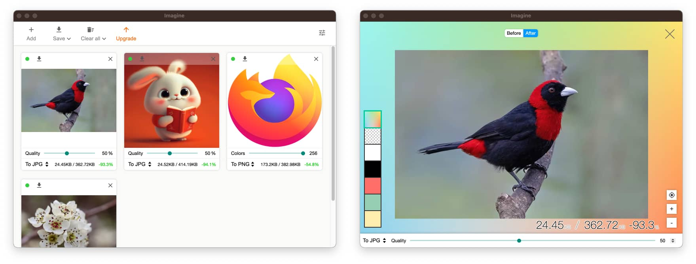
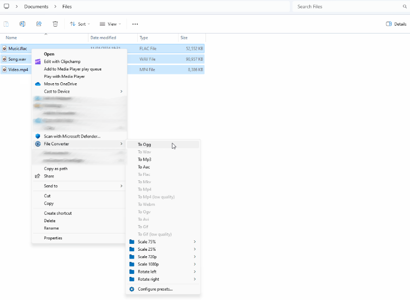
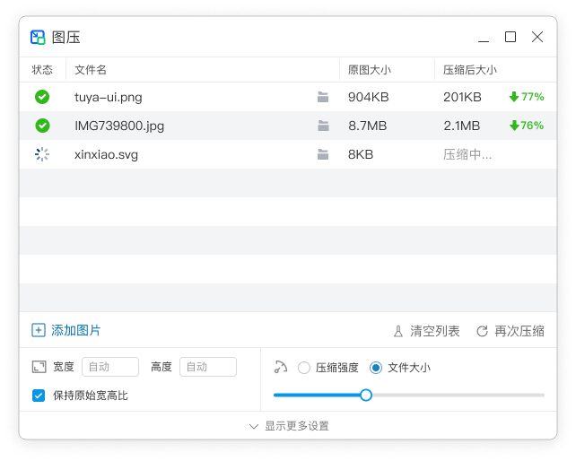
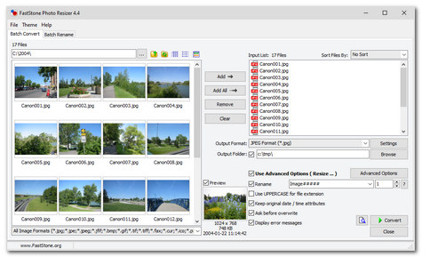

# 图片批量压缩

我需要一个通用类 (不限制于obsidian) 的批量图片压缩替换方案

## 首次调研

[list2ut|addClass(ab-super-width)]

- < 产品
  - 介绍
  - 补充
- [Lymphatus/caesium-image-compressor](https://github.com/Lymphatus/caesium-image-compressor) ⭐5.5k, c++, 4 months ago
  - 一款图像压缩软件，可帮助您存储、发送和分享数字图片，支持 JPG、PNG、WebP 和 TIFF 格式。您可以通过保持图像的整体质量来快速减小文件大小（如果需要的话，还能降低分辨率）。
  - GUI比较友好，**可以查看图片压缩前后的效果**，以控制压缩率和避免过度压缩
    
- [meowtec/Imagine](https://github.com/meowtec/Imagine) ⭐4.3k, typescript, 3 years ago
  - 适用于 macOS、Windows 和 Linux 系统的 PNG/JPEG 图像优化应用程序
  - GUI比较友好
    
- ~~[php-imagine/Imagine](https://github.com/php-imagine/Imagine)~~ ⭐4.5k, php, 25 hours ago
  - php面向对象的图像处理库
- [hadrien-psydk/pngoptimizer](https://github.com/hadrien-psydk/pngoptimizer) ⭐129, c++, 4 years ago
  - 优化 PNG 图像，并将其他无损格式（如 BMP、GIF、TGA 等）的图像转换为 PNG 格式。
- [Tichau/FileConverter](https://github.com/Tichau/FileConverter) ⭐13.3k, c#, 2 months ago
  - 在文件资源管理器中，可以多选文件，右键 > File Converter > 然后压缩
  - 
- [XnConvert](https://www.nchsoftware.com/imageconverter/index.html)
  - 太古早了
- [FileOptimizer](https://nikkhokkho.sourceforge.io/?page=FileOptimizer)
  - (追求极致压缩率)
- [ImageMagick](https://imagemagick.org/)
  - (极客/命令行方案)
- [PP鸭](https://ppduck.com/)
  - 收费，69.9元
- [图压](https://tuya.xinxiao.tech/)
  - 20年就停止更新了
  - 基于了一些开源项目: https://tuya.xinxiao.tech/#open-source
    
- [FastStone Photo Resizer](https://www.faststone.org/FSResizerDetail.htm)
  - 太古早了
  - 
- 美图秀秀批处理
- photoshop批处理
- 文件批量处理百宝箱

## 二次调研

[](https://www.star-history.com/#Lymphatus/caesium-image-compressor&meowtec/Imagine&Tichau/FileConverter&type=date&legend=top-left)

## 群友的分享

### 槑头脑的分享

讲正经的，*file converter* 不错
依赖于 FFmpeg，开源的，集成到右键菜单，支持批量压缩转换（多选文件即可）

### 曲谈歌的分享

用mac的话 可以试试*clop*，自动压缩复制到剪贴板的图片，也可以监控特定文件夹，自动压缩

### Moy的分享

起因

一开始是看到咖啡豆的这个：

[【善用佳软】：拯救你的超大库，一键压缩obsidian图片，节省60%空间]()

推荐了两个：

- *PP鸭*：收费，70块钱
- *图压*：20年就停止更新了，但是免费

遂自己找了一下。有这两个：

- *Caesium*: Caesium - Image Compressor
- *Imagine*: meowtec/lmagine

2024.05.15 评论区又看到一个：
GitHub - *hadrien-psydk/pngoptimizer*
虽然停止维护的更早......2021年就没更新了。
评论区还提到一个 *mozjpeg*，只能处理jpg 图片。Mozilla出的噗。

### sasa 的分享

https://tinypng.com

在线压缩，可以上传20张、最多5MB的图片。也算是小 "批量"

### deepseek 的分享

针对你的需求，我这里整理了一份**通用、可批量压缩并替换图片**的方案。无论你是需要简单易用的图形工具，还是希望通过编程实现全自动化，都能找到对应的选择。

下面的表格汇总了几类主流方案，你可以快速了解其特点：

[addClass(ab-super-width)]

| 方案类型        | 典型工具/方法                                                                                   | 核心优势                                                | 注意事项/适用场景                                       |
| :---------- | :---------------------------------------------------------------------------------------- | :-------------------------------------------------- | :---------------------------------------------- |
| 🧰 本地图形化软件  | **ImageOptim** (Mac)、**FastStone Photo Resizer** (Win)、**XnConvert** (跨平台)、**轻压图片** (Mac) | **隐私安全**（图片不离本地）、功能丰富、可批量处理文件夹、支持覆盖原文件或输出到新位置。      | 无需编程，适合大多数用户。需注意软件是否支持“覆盖原文件”或自定义输出路径至原文件夹。     |
| 🌐 在线压缩工具   | **TinyPNG**、**iLoveIMG**、**Compressor.io**                                                | **无需安装**、开箱即用、操作简单。部分支持从网盘直接处理。                     | **隐私风险**：图片需上传至服务器。**不便替换**：通常需手动下载并替换原图，难以自动化。 |
| ⚙️ 命令行/脚本工具 | **q-image-compressor** (Node.js)、**Caesium** (支持CLI)                                      | **易于集成自动化流程**，可编写脚本一键处理整个目录并直接替换原图，适合**大批量、定期**的任务。 | 需要一定的**命令行或编程基础**。                              |
| 💻 自行开发脚本   | 使用 **Sharp** (Node.js) 或 **Pillow** (Python) 等库                                           | **灵活性最高**，可完全自定义压缩算法、阈值、备份逻辑等，完美契合“压缩后替换”的需求。       | 需要**编程能力**，适合开发者或希望深度定制的用户。                     |
2

[addClass(ab-super-width)]

| 软件名称      | 类型 / 许可     | 核心功能与特点                                    | 适用场景                                  |
| :-------- | :---------- | :----------------------------------------- | :------------------------------------ |
| Caesium   | 开源免费软件      | 支持JPG、PNG、WebP、TIFF格式；可调质量与尺寸；压缩率高，界面简洁直观。 | 追求高压缩率、支持开源软件、处理多格式图片的用户。             |
| WPS图片     | 免费 (内置于WPS) | 无需额外安装；支持按比例或指定大小压缩；操作极为简单。                | 已安装WPS，追求便捷、快速处理日常图片的用户。              |
| 美图秀秀批处理   | 免费软件        | 提供“缩小优先”、“清晰优先”等智能模式；集成大量美化、裁剪等功能。         | 需要“一键式”智能压缩，同时可能需要对图片进行简单美化处理的用户。     |
| 文件批量处理百宝箱 | 共享软件        | **功能极为全面**，除压缩外，还包含重命名、格式转换、水印等数百种批量操作。    | 需要高强度、多样化批量文件处理的办公或运维人员。              |
| 美蛋工具箱     | 免费绿色软件      | 专注于开发者与自动化，**支持命令行调用**，可集成到脚本中实现自动化处理。     | 开发者、IT人员，或希望通过脚本、定时任务实现**全自动化处理**的用户。 |

### Gemini 3 pro 的分享

这是一个非常实用的需求。既然你需要一个**通用、Windows 优先、支持批量压缩且能直接替换原文件**的方案，以下是我为你推荐的几种最佳选择，按推荐程度排序：

1. Caesium Image Compressor (首选推荐)

    这是目前 Windows 上最受好评的开源图片压缩工具之一。
    - **优点**：界面简洁，支持预览压缩效果，支持 JPG/PNG/WEBP，可以保留 EXIF 信息。
    - **如何实现“替换”**：
        1.  把图片文件夹拖入软件。
        2.  在底部的 Output Folder (输出文件夹) 选项中，勾选 **"Same folder as input" (与输入文件夹相同)**。
        3.  勾选 **"Keep Original Date/Time"** (保留原始时间，可选)。
        4.  点击压缩。软件会询问是否覆盖原文件，确认即可（或者在设置里找“Overwrite”相关选项）。

2. XnConvert (功能最强大)

    XnSoft 开发的批量图像处理器，功能极其丰富。
    - **优点**：不仅能压缩，还能批量重命名、调整大小、加水印、去元数据等。支持格式极多。
    - **如何实现“替换”**：
        1.  在“输入”标签页添加文件或文件夹。
        2.  在“动作”标签页添加“图像 -> 压缩”或者直接调整输出格式的设置。
        3.  在“输出”标签页：
            - 文件夹选择：**源文件夹**。
            - 文件名：保持 `{Filename}` 不变。
            - **如果文件存在**：选择 **“覆盖”** (Overwrite)。
        4.  点击转换。

3. FileOptimizer (追求极致压缩率)

    如果你不在意压缩速度，只想要体积最小（无损或近乎无损），选这个。
    - **优点**：调用了几十种压缩引擎（如 PngOptimizer, ECT, MozJPEG 等）来压榨每一个字节。
    - **特点**：它的默认行为就是**直接替换原文件**（原来的文件会被丢进回收站，以防万一）。
    - **操作**：拖进去，右键 -> Optimize (优化)。简单粗暴。

4. ImageMagick (极客/命令行方案)

    如果你习惯使用终端或者想写脚本（Bat/PowerShell）自动处理，这是行业标准。
    - **命令示例**（使用 `mogrify` 命令可以直接修改原文件）：
    ```powershell
    # 安装后在包含图片的目录下运行终端
    # 将所有 jpg 图片压缩质量至 80% 并覆盖原文件
    magick mogrify -quality 80 *.jpg
    
    # 将所有 png 图片压缩
    magick mogrify -quality 80 *.png
    ```

总结建议

- **最推荐**：**Caesium**。简单、免费、开源、不仅能看前后对比，处理逻辑也符合“替换”的需求。
- **最全能**：**XnConvert**。如果你除了压缩还要改尺寸或格式。
- **最无脑**：**FileOptimizer**。拖进去不用管，默认就是覆盖。

