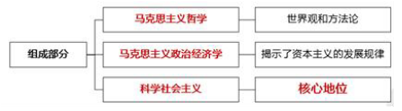

# 马克思主义哲学0

## 导论 马克思主义是关于工人阶级和人类解放的科学

[title2list|list2c2t]

### 马克思主义是时代的产物★★

1. 马克思主义产生于（**19世纪40年代中期**）。
2. 三大工人运动：法国里昂起义、英国“人民宪章”运动、德国西里西亚工人起义。
3. 马克思主义产生的**客观条件**：资本主义的发展及其内在矛盾的尖锐化。
4. 马克思主义产生的**阶级基础**：**工人阶级**作为一支独立的政治力量登上历史舞台，进行反对资本主义
制度和资产阶级统治的斗争。

### 马克思主义对人类文明成果的继承与创新★★★

1.  直接理论来源及其代表人物
    1. 马克思主义哲学——德国古典哲学——**黑格尔**和**费尔巴哈**——辩证法和唯物主义
    2. 政治经济学——英国古典政治经济学——**亚当·斯密**和**大卫·李嘉图**——劳动价值论
    3. 科学社会主义——英法两国空想社会主义——**圣西门**、**傅里叶**和**欧文**——空想社会主义学说
2.  组成部分
    
3.  自然科学基础：**细胞学说、能量守恒和转化定律、生物进化论**。

### 马克思主义在实践中不断发展★★

1.  **《哲学的贫困》和《共产党宣言》**标志着马克思主义的公开问世。
2.  改革开放以来，我们党开辟了中国特色社会主义道路，形成了中国特色社会主义理论体系，包括：
    邓小平理论、“三个代表”重要思想、科学发展观、习近平新时代中国特色社会主义。

### 马克思主义的科学内涵★★★

1. 马克思主义的科学内涵：马克思主义是由**马克思、恩格斯**创立的，为他们的后继者所发展的，是关于工人阶级和人类解放的科学。
2. 马克思主义哲学是科学的世界观和方法论，**政治经济学**揭示了资本主义的发展规律处于**核心地位**的则是科学社会主义理论。

### 马克思主义基本特征及品质★★★

1. 马克思主义的基本特征是以实践为基础的（**科学性和革命性的统一**）。
    1. 马克思主义的革命性，集中表现为它的彻底的批判精神。
    2. 马克思主义的革命性，还表现在它具有鲜明的政治立场上。
    马克思主义具有鲜明的**科学性、人民性、实践性、发展性**，这些特征体现了马克思主义的本质和使命，也展现出马克思主义的理论形象。
2. 马克思主义的理论品质是（**与时俱进**）。

### 马克思主义的社会理想★★★

1. 马克思主义的社会理想是**推翻资本主义、实现社会主义和共产主义**。
2. **最高理想**：实现**共产主义**，是长期的远大的理想；
   **共同理想**：**走中特色道路**，把我国建设成富强、民主、文明、和谐的社会主义现代化国家。

### 马克思主义的当代价值★★

1. 观察当代世界变化的认识工具
2. 指引当代中国发展的行动指南
3. 引领人类社会进步的科学真理

### 自觉学习和运用马克思主义★★

第一，努力学习和掌握马克思主义的基本立场观点方法。
第二，努力学习和掌握马克思主义中国化时代化的理论成果。
第三，坚持理论联系实际的马克思主义学风。
第四，自觉将马克思主义内化于心、外化于行

