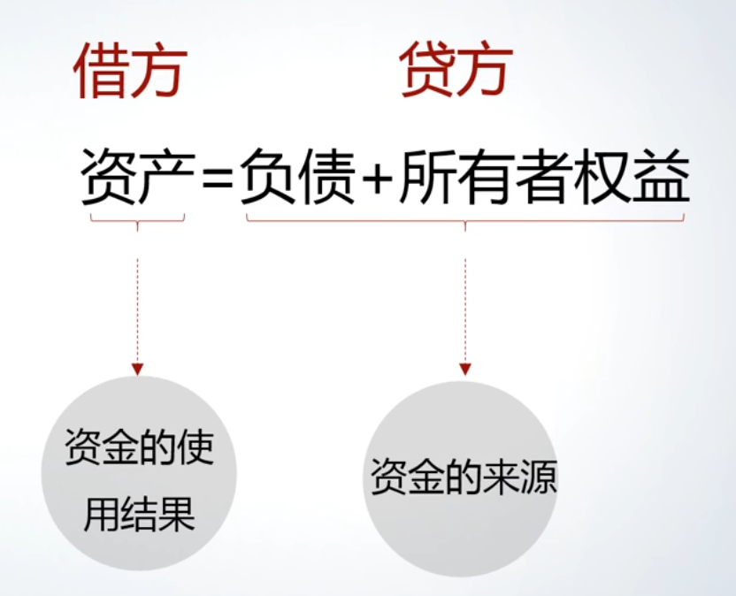

# 会计恒等式：资金运动的时点与时段记录

## 引言：会计作为记录资金运动的商业语言

[00:08](https://www.bilibili.com/video/BV1YQ4y1A7MJ?p=5&t=8)

- 会计的角色：作为商业语言，用于**记录资金运动**。
- 资金运动的特性：是一个连续不断的过程。
- 记录的两种视角：
    - **时点视角**：观察资金在**某一特定时刻**的静态结果。
        - 看不见资金的流动过程，只能看到流动的*结果*。
        - 同时可以看到这个结果是由什么*原因*或*来源*驱动的。
    - **时段视角**：了解在一**段时期内**资金运动的*变化情况*。
        - 旨在分析时点上的结果是由哪些*原因*驱动的变动造成的。

## 核心会计恒等式（资产 = 负债 + 所有者权益）

[01:09](https://www.bilibili.com/video/BV1YQ4y1A7MJ?p=5&t=69)

- 等式形式：$资产 = 负债 + 所有者权益$
- 反映的视角：反映的是在任何**一个时点**上的资金状况。
- 等式的内涵：
    - 等式**左**边（资产）：反映资金使用的结果，即资金的**去向**。表现为企业在时点上形成的各种资源。
    - 等式**右**边（负债 + 所有者权益）：反映资金的**来源**，如:
        - 负债：来源于企业外部的债权人，属于借入资金。
        - 所有者权益：来源于企业的股东（老板），属于投入资金。
- 恒等关系：在任何一个时点上，资金的使用（去向） 与 资金的来源 必须相等。

## 衍生会计恒等式（收入 - 费用 = 利润）

[01:21](https://www.bilibili.com/video/BV1YQ4y1A7MJ?p=5&t=81)

- 等式形式：$收入 - 费用 = 利润$
  - 与核心等式的关系：由 $资产 = 负债 + 所有者权益$ 衍生而来
  - 出现时间：晚于第一个等式
- 反映的视角：用于考察在**一段时期**内资金运动的变化情况。
- **作用**：解释两个时点之间，财务状况（资产、负债、所有者权益）发生变动的原因。

## 两个等式的关系与复式记账原理

[01:33](https://www.bilibili.com/video/BV1YQ4y1A7MJ?p=5&t=93)

- 分析时段变化的两种路径：
    1. 将 $资产 = 负债 + 所有者权益$ 在两个时点的数值直接相减，得到变化量。
    2. 利用 $收入 - 费用 = 利润$ 来考察期间内的经营成果如何导致权益变动。
- 复式记账的体现：
    - 资产 = 负债 + 所有者权益 这一等式是*复式记账下的产物*。
    - 记账规则：记录任何一笔经济交易时，必须同时进行双重记录：
        - **借方**：记录等式的左边，即**资金的使用（去向）**。
        - **贷方**：记录等式的右边，即**资金的来源**（无论是负债形式还是所有者权益形式）。
    - **核心原则**：通过这种记账方法，确保在每一时点，**资金的使用总额**恒等于**资金的来源总额**。

