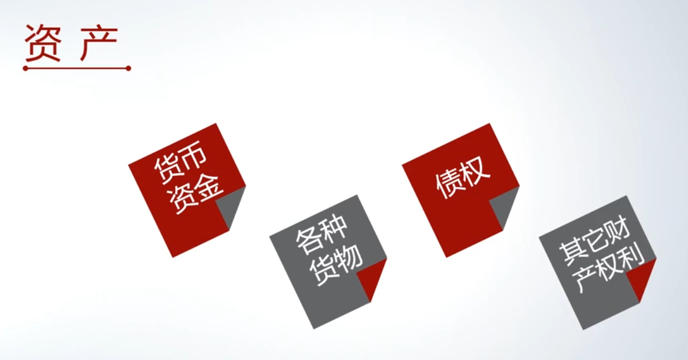
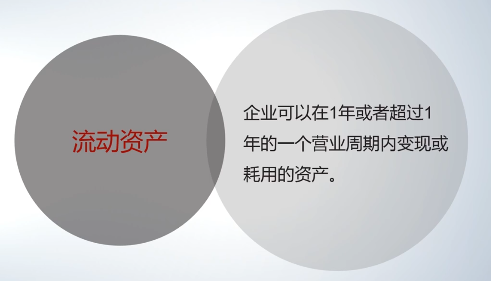

# 会计基础：资产、负债与所有者权益

本部分内容基于会计恒等式展开，核心是理解资产、负债与所有者权益的具体含义。

## 资产的定义与核心特征

**[00:20](https://www.bilibili.com/video/BV1YQ4y1A7MJ?p=6&t=20)**

资产是企业的一种经济资源。其定义包含三个关键要素：

1. **由过去的交易或事项形成**：在当下这个时点，企业已经拥有或控制该资源。
2. **为企业拥有或控制**：
    - “拥有”指法律上的*所有权*。
    - “控制”指即使没有所有权，但企业*能支配*该资源并获取其带来的经济利益（例如：借来的母鸡，其产的蛋归企业所有，则母鸡可被视为企业控制的资产）。
3. **预期能带来经济利益**：该资源未来无论是出售还是使用，都能为企业带来可以用货币计量的好处。

## 资产的分类

[03:31](https://www.bilibili.com/video/BV1YQ4y1A7MJ?p=6&t=211)

资产主要有两种分类方式：

- (分类一：按形态划分)
    - **现金资产（货币资金）**：以现金形式存在的资源。
    - **非现金资产**：不以现金形式存在的资源。这类资产涉及到以何种金额计量和记录的问题。
- (分类二：按变现或耗用周期划分，更常用)
  - **流动资产**
  - **非流动资产**

这种分类主要基于一项资源能否在**一年内（或一个营业周期内，取较长者）**变现或被耗用。

#### 1. 流动资产

[04:11](https://www.bilibili.com/video/BV1YQ4y1A7MJ?p=6&t=251)

指预计在一年或一个营业周期内能够变现、出售或耗用的资产。其核心特征是**短期内能转化为现金**。

常见的流动资产项目及举例（以蛋糕店为例）：

- **货币资金**
    - 库存现金：企业保险柜里的钱。
    - 银行存款：企业在银行账户里的钱。
- **应收款项（钱在客户手里）**
    - 应收票据：客户开具的商业汇票（承诺未来特定日期付款）。
    - 应收账款：客户的口头或书面付款承诺，无票据。
- **预付款项（钱在供应商手里）**
    - 预付账款：为购买货物/设备预先支付的定金，供应商承诺未来交货。
- **存货**
    - 原材料：为生产而购入的面粉、糖等。
    - 库存商品：已加工完成待出售的蛋糕。
    - 特点：从原材料到生产为商品再到出售，这个周期通常较短。

#### 2. 非流动资产

[09:43](https://www.bilibili.com/video/BV1YQ4y1A7MJ?p=6&t=583)

指变现或耗用时间超过一年（或一个营业周期）的资产。例如：
- 长期股权投资
- 固定资产（设备、房屋）
- 无形资产

### 进行流动资产/非流动资产分类的主要目的

1. **从债权人角度看**
   便于债权人评估企业的短期偿债能力。债权人关心企业是否有足够容易变现的资产（流动资产）来偿还短期债务。
2. **从资金角度看**
   经营管理视角看，便于企业分析资源的周转效率。
    - 流动资产（如存货）周转快。
    - 非流动资产（如设备、厂房）周转慢，耗用时间长。
3. **从资产使用周转状况看**
   

## 总结：会计恒等式的视角

[10:49](https://www.bilibili.com/video/BV1YQ4y1A7MJ?p=6&t=649)

会计恒等式 $资产 = 负债 + 所有者权益$ 体现了资金的两种视角：

- 资产：反映了**资金的使用结果与存在形态**（钱变成了存货、设备等）。
- 负债与所有者权益：反映了**资金的来源**（来自债权人或股东）。

对资产进行细致分类，正是为了更清晰地反映其变现能力和周转特性，服务于债权人决策和企业内部管理。

