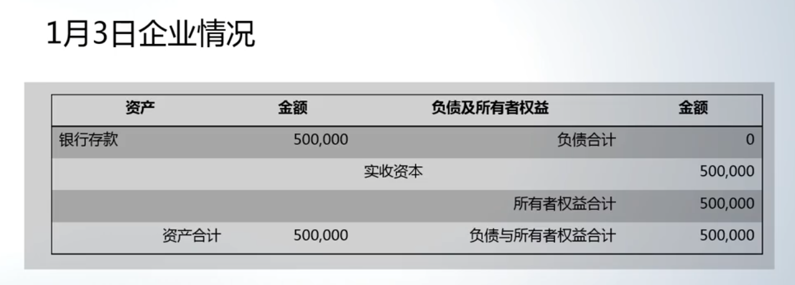
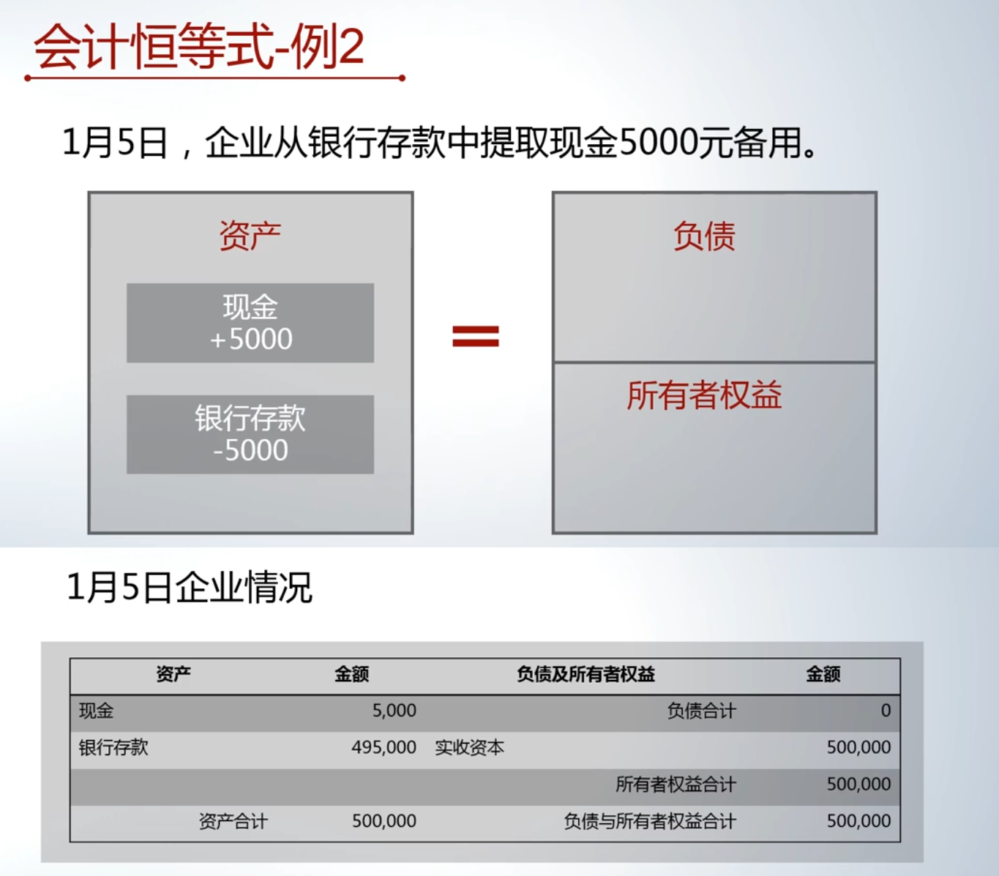
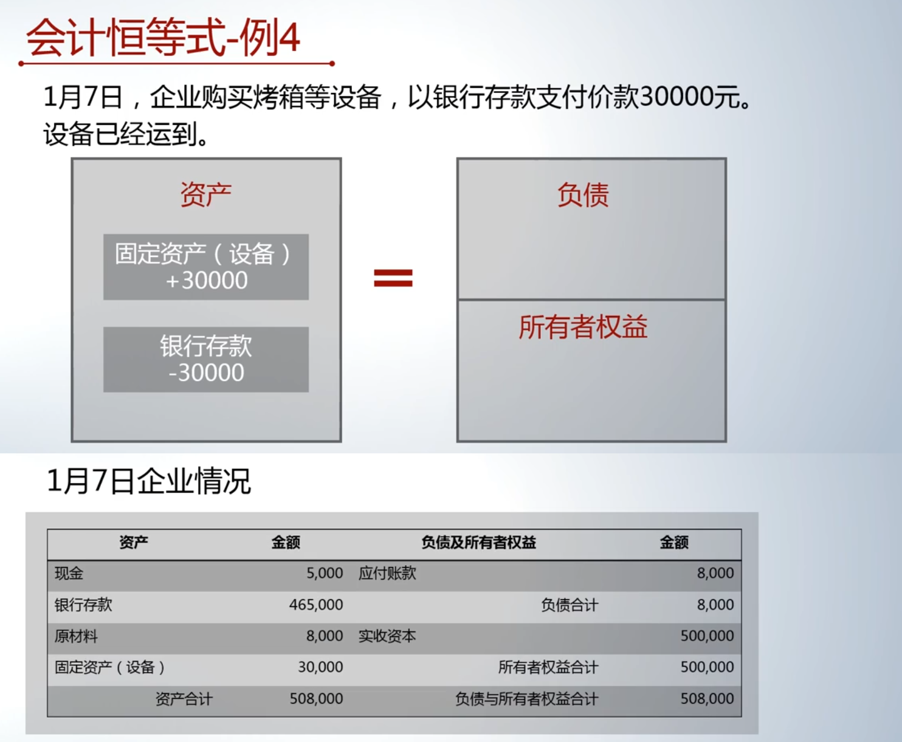
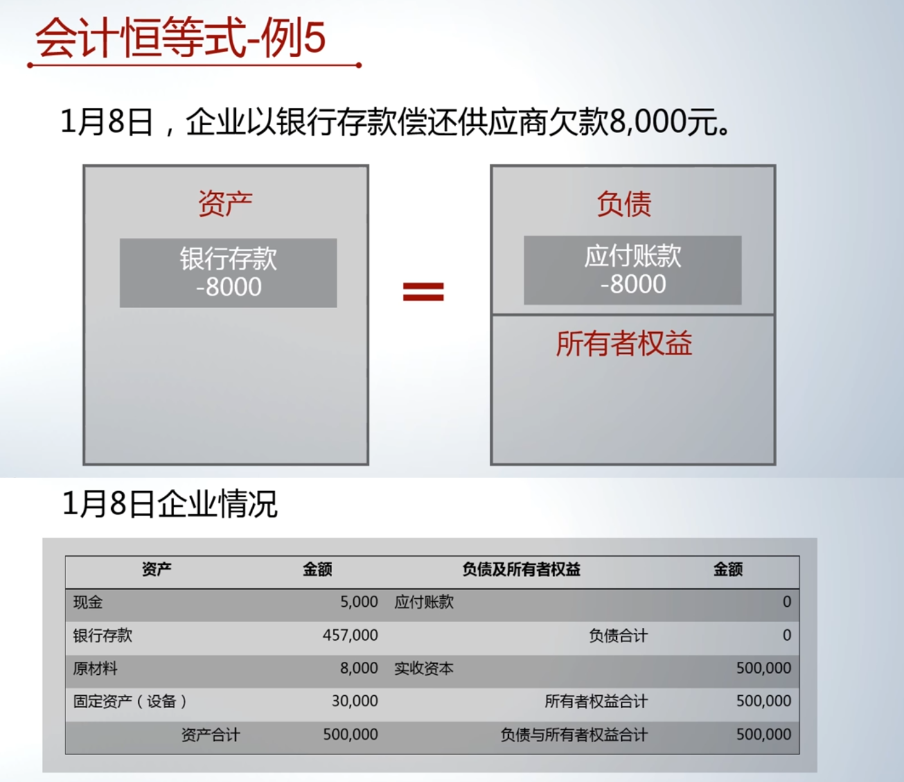

# 会计恒等式举例1：蛋糕店资金流转分析

复式记账法基础示例：蛋糕店资金流转分析

本视频通过一个开蛋糕店的连续例子，详细解释了企业运营初期几笔典型经济交易如何用复式记账法进行记录，并分析了每笔交易后企业资金状况（资产、负债及所有者权益）的变化。

## 一、注册公司并注入资本

[00:08](https://www.bilibili.com/video/BV1YQ4y1A7MJ?p=9&t=8)

- **业务背景**：所有者成立一家蛋糕店，注册资本50万元
- **交易过程**：1月3日，所有者将50万元存入企业的银行账户
- **会计记录与分析**：
    - *资金使用结果*：企业资产中“银行存款”增加50万元。
    - *资金来源*：来源于所有者投入，在所有者权益中记录为“实收资本”50万元
- **复式记账体现**：
    - 资产（银行存款） = 负债及所有者权益（实收资本）
    - 等式两边同时记录，便于检查记账准确性（如两边金额不等则易发现错误）
- **交易后企业状况（1月3日结束时）**：
    - 资产总计：50万元（全部为银行存款）
    - 负债及所有者权益总计：50万元（全部为实收资本）
- **交易类型**：代表资金从企业外部（所有者）*流入*企业内部

## 二、从银行提取现金备用

[02:38](https://www.bilibili.com/video/BV1YQ4y1A7MJ?p=9&t=158)

- **业务背景**：企业从银行账户提取现金，用于日常备用
- **交易过程**：1月5日，从银行存款中取出5000元现金
- **会计记录与分析**：
    - *资金使用结果*：企业资产中“库存现金”增加5000元
    - *资金来源*：并非来自企业外部，而是由企业内部资源（银行存款）转化而来。因此，“银行存款”减少5000元
- **复式记账体现**：
    - 等式左边（资产）内部一增一减：现金增加，银行存款减少
    - 若将银行存款的减少视为“负号”移至等式右边，则变为“正号”，同样代表这笔交易的资金来源
- **交易后企业状况（1月5日结束时）**：
    - 资产总计：50万元（构成变为：现金5000元，银行存款49.5万元）
    - 负债及所有者权益总计：50万元（全部为实收资本，无变化）
- **交易类型**：企业外部无资金流入，仅是资金在企业内部不同形态（银行存款→现金）之间的*流转*

## 三、赊购原材料（面粉）

[06:29](https://www.bilibili.com/video/BV1YQ4y1A7MJ?p=9&t=389)

- **业务背景**：企业购买原材料，但货款暂未支付
- **交易过程**：1月6日，购入8000元面粉，供应商已发货，企业承诺过几天付款
- **会计记录与分析**：
    - *资金使用结果*：企业资产中“原材料”增加8000元
    - *资金来源*：来源于企业外部的供应商，但形式是信用（欠款）。这在负债中记录为“应付账款”8000元
- **复式记账体现**：
    - 等式左边资产增加，等式右边负债增加，总额保持平衡
- **交易后企业状况（1月6日结束时）**：
    - 资产总计：50.8万元（构成：现金5000元，银行存款49.5万元，原材料8000元）
    - 负债及所有者权益总计：50.8万元（构成：应付账款8000元，实收资本50万元）
- **交易类型**：资金从企业外部（债权人/供应商）*流入*企业内部，增加了企业的资产和负债

## 四、支付银行存款购买设备（烤箱）

[08:40](https://www.bilibili.com/video/BV1YQ4y1A7MJ?p=9&t=520)

- **业务背景**：企业购买生产设备。
- **交易过程**：1月7日，购买价值3万元的烤箱设备，款项已通过银行存款支付，设备已取得。
- **会计记录与分析**：
    - *资金使用结果*：企业资产中“固定资产”增加3万元。
    - *资金来源*：并非来自企业外部，而是由企业内部资源（银行存款）转化而来。因此，“银行存款”减少3万元。
- **复式记账体现**：
    - 等式左边（资产）内部一增一减：固定资产增加，银行存款减少。
    - 资产总额不变，等式右边（负债及所有者权益）也无变化。
- **交易后企业状况（1月7日结束时）**：
    - 资产总计：50.8万元（构成：现金5000元，银行存款46.5万元，原材料8000元，固定资产3万元）。
    - 负债及所有者权益总计：50.8万元（构成与1月6日相同：应付账款8000元，实收资本50万元）。
- **交易类型**：企业外部无资金流入，资金在企业*内部*改变形态（银行存款→固定资产）

## 五、偿还供应商欠款

[11:49](https://www.bilibili.com/video/BV1YQ4y1A7MJ?p=9&t=709)

- **业务背景**：企业偿还之前赊购原材料产生的债务
- **交易过程**：1月8日，使用银行存款向供应商支付8000元货款
- **会计记录与分析**：
    - *资金使用结果*：清偿了对供应商的负债，负债中的“应付账款”减少8000元
    - *资金来源*：由企业内部资源（银行存款）提供。因此，“银行存款”减少8000元
- **复式记账体现**：
    - 等式右边负债减少，等式左边资产减少
    - 若将负债的减少（负号）移至等式左边，则变为正号，代表资金的使用结果是减少负债
- **交易后企业状况（1月8日结束时）**：
    - 资产总计：50万元（构成：现金5000元，银行存款45.7万元，原材料8000元，固定资产3万元）
    - 负债及所有者权益总计：50万元（构成：负债清零，全部为实收资本50万元）
- **交易类型**：企业外部无资金流入，是企业资金对外*付出*，用于清偿债务

## 总结与要点回顾

(视频无这一部分，gpt自己加的)

[addClass(ab-super-width)]

| 日期   | 交易简述      | 资金使用结果（资产/负债变化）           | 资金来源            | 交易后资产总额 | 交易后权益总额 | 资金流动类型    |
| :--- | :-------- | :------------------------ | :-------------- | :------ | :------ | :-------- |
| 1月3日 | 所有者注资50万  | 资产(银行存款)+50万              | 所有者权益(实收资本)+50万 | 50万     | 50万     | 外部流入(所有者) |
| 1月5日 | 取现5000元   | 资产(现金)+5000，资产(银行存款)-5000 | 内部转化(银行存款)      | 50万     | 50万     | 内部流转      |
| 1月6日 | 赊购面粉8000元 | 资产(原材料)+8000              | 负债(应付账款)+8000   | 50.8万   | 50.8万   | 外部流入(债权人) |
| 1月7日 | 购设备付款3万   | 资产(固定资产)+3万，资产(银行存款)-3万   | 内部转化(银行存款)      | 50.8万   | 50.8万   | 内部流转      |
| 1月8日 | 偿还欠款8000元 | 负债(应付账款)-8000             | 内部资源(银行存款)-8000 | 50万     | 50万     | 对外付出      |

核心概念：

1. **复式记账**：每一笔经济交易都需要同时在“资金使用结果”（通常为资产）和“资金来源”（负债或所有者权益，或资产减少）两个方面进行记录，确保会计等式（资产 = 负债 + 所有者权益）始终平衡。
2. **资金来源判断**：关键判断资金是否从*企业外部*（所有者或债权人）新流入。若是，则影响等式右边（权益或负债）；若否，则是企业内部资源形态的转化，只影响等式左边（资产）内部结构。
3. **交易影响**：不仅改变企业资产的数量和形态，也可能改变企业的负债结构和所有者权益构成。

