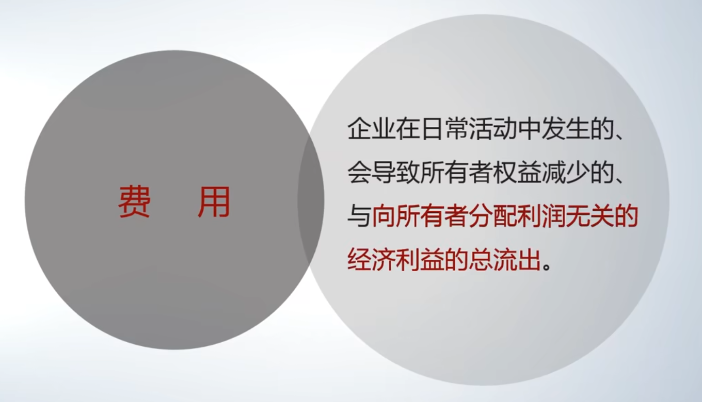
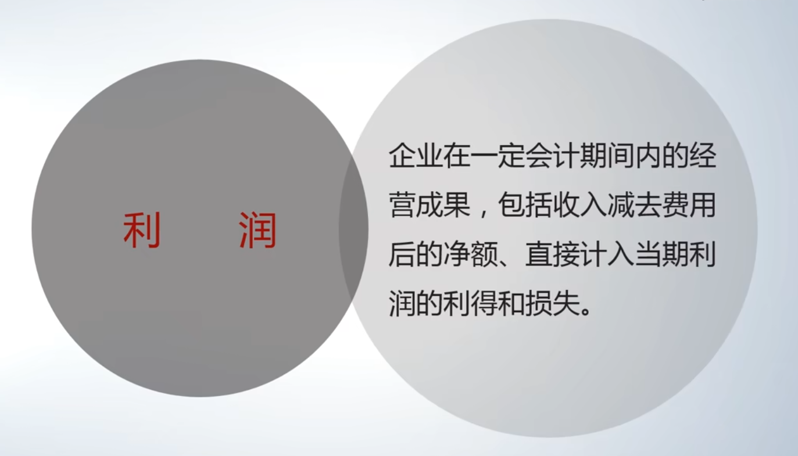
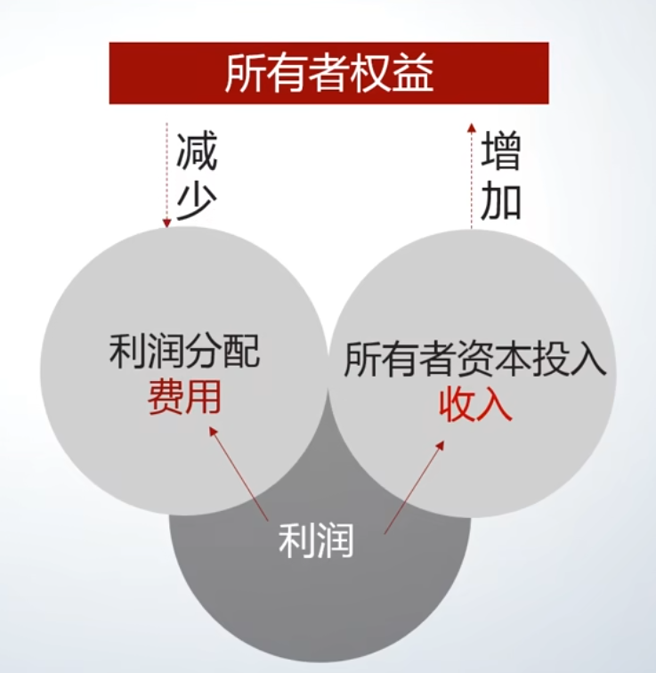

# 费用与利润：概念、配比与构成

## 费用 - 定义、特征

[00:08](https://www.bilibili.com/video/BV1YQ4y1A7MJ?p=11&t=8)

费用是企业为获得收入而付出的代价。

- 本质：一种经济利益的流出。
- 发生场景：在日常经营活动过程中发生。
- 核心影响：
    - 会导致所有者权益减少。
    - 但这种减少与向所有者分配利润无关（即不是分红导致的权益减少）。
- **定义**的理解：费用是“与向所有者分配利润无关的、导致所有者权益减少的经济利益总流出”。
  这个定义采用排除法，以涵盖其经济实质。

## 费用 - 与收入的配比关系

[01:46](https://www.bilibili.com/video/BV1YQ4y1A7MJ?p=11&t=106)

会计上强调费用应与收入配比，以准确反映经营成果。

- 配比原则：在确认收入的时点，将为了获得该收入所付出的代价与之匹配。
- **时间匹配**：
    - 理想状态：在同一天匹配（实际操作困难）。
    - 常见实践：在同一会计期间（如年度）内匹配。
- **常见的配比对应关系**：
    - 主营业务收入 ↔ 主营业务成本
    - 其他业务收入 ↔ 其他业务成本
    - 投资收益 ↔ 投资损失
    - 营业外收入 ↔ 营业外支出

## 费用 - 不同类型的确认与处理

[03:40](https://www.bilibili.com/video/BV1YQ4y1A7MJ?p=11&t=220)

根据费用与收入的直接关联程度，确认方式有所不同。

1. 能与收入**直接、明确配比**的费用
    - *示例*：销售商品的直接成本（如蛋糕的面粉、鸡蛋）、与单笔交易直接相关的运费（快递费）。
    - *会计处理*：在*确认收入时*，将这笔代价直接确认为费用（如主营业务成本、销售费用-运输费）。
2. 与收入**相关但难以直接、逐一配比**的费用
    - 特点：为获取收入而整体发生，但无法与单笔收入直接挂钩。
    - *示例*：广告费、管理人员工资、研发费、培训费、借款利息。
      即:
        - 销售费用（如广告费）
        - 管理费用（如管理人员工资、研发费、培训费）
        - 财务费用（如借款利息）
    - *会计处理*：在费用实际发生 *（支付）的期间* 予以确认。
    - 
3. **与政府相关的“代价”**
   示例:
    - **税金及附加**：
        - 与交易活动相关，在产生收入/交易时发生。
        - *示例*：消费税、城市维护建设税、教育费附加。
        - 部分可与收入对应，部分不能。
    - **所得税**费用：
        - 与企业经营成果（利润）相关，在产生利润后征收。
4. **特殊的代价：资产减值损失**
    - 性质：资产价值非正常下降造成的损失。
    - 确认原因：
        - 会计的**谨慎性**原则。
        - 资产是企业偿债的基础，其价值下降意味着偿债能力减弱，可能引发经营风险。
        - 目的是反映资产真实价值，评估企业持续经营能力。
    - 确认方式：在会计期末（如12月31日相比1月1日），比较资产价值，将非正常损耗（即减值部分）确认为当期费用。

## 利润 - 经营成果的体现

[09:51](https://www.bilibili.com/video/BV1YQ4y1A7MJ?p=11&t=591)

- 形成：利润是收入与费用配比后的差额（$收入 - 费用$）。
- 含义：代表企业在一定时期内的经营成果。
- 归属：利润最终归企业所有者所有。
- 对所有者权益的影响：
    - 利润为“+”（盈利） → 所有者权益增加。
    - 利润为“-”（亏损） → 所有者权益减少。
- 特点：利润是收入和费用核算后的自然结果，会计上更关注收入和费用这两个直接影响利润的要素。

## 利润 - 层次与构成

[10:46](https://www.bilibili.com/video/BV1YQ4y1A7MJ?p=11&t=646)

利润在报表中表现为不同的层次：

- **营业利润**：来自主营和其他业务的利润。
- **利润总额**：营业利润加上营业外利润（营业外收入-营业外支出）。
- **净利润（税后利润）**：利润总额减去所得税费用后的净额。

**利润的最终流向**：净利润会增加所有者权益。所有者可以通过利润分配（如分红）将其取出，这会导致所有者权益减少。

经济活动对所有者权益的影响:

