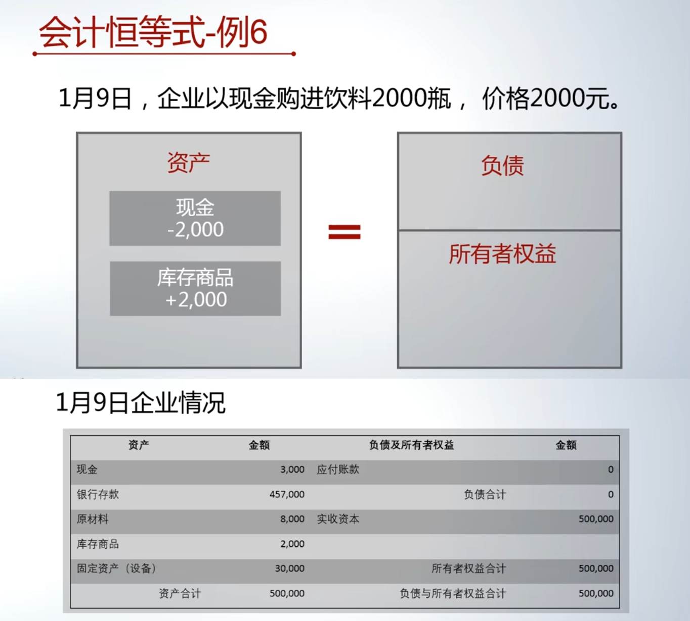
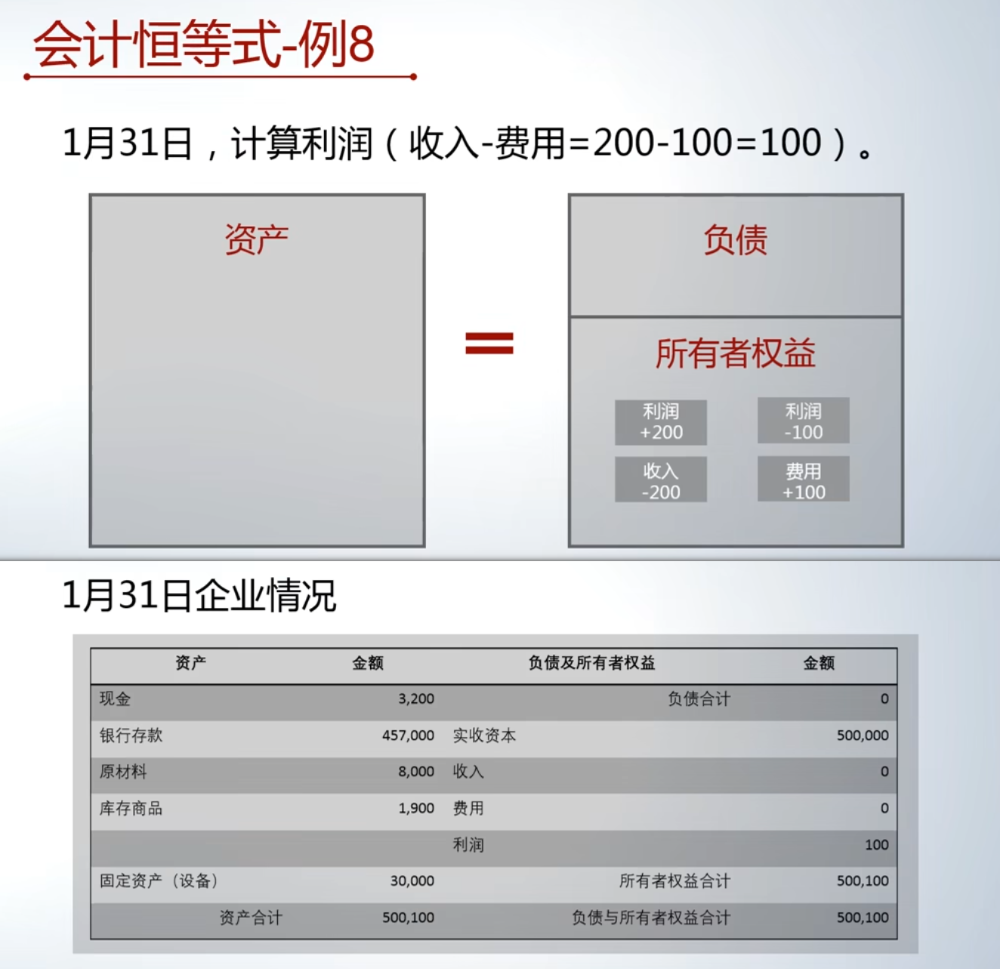
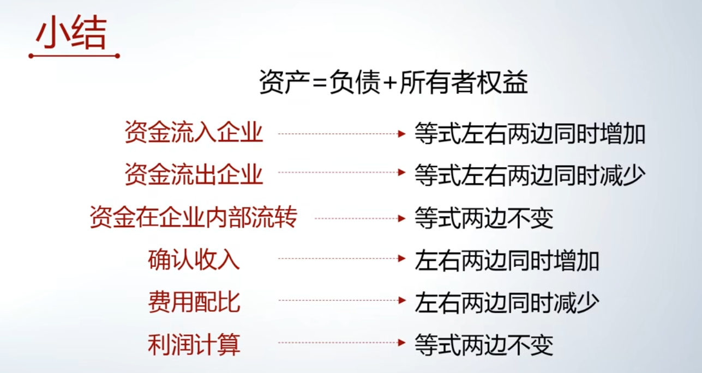

# 会计恒等式举例2

会计恒等式与会计要素的关系梳理

- *两个会计恒等式* 与 *六个会计要素* 之间存在很强的联系。
- 通过蛋糕店的具体例子来阐述它们是如何联系在一起的。

## 案例背景：蛋糕店的初始状态与第一笔交易

[00:16](https://www.bilibili.com/video/BV1YQ4y1A7MJ?p=12&t=16)

- **初始状态**：1月8日结束时，蛋糕店的财务状况为：
    - 资产总额 = 负债 + 所有者权益 = 500,000元
- **1月9日交易**：以现金购买2000瓶饮料，花费2000元。
    - 交易分析：
        - 资金使用结果：库存商品增加2000元。
        - 资金来源：由企业内部现金（资产）提供。
    - 交易影响：
        - 资产总额不变（仍为500,000元）。
        - 资产内部结构变化：现金减少2000元，库存商品增加2000元。
        - 负债与所有者权益总额不变（仍为500,000元）。
    - 本质：资金在企业内部流转，未引起等式两边总额变化。

## 核心案例：销售活动的会计记录“三步曲”

[01:45](https://www.bilibili.com/video/BV1YQ4y1A7MJ?p=12&t=105)

### 三步曲

前两步可单独计算，而其中第三步不单独计算原因是: 每期的利润之间往往是有联系的。(往往会计周期才计算，延时计算)

例如第一次消费后，我会承诺你下一次消费可以八折，让你下次也过来且多买。如果分开来看，则看不到这种整体关系

**业务背景**：1月10日，蛋糕店卖出饮料100瓶，每瓶售价2元，收到现金200元。该饮料进货成本为每瓶1元。

会计上，销售活动被拆分为三个步骤记录：
- **第一步与第二步在业务发生日（1月10日）记录**。
- **第三步在会计期间结束时（例如1月31日）记录**。

### 第一步：确认收入

- 时间：1月10日。
- 业务：确认因销售收到的200元现金。
- 会计记录分析：
    - 资金使用结果：现金（资产）增加200元。
    - 资金来源：来自于企业外部，但并非债权人借款。会计上将其视作所有者对企业的投入，记录为**收入**（属于所有者权益项下）。
- 交易影响（确认收入后）：
    - 资产总额变为 500,200元。
    - 负债及所有者权益总额变为 500,200元。
    - 所有者权益中新增“收入”200元。
- **关键理解**：会计视角的收入，意味着所有者权益的增加，是企业资源（最终归所有者所有）的增加。

### 第二步：配比费用

- 时间：1月10日。
- 业务：结转已售100瓶饮料的成本（100元）。
- 会计记录分析：
    - 资金使用结果：获得收入的代价发生，记录为**费用**（属于所有者权益项下，为负值）。
    - 资金来源：由企业内部资产（库存商品）提供。
- 交易影响（配比费用后）：
    - 资产总额变为 500,100元（库存商品减少100元）。
    - 负债及所有者权益总额变为 500,100元。
    - 所有者权益中新增“费用” -100元。

### 第三步：计算利润

- 时间：会计期末（本例为1月31日）。
- 业务：将收入与费用结转，计算利润。
- **核心逻辑**：将“收入”和“费用”项目清零，其净额转入“**利润**”项目。
- 会计记录分析（分两笔）：
    1. 将收入纳入利润计算：
        - 资金使用结果：收入（作为所有者权益的义务）得到清偿（减少）。
        - 资金来源：由所有者权益中的“利润”项目提供。
    2. 将费用纳入利润计算：
        - 资金使用结果：利润减少（对应费用的代价）。
        - 资金来源：由费用（的结转）提供。
- 交易影响（计算利润后，假设1月10日后无其他销售）：
    - 资产总额保持 500,100元不变。
    - 负债及所有者权益总额保持 500,100元不变。
    - 所有者权益中，“收入”和“费用”项目清零，新增“利润”100元。

## 会计恒等式运动规律小结

[14:38](https://www.bilibili.com/video/BV1YQ4y1A7MJ?p=12&t=878)

会计恒等式（$资产 = 负债 + 所有者权益$）用于理解和记录企业资金运动，其变化规律如下：
- **资金流入企业**（从债权人或所有者处）：
    - 等式两边*同时增加*
- **资金流出企业**（向债权人偿还或向所有者分配）：
    - 等式两边*同时减少*
- **资金在企业内部流转**（如用现金购买存货）：
    - 等式两边*总额不变*
    - 资产内部结构发生变化
- **销售活动的影响**：
    1. 确认收入：等式两边*同时增加*
    2. 配比费用：等式两边*同时减少*
    3. 计算利润：等式两边*总额不变*，仅引起所有者权益内部结构变化（收入、费用转为利润）。

