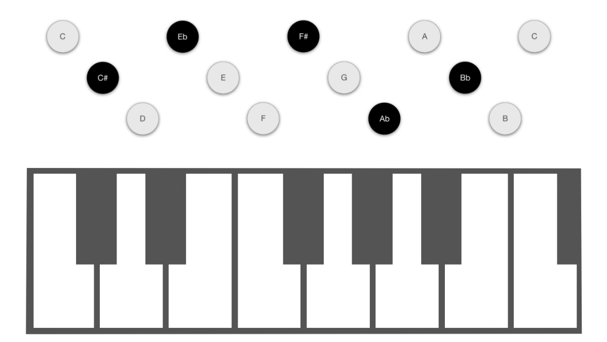

# 巴扬

常见的两种手风琴:

- 键盘手风琴
- 巴扬 (键钮) 手风琴

## 巴扬阵列

参考: [「仲凯手风琴讲堂」【干货】3分钟搞懂『巴扬手风琴』的键钮排列](https://www.bilibili.com/video/BV1pJ411G7Xc)

### B系统巴扬

四排和五排:

- 机械的重复按钮，物理上是相连的

### C系统巴扬

两者之间是镜面对称关系

类似汽车的左右驾

