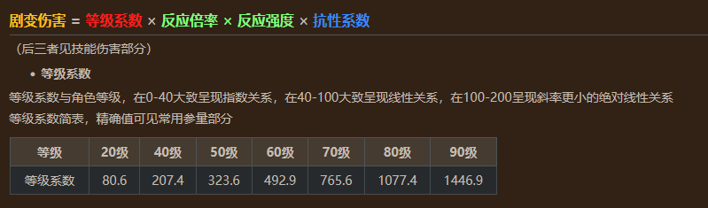
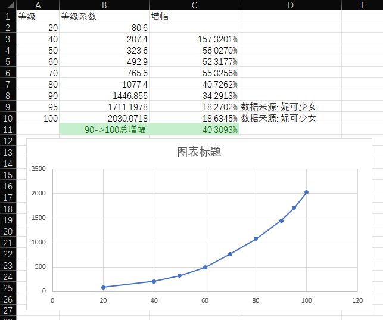
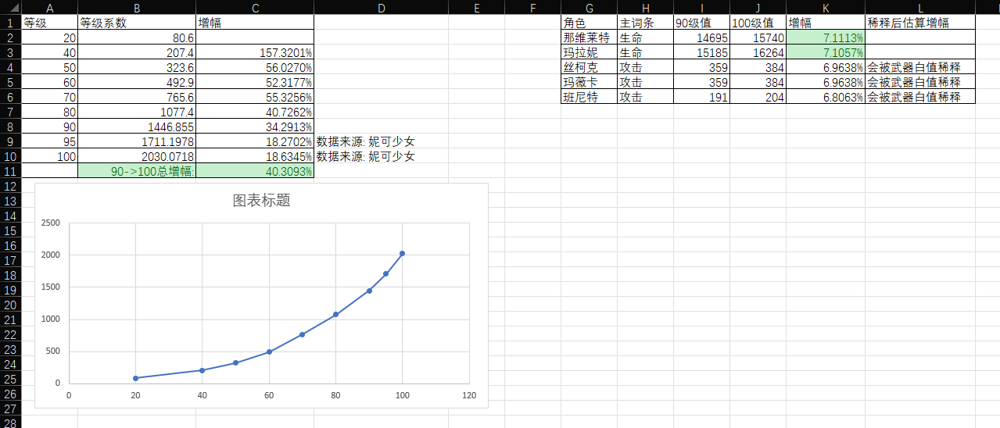

# 90到100级提升

我尝试算点更准确的

## 伤害公式
$技能伤害 = Σ(攻击力 × 技能倍率) × (1+暴伤) × 伤害倍率 × 反应倍率 × 反应强度 × 防御系数 × 抗性系数 × 等级压制$
目前来看等级超限不影响突破属性、技能倍率。即只影响以下几点：

1. 基础面板区
2. 等级压制 (仅当双方**等级差≥70级**且受击方≤10级时触发。几乎不会触发，**可忽略**)
3. 防御系数
4. 反应基础伤害 (如果是剧变反应)  

## (1) 基础面板区

不同角色不同，主要是看是吃生命/防御/攻击，是四星还是五星，匹配的武器是否高白值，等等

列举一些热门角色：

## (2) 等级压制 (应忽略)
  
等级压制: 仅当双方**等级差≥70级**且受击方≤10级时，可触发等级压制。几乎不会触发，忽略  

## (3) 防御系数

(注意，**聚变反应伤害不吃防御力，不参与这部分的增幅**)

**防御计算**：

$$
\begin{align}
(1)首先计算两个中间变量:\\
敌人防御力 &= 5×等级+500\\
攻击方系数 &= 5×攻击方等级+500

\\~\\
(2)然后再算两个中间变量:\\
防御系数 &= \frac {1}{1+\frac{防御力}{攻击方系数}} = \frac {攻击方系数}{防御力+攻击方系数}\\
减防加成 &= \frac {原防御+攻击方系数}{现防御+攻击方系数}

\\~\\
(3)最后加上减防/无视防御等得到实际防御:\\
实际防御 &= 基础防御 × ( 1 + Σ防御加成 - Σ防御减益 ) + Σ固定值防御
\end{align}
$$

得到计算结果：

## (4) 聚变反应的等级系数
  
剧变反应的等级系数：

## 备用

