# 数回

## 基本规则

参考: https://www.bilibili.com/read/cv15698726/?opus_fallback=1

1. 数字是几其四周就有几条边
2. 不能提前闭合形成多个回路

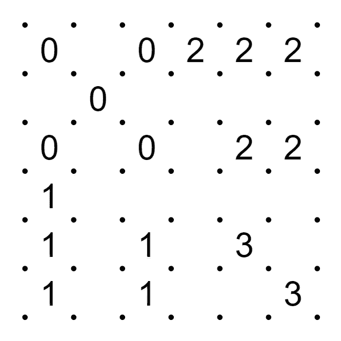

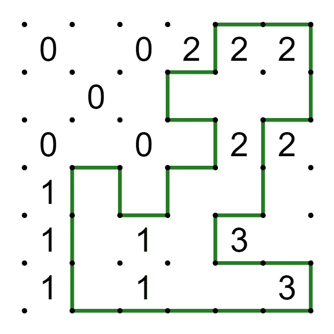

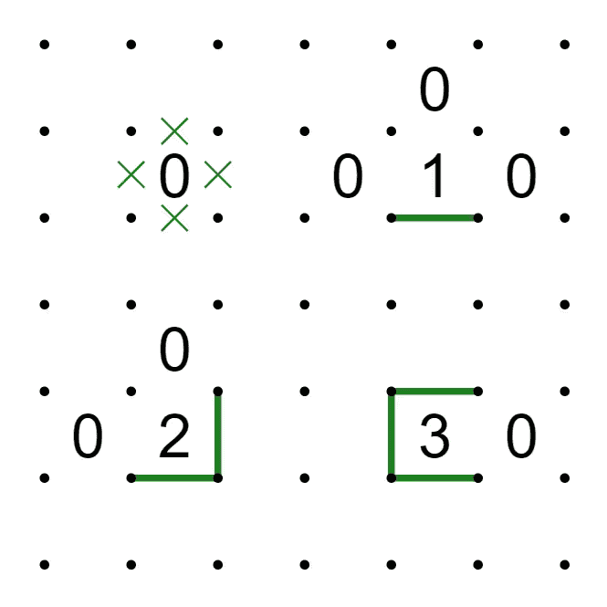

## 技巧

参考: https://www.bilibili.com/read/cv15698726/?opus_fallback=1

### 角点的特殊性

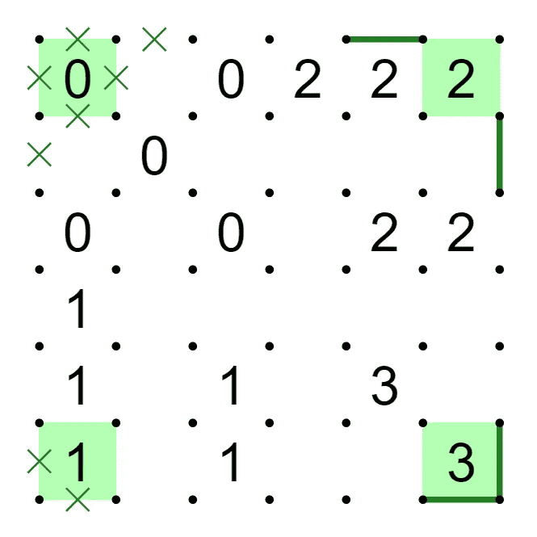

进阶 —— 类角点

当R6C1左下的点已经确定不被通过的时候，R6C1左上和右下的两个点也只剩下两条形成拐弯的线段可以用，因此它们成为了新的角点，也就可以运用角上数字的特殊结构了

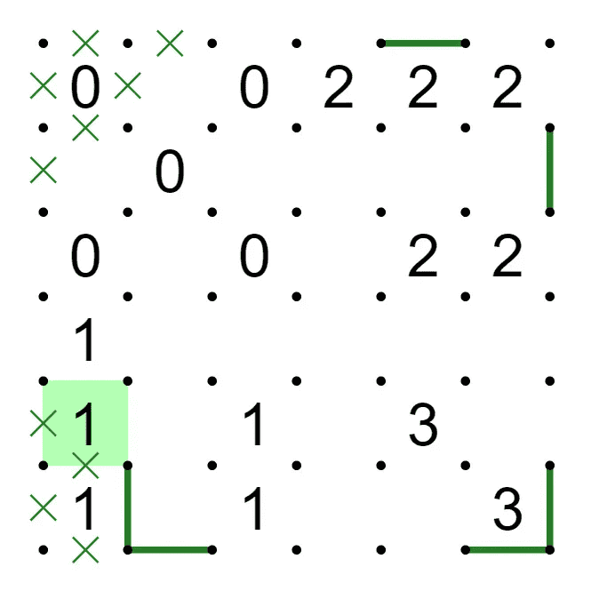

### 两数的一些结构

#### 33结构

反推一下很好理解，这里*左上的三*如果开口是往上/左，那么*右下的三*的上方和左侧都是堵塞的，不成立

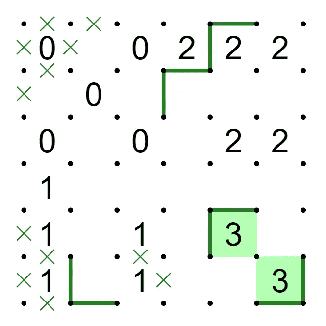

这里也能反推理解，*左侧的三*如果开口向左，则*右侧的三*上下堵塞，不成立；
*左侧的三*如果开口向右，则*右侧的三*只能开口向左，形成多个回路，不成立。(除非其他地方没线了)

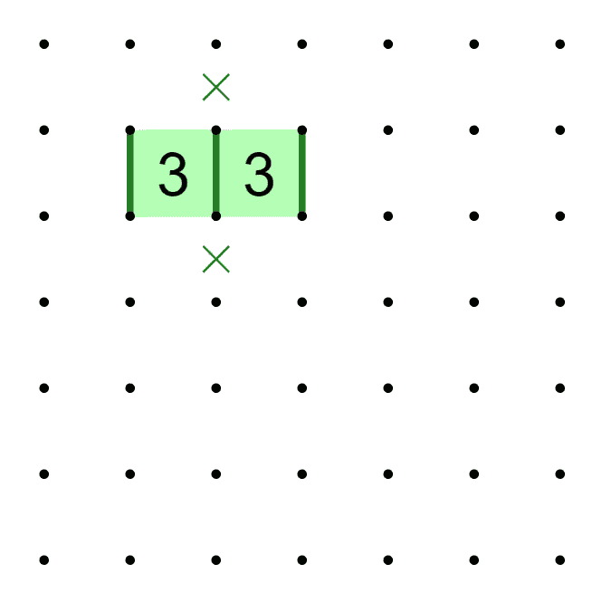

#### 323结构，衍生

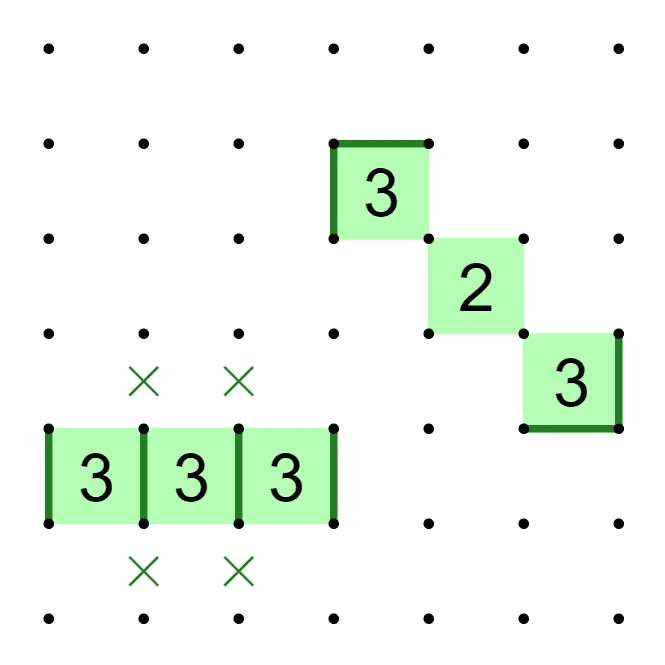

#### 已知线段的影响 (最常用)

可反推理解:

3如果开头向上/左，有分叉点，不成立；3无论向右还是下，打叉点为线则冲突，不成立；

2那个是对称的，只看一个就行。如果2右下那个叉点是线，则2的右和下为叉，则其上和右为叉，冲突不成立；

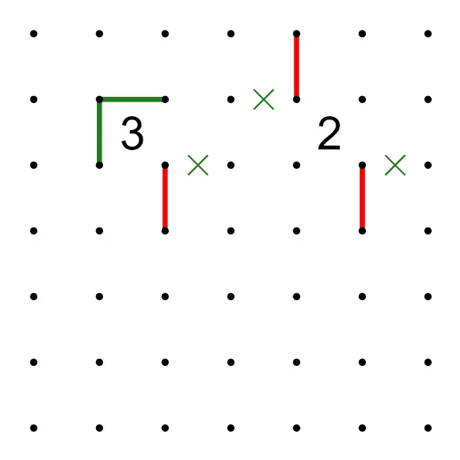

#### 其他，靠边

13、11、12

不追求速度可以不记，多假设1的原理方向位置是否可能为线，并证否就行

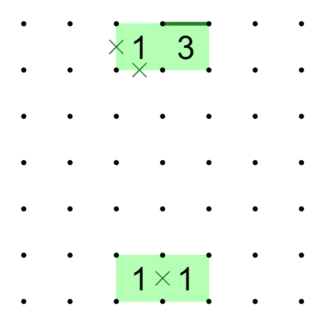

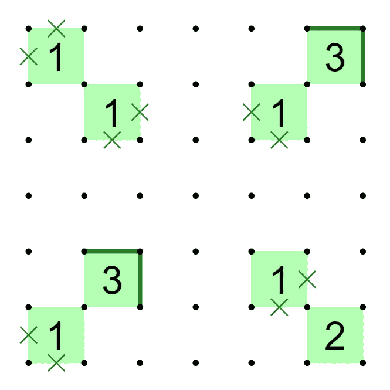

## 定式库

参考: 原神千星域数回里的那个定式库

感觉一个技巧是找 *端点* 和 *中间点*

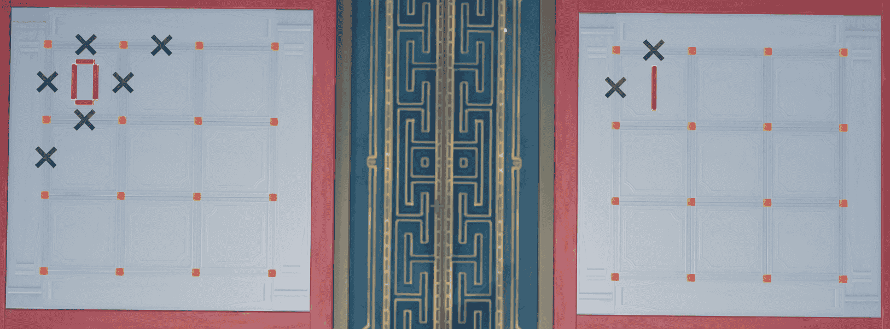

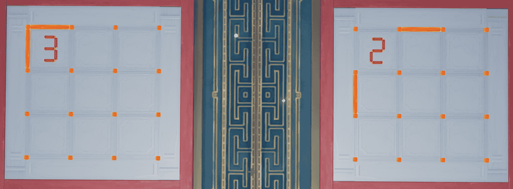

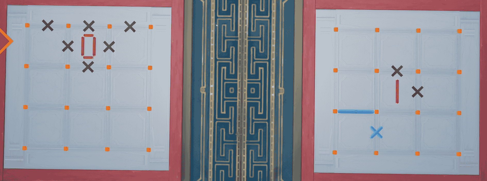

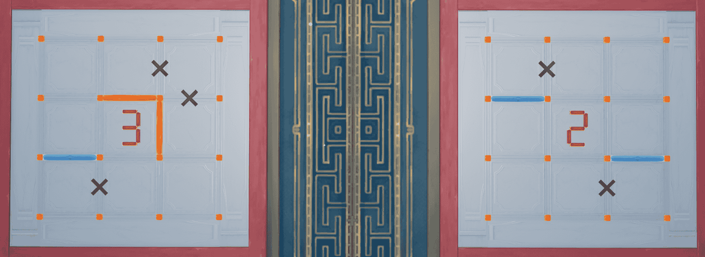

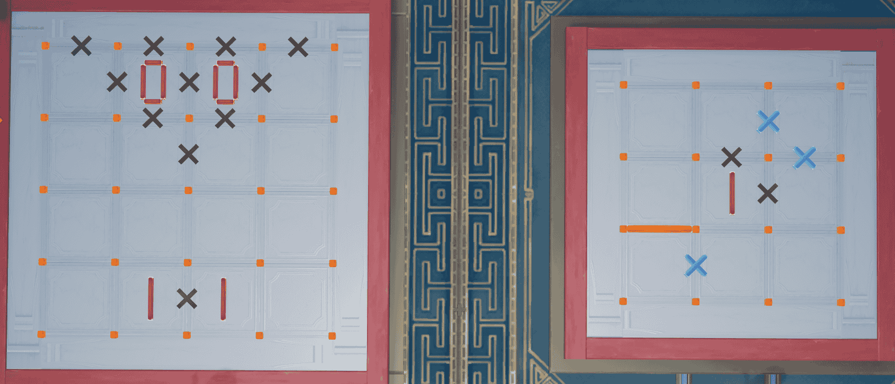

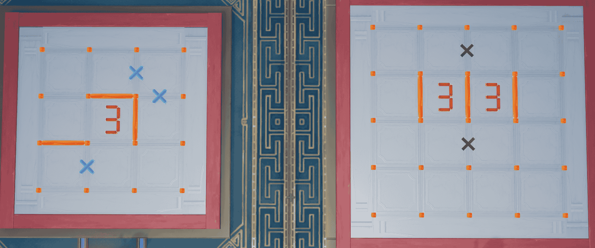

这里有个不知道为什么复原了

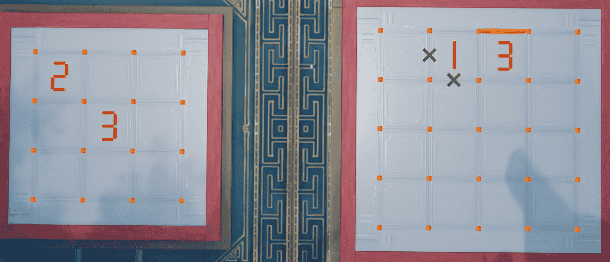

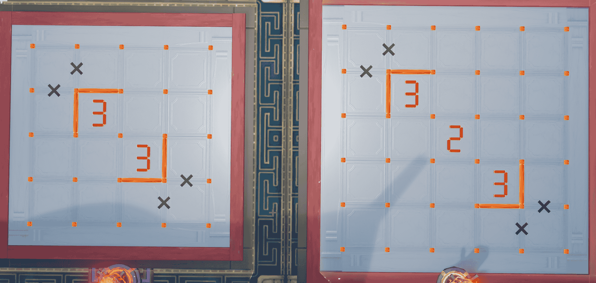

