# 重力弹球攻略

# 个人记录

2月12日入坑

2月13日进群


3月11日，榜一毕业

毕业留影


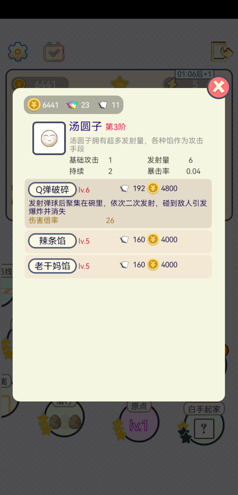
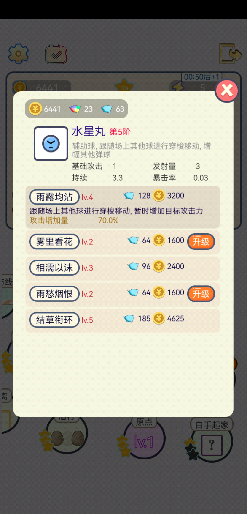


弹运会1w5k分，榜一

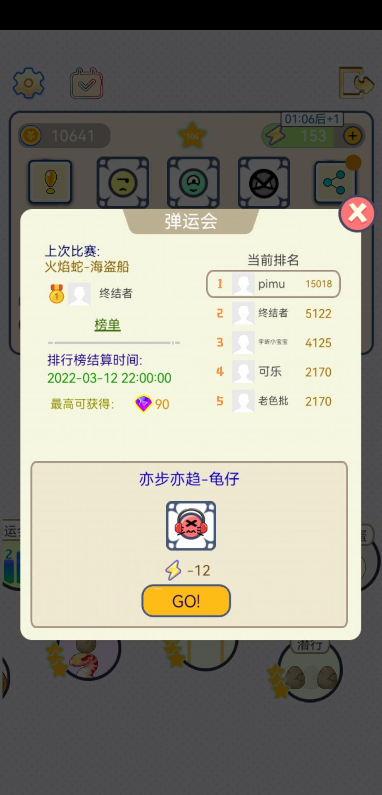

# 文案错误

## 技能倍率描述不统一

技能倍率有的是百分比有的是整数，感觉就不像同一个人做出来的

三种不同的风格

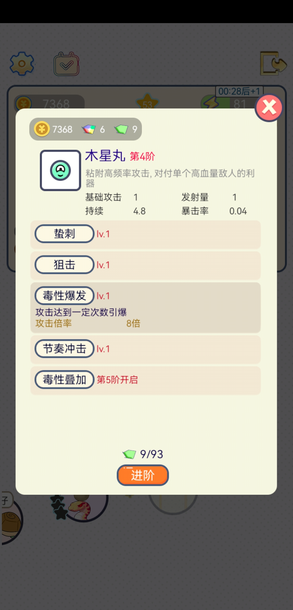

## 装备倍率以绿字为准

然后就有一个问题，倍率65是怎么打出的70伤害

会不会绿色的，后面那个70的数字才是对的呢

而且你发现没有，9级装备明明不能升级，但却依然后绿色数字

我有理由怀疑后面那个数字才是对的（确实后面那个才是对的）

## 主动装备能黏贴主动装备

虽然他文案说不可以


## 关于能量电池的触发间隔错误

7级能量电池文案标注的触发间隔为：`[2.5 > 2.0]`
实测为：5.5s才会触发一次 
_
测试环境：不是原点或白手起家，装备等级没清零。
我昨天用红球打白母姬时就发现不对劲了，我那会一直点月牙，发动了24次月牙，按理说游戏时长168s以上，但结算面显示能量电池仅发动34次，相当于近5s才发动一次，不吻合。当时我是在怀疑会不会是结算面板统计有bug。
今天我又用亦步亦趋+绿球测试，逐帧分析能量多少，结论就是7级能量电池确实是每5.5s才回复一点能量
_
原因猜测：而后我在群文件中攻略作者所发的数值文件中找到了能量电池的数据。初始5.5s一次，而后每次升级减少0.5s，七级时应为2.5s，与面板相符。而我实测的cd 5.5s却又等同初始值，由此我合理推测——能量电池升级等于白升级


我能量电池白升级了

本来想着是特殊类装备，而且看起来升级幅度属于指数型增长，这次全运会有发育时间可能能用得上。后来越升级越发现不对劲，tnnd

# 攻略

## 亦步亦趋与圣光十字

发现在亦步亦趋中，圣光真的神器
按按钮 > 发球的同时敌人前进
不按按钮 > 当球全部消失时，自动发球同时敌人前进
装了圣光：球要消失时续上，敌人会前进得很慢。不还是怕辣椒，连续给你炸了，怪就一下冲到门口

## 辅助型装备 大致计算

感觉加暴击会稀释，根据我玩其他游戏的经验
土球技能3为lv2：期望1.08->1.36
白球暴击期望：1.04
_
现在给他两分别装上5级猫须（加0.21）
土球暴击期望：1+(0.08+0.28+0.21)=1.57
白球暴击期望：1+(0.04+0.21)=1.25
_
两球各自的提升比分别为
15.44%
20%


土球是唯一的一个本身具有高额暴击的球，再给暴击收益就会稀释

（暴击伤害为原来的两倍）


即土球用猫须的话，装备提升还是20%，但自身发出的伤害提升只有15.44%
但一般来说土球装备的输出占比也不会高，其实还是稀释得挺多的

## 喵须/腮红 增幅计算

【理论计算攻略】喵须/腮红
_
先引：首先是通用期望公式（简化的模型）
伤害期望 = 基础攻击 x 发射量 x (1+暴击率) x 持续 x 技能倍率/装备伤害倍率
（例外：其中白球不吃持续，红球也不用看持续）
_
然后再来看喵须
喵须越往后越强，假设喵须每次升级提升0.02，那么10级增幅量应该是0.31
对于面板暴击分别是0.03、0.04、0.05、0.06的蓝、白绿、黄紫、黑球来说（先排除土），单球的提升必然为30.10%、29.81%、29.52%、29.25%
我都当他30%算了，差不多
_
而替换非增幅性装备的贡献值也是能算的
0.3/1.3=23.1%（模拟贡献）
【【【注意不能直接把他当作贡献比，因为他和技能/装备倍率区不是同一个乘区的，只有加算之间才能够看贡献比，相当于加权的意思。
这里之所以能够比较贡献比，是把某个装备以贡献比的方式抽出来作为一个乘数银子】】】
_
【即结论】单球中但凡是你结算面板中你某个非增幅的装备的贡献值达不到23.1%的，都可以换成满级喵须
_
也就喵须/腮红作为唯一的暴击增加手段 (除土球) 比较好算了，攻击拐太多了，两个以上就会遇到稀释问题了

## 攻击增幅装备的选择、攻击增幅的稀释问题

【理论计算攻略】攻击增幅装备的选择、攻击增幅的稀释问题
仅计算耳机和奶牛，不计算靶向光环和攻击辐射等，他们不好统计能吃多少百分比
_
10级耳机增幅期望：0.36，设只有这一个攻击拐，则提升为36%
模拟贡献为26.5%
_
10级奶牛增幅期望：0.294，设只有这一个攻击拐，则提升为29.4%
模拟贡献为22.7%
_
设在已经有了耳机的基础上追加奶牛
模拟贡献为：0.294/(1+0.36+0.294)=17.78%
_
设已经和蓝球配队的前提下追加耳机，仅当蓝球给予本球平均0.2的攻击增幅
模拟贡献为：0.36/(1+0.2+0.36)=23.1%，与喵须持平
但一般来说蓝球给予的增幅会更高得多得多，起码有0.6
_
设已经和蓝球配队的前提下且已经装了耳机，的基础上再装奶牛
模拟贡献为 (蓝球0.2增幅)：0.294/(1+0.2+0.36+0.294)=15.86%
模拟贡献为 (蓝球0.6增幅)：0.294/(1+0.4+0.36+0.294)=13.04%
_
（注1：模拟贡献仅能用于和伤害型装备比较哪个更优，不能直接当贡献比）
（注2：我没实际的10级装备，是猜测每次升级的增幅比例相同推算出来的）
 _
结论：
单球状态下（且没装其他的攻击增幅装备时）：耳机大于喵须约等于奶牛，而已经装备的耳机的前提下 喵须大于奶牛
有蓝球辅助的状态下：喵须大于耳机大于奶牛

## 装备倍率所基于的基础攻击力

【主要结论1】装备伤害计算不是基于面板，而是基于在场球的平均值
【主要结论2】确实是装备后面那个数字才是对的

### 黑球+靶向光环实测

此时可以得知奶牛的波动是怎么算的
此外我又用黑球测了一下靶向光环
_
增幅量有三种结果：增加：13、26、18
在20次数据中这三种结果依次出现了：10、8、2次
这三种结果的具体情况依次是：场上存在4个黑球且1个黑球进了光环、场上存在4个黑球且2个黑球进了光环、场上存在3个黑球且1个黑球进了光环

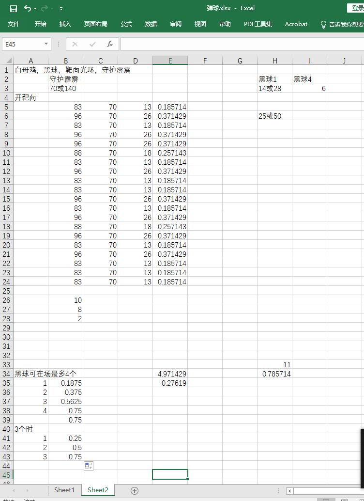

### 牛奶+守护霹雳实测

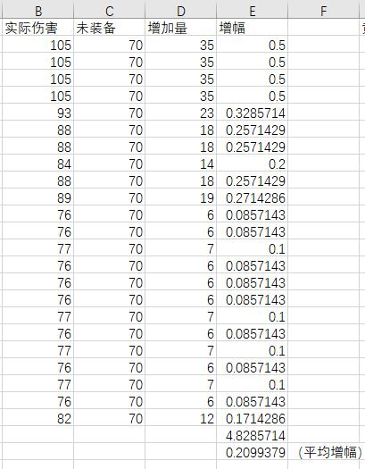

## 白球+攻击辐射的绝妙搭配

### 数据


根据昨天说的结论，请问这部分球能吃到辐射吗？答：可以
而白球出去撞到怪就死，这导致白球很能吃辐射
——
当你不左右乱摆时，能吃99%的效果
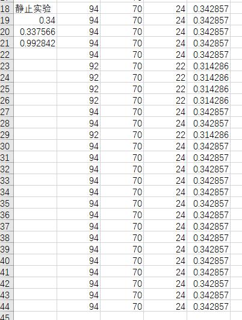
——
当你【很快速】地左右乱摆时，能吃83%的效果

 ——
当你斜45度固定，让大多数球不在辐射的范围时（极端情况），也能吃到71%的保底效果
 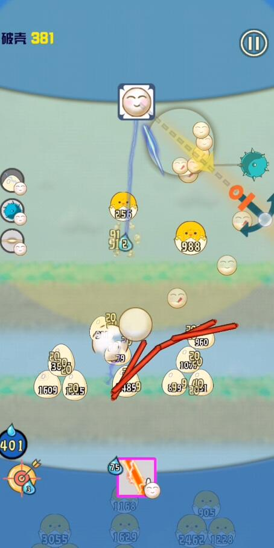


——
一般正常使用的情况下，估计能吃个90%

### 白球增幅装备的选择

九级力量辐射用于白球的期望：0.52*0.9=0.468
保底0.52*0.71=0.37
这玩意在白球身上是超过耳机（0.35）的期望的，比耳机强
_
但用于非白球身上吃不了这么多，白球用力量辐射有得天独厚的优势：
\1. 碗里能吃辐射，辐射范围比显示的区域更大
\2. 如果对着怪，射出的球也会在辐射范围
\3. 脱离碗的部分即使没碰到怪，脱离了辐射范围，但碰到怪就死，死得快，不会乱蹦，不会拖累整体的平均值

-

我本来以为碗里的吃不到加成的，没想到是吃的
你不左右摇的话白球还tm是吃满增幅的，0.52的加成，贼恐怖

### 两球中的攻击辐射表现

绿球只带力量辐射，白球只带守护霹雳。特意使绿球在左白球在右，看辐射是否能影响左侧的白球：结论：完全不能，白球霹雳一直是75伤害
所以说，之前说的白球的“优势”其实也是“劣势”，双刃剑


## 装备攻击和击杀不触发装备效果

### 结论

【再来一个结论】
装备伤害不触发“攻击/击杀敌人时触发的装备”

实测“临近波”伤害敌人不会触发“死神残影”

实测“守护霹雳”伤害不触发“白姬-大型鸡波”

——

当然还有一种可能，是装备结算有优先级，但我相信群主懒得做这个

其实也能理解，比如a和b两个装备都是攻击敌人时然后爆炸伤害敌人，那么同时装a和b会不会导致这种情况：

敌人受伤触发a，a对敌人造成伤害触发b，b又伤害敌人，无限循环。然后每个游戏帧都在结算，那就会变成帧伤

所以也能理解为什么装备伤害不能触发“击杀或攻击”的其他装备效果

### 错误示范

所以说这老哥的大型记波他真的能触发吗


装备击杀应该是不触发大鸡波，这点我用守护霹雳和临近波都做过实验，虽然月牙没测但应该不是例外
正是因为其他装备很猛，到了后期月牙dps上的1w时，由红球本体击杀的怪应该是几乎没有的，那么很可能大鸡波就和纯摆设，完全触发不出来

除非月牙例外，月牙的击杀能够触发大鸡波

### 白球的三个技能亦不触发装备效果

【今日研究】
昨天说了装备不触发装备效果，装备伤害不触发“攻击/击杀敌人时触发的装备”。然后我就在怀疑白球的你能2和技能3这种残留物是否会当作装备伤害处理

_
结论：是
实验得知：白球的辣条和辣酱不会触发死神残影

-

补充：技能1其实也不触发，技能1其实也是个aoe，但技能1那个aoe也不触发。
白球碰到敌人->有几率触发死神残影->白球死亡->触发技能1的aoe->再触发技能2和技能3

-

而土球的激光看作本体伤害，紫球的音波应该也算
死神残影与白球适配度较低，与土球和紫球高适配

## 红球攻略——红球的基础攻击力

### 红球融合攻击力


红球，一共有七阶，有七种大小，其中1\~7阶的攻击力分别为1、2、2、3、3、5、5。其中23、45、67阶之间不加攻击力，我怀疑是加持续时间的，持续时间懒得测。每次升阶轮流升级攻击力和持续时间，第5阶~第7阶有雷神之翅
_
装备伤害依然为全场球的平均攻击力，到了后阶，在没有其他加持续时间装备的前提下，大概能维持三个七阶球外加1~2个一阶球（有圣光似乎能多养活一个），后期红球的平均攻击力为 $(3*5+2*1)/6=2.83$ 或 $(3*5+1*1)/6=2.67$
_
两个球融合以后依然吃耳机，例如两个一阶球融合，1.36+1.36->2.36，耳机的增幅量不变。装满级耳机(+0.36)的话增幅为12.7%或13.5%【攻击力高度稀释】但攻击力装备还是要带的，没什么其他更好的选择）
至于奶牛我不想测，那个太难测了，要么重新随机一个增幅量给新融合的球，要么沿用原来的其中一个球的量
_
这期是真的难测，红球大小区别很小，而且刚开始没想到他升两阶才加一次攻击力走了不少弯路

### 圣光十字对红球的影响

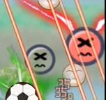


非圣光十字的其他加续航的可能对红球作用不大，七阶球的融合分两个阶段
\1. 补充满持续时间（不是转移，反正就是直接冲满持续时间）
\2. 被转移持续时间球由于持续时间不足而消失
_
在第二个阶段，圣光能使本应该消失的低阶球重新具有持续时间，以至于能再次填充满另一个七阶球。一球两冲

不对，好像就是转移，不是充满。大球好像持续时间不会变长，也是4.5s，文案是说整体变持久而不是指融合后的小球会更持久

那23、45、67阶之间升级了个寂寞

——

——

——

纠正：非圣光十字的其他加续航在特定关卡对红球也有强大的作用，特别在亦步亦趋中

续航辐射加圣光十字能《无限续球》

但我一般不用这个打法，我用的是养单球的打发，续航会阻碍我养单球，打乱节奏，容易养出多个球来

## 刷箱子等级

我赏金里最高是5体力换4箱子（赏金里的20体力换16）
理论一天不在商店购买东西能刷的箱子为：

```
24*60/2.5*4/5+18+24*60/35=520
```

箱子有1/10的概率再开箱子（不嵌套）：
一天能刷 $520*1.1=572$ 个箱子

箱子有1/10的概率再开箱子（不嵌套）：
一天能刷 $520*1.1=572$ 个箱子

## 宝藏模式

### 重复刷——快速刷取碎片的方法

都要主动结束的，一轮上限60碎片，结束再重新打，不然血亏

宝藏分高了时间长，可以主动选场景给的装备，比如我刚刚那轮就选了两个九级的长枪和守护霹雳，本来想选些增辅类的但他一直不给我

不要的就移走

上限给你5个

没满5个就会一直随机给你

没吃之前才能移走，吃到了就不能

多球的话还能决定让谁吃给的装备

比如多球随机到死魂我就拖给白球

犹豫要不要的还可以拖下去养起来，但不要养太多，加上已装备的为5个时应该是不会再给你随机装备了

_

比如我打没优惠的正常产出的宝藏，我可以带3个9级，一个不满级，然后每250分拿到15碎片就结束，重新挑战

也就多耗费点题体力，当然基因不建议这样打

我拿到死魂当天刚好有个比较好打的，然后当天直接升到6级半（还不是极限）


### 宝藏模式的优惠政策

【攻略——宝藏模式的优惠制度】

结论1：获取碎片和分数之间的关系，为线性关系，哪怕你携带的是不同品质的碎片组合。不过不完全线性，有点随机波动

结论2：当同时携带不同品质碎片时出低品质的碎片的几率更高，当低品质满了以后都是出高品质。整个过程依然符合线性增加

结论3：宝藏模式有时获取碎片所需要的积分不同，这种不同与你携带未满级碎片的数量无关，品质无关，宝藏模式所需要的体力无关，仅仅与特定关卡有关。数据如下：
_
我将奖励分为了三挡：正常（大多数情况小）、优惠、翻倍
碎片与积分的关系依次为

大惠：每500分数获取45个碎片（1000分90个）
优惠：每1000分数获取75个碎片
正常：每500分数获取30个碎片（1000分60个）
昂贵：每1000分数获取45个碎片
翻倍：每1000分数获取30个碎片
_
其中大多数关卡为正常
大惠类关卡有：龟仔、危险滞留、皮蛋仔
优惠类关卡有：无尽实验室（不过这个不是宝藏，另外这个也有50分以上的限制）
翻倍类关卡有：躲猫猫
昂贵类关卡有：刺客仔
（关卡可能不全，我也不是每种关卡的宝藏都能刷到的）

## 斧头和足球

这是在同一关的表现，足球和斧头没说哪个更强，得看给谁用。足球更吃球的移动速度


## 黏贴装备

### 消耗量

消耗基因数量为高级稀有传说分别是15,20,75，然后相加

比如稀有加传说就是95，传说加传说140，高级加稀有35

## 暂停不影响动画导致的伤害判定bug

还有一个没什么卵用的性质，而且这个性质是我猜想，还未实证——暂停可能可以加快伤害判定

我之前研究过他伤害判定的帧前后顺序，大概流程就是：
球先碰到怪 > 触发技能 > 出现技能动画 > 出现技能伤害


而暂停有一点很特殊：暂停不会暂停技能动画，技能动画和一些其他动画（比如能量回收）不受到暂停的影响


技能伤害一定是在技能动画完成之后结算的，这点可以看上面的表格
那么程序有两种可能：一是动画完成后自动触发钩子函数进行技能伤害结算，二是技能伤害结算的延迟时间刚好等于技能动画时间
如果是前者，那么——暂停可能可以加快伤害判定


技能动画有长有短，比如红心和光刺结算就是在动画出来的后一帧就进行结算，并不等动画完全结束。但有的很长，比如死神残影带0.5s的动画，伤害判定也在0.5s后


这0.5s内无法再次进行死神残影的标记。那么如果我使用暂停，让死神残影动画提前播放完，是否能让伤害结算提前这0.5s？从而提高这一技能的发动频率？

### 暂停导致的死神残影判定提前

猜测正确：来看下面3张图
暂停前一帧：

已经暂停了

暂停后动画依然进行这点没问题，此时留意最下面那坨死神残影标记的黑雾正在散开！白母鸡是2507血
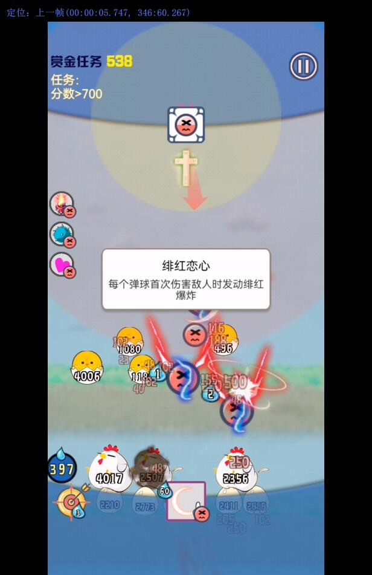
黑雾散开，伤害判定下来！扣了627血

在暂停时间内怪依然受到了伤害！！！
伤害判定提前！！！
本应该0.5s后扣除百分比生命的死神残影提前进行了判定！！！
_
一般来说这比如一个怪20000血被标记的死神残影，应该扣他5000血，但由于死神残影延迟0.5s，这0.5s如果这个怪被打掉了10000血，最后死神残影爆发时只会按这个时间的血量进行百分比扣除，变成了只扣 2500血。而如果使用暂停大法则能使死神残影提前判定，从而提高dps！！！
_
不过操作会很累就是，而且提升不高，只能说毫无卵用

### 暂停导致的伤害判定丢失

缺点也有，可能会出现伤害判定丢失
比如暂停时间内红球向下发的火炮在经过怪群时怪不扣血，随后火焰提前消失，等重新开始时这火焰他就没了，本应造成的伤害也没了......长枪似乎也有这个问题，暂停的时候长枪还在戳，戳到长枪消失了都没把怪打扣血

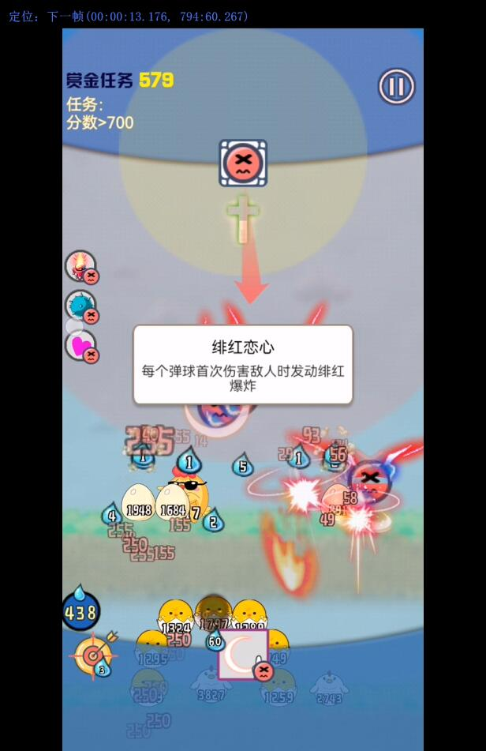


### 结论

总结：
1. 动画和伤害判定关联，但暂停却不影响动画播放，导致伤害判定会出bug，进行提前判定或判定丢失
2. 如果在动画过程中，动画效果会打怪（有碰撞箱判定）。那么暂停后，动画效果打到怪怪不会扣血，伤害判定丢失
3. 如果在动画过程中，动画效果不通过碰撞箱等方式打怪，而是直接对伤害进行结算。那么暂停后，动画效果依然会造成伤害判定，不受影响

# 弹运会

## 亦步亦趋+龟仔

### 技巧

这次比较吃技巧
—
1. 主要诀窍是只养一个球，月牙就往一个球上叠，结算面板中我月牙伤害占比78％，多个球没用，反而是只养一个球的化可以减少出球速度和怪的前进速度，让怪吃更多的伤害
2. 有节奏放球，那个嘀哒4声到8声放一个球，节奏自己把控。月牙必须在放球之前才用，保证每次叠加到你要养的那个球
3. 少用靶标多用重力控球，节省能量，用更多次月牙。后面基本上是完全不需要靶标的
4. 前期可以把球养在左下角，只用守护霹雳和长枪打


这次弹运会以后，我就毕业不玩了（虽然白手起家还没打过）

### 4600分

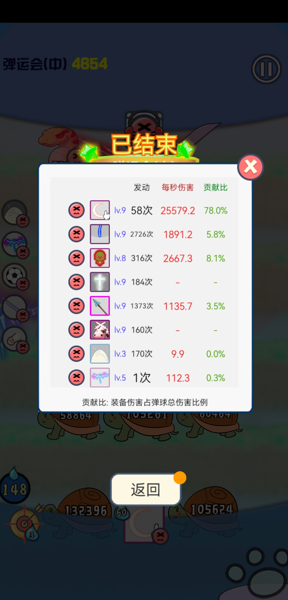

### 7400分


### 1w5k分


