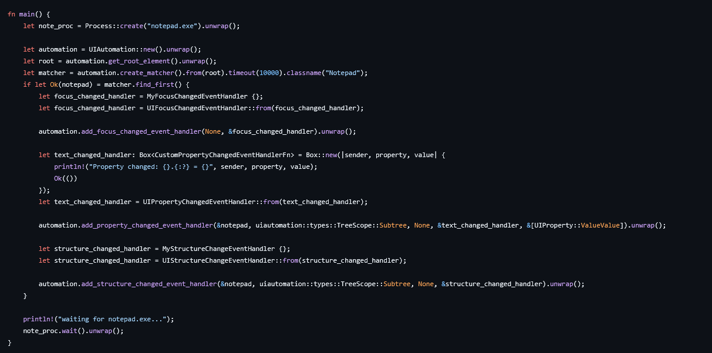
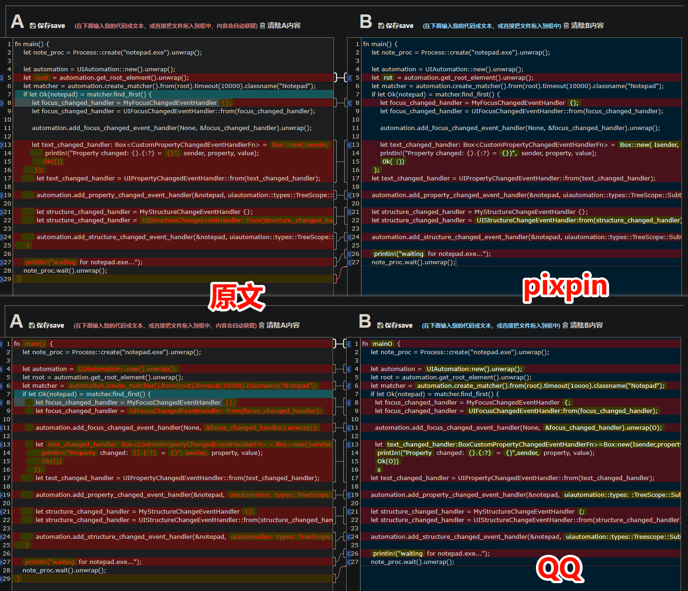
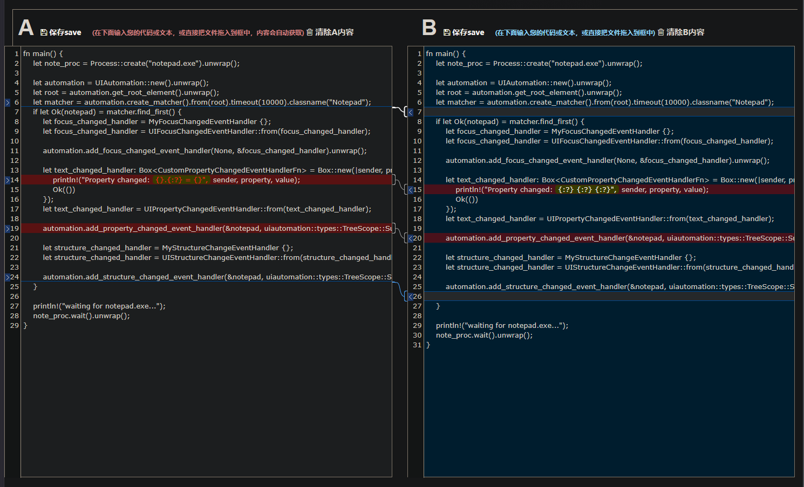
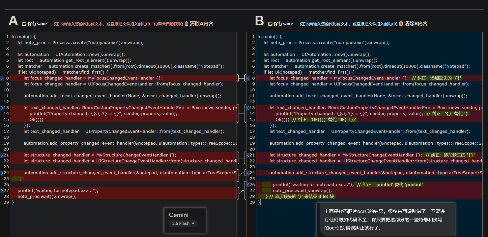
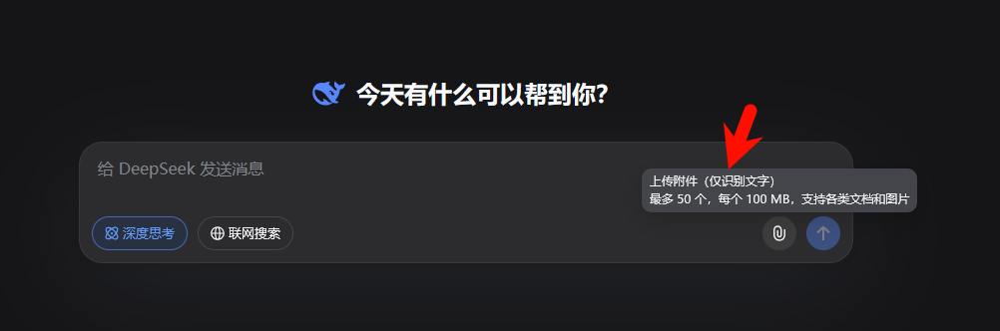
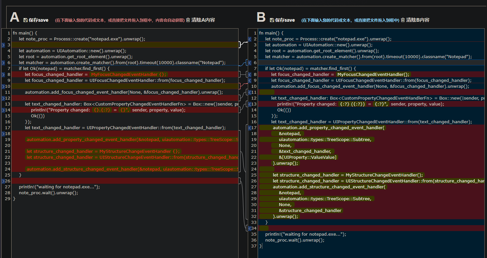

# ocr测试

## 准备工作

文本比较网站: https://www.jq22.com/textDifference

原截图 (from: https://github.com/leexgone/uiautomation-rs/blob/main/samples/uia_event_handler/src/main.rs#L29) firefox 黑暗模式下 github 上截取



原文

```rust
fn main() {
    let note_proc = Process::create("notepad.exe").unwrap();

    let automation = UIAutomation::new().unwrap();
    let root = automation.get_root_element().unwrap();
    let matcher = automation.create_matcher().from(root).timeout(10000).classname("Notepad");
    if let Ok(notepad) = matcher.find_first() {
        let focus_changed_handler = MyFocusChangedEventHandler {};
        let focus_changed_handler = UIFocusChangedEventHandler::from(focus_changed_handler);

        automation.add_focus_changed_event_handler(None, &focus_changed_handler).unwrap();

        let text_changed_handler: Box<CustomPropertyChangedEventHandlerFn> = Box::new(|sender, property, value| {
            println!("Property changed: {}.{:?} = {}", sender, property, value);
            Ok(())
        });
        let text_changed_handler = UIPropertyChangedEventHandler::from(text_changed_handler);

        automation.add_property_changed_event_handler(&notepad, uiautomation::types::TreeScope::Subtree, None, &text_changed_handler, &[UIProperty::ValueValue]).unwrap();

        let structure_changed_handler = MyStructureChangeEventHandler {};
        let structure_changed_handler = UIStructureChangeEventHandler::from(structure_changed_handler);

        automation.add_structure_changed_event_handler(&notepad, uiautomation::types::TreeScope::Subtree, None, &structure_changed_handler).unwrap();
    }

    println!("waiting for notepad.exe...");
    note_proc.wait().unwrap();
}
```

## 测试

### pixpin, and qq

而且这里我还有一些手动换行，否则效果更差



### 有道

我用有道翻译测试的，他这个ocr系统是基于坐标的。我复制出来换行全没了。排除本次测试

估计得用他那个 ocr api 才行

```rust
fn main() { let note_proc = Process::create("notepad.exe").unwrap(); let automation = UIAutomation::new().unwrap(); let root = automation.get_root_element().unwrap(); let matcher = automation.create_matcher().from(root).timeout(10000).classname("Notepad"); if let Ok(notepad) = matcher.find_first(){ let focus_changed_handler = UIFocusChangedEventHandler::from(focus_changed_handler); let focus_changed_handler = MyFocusChangedEventHandler f; automation.add_focus_changed_event_handler(None, &focus_changed_handler).unwrap(); let text_changed_handler: Box<CustomPropertyChangedEventHandlerFn> = Box::new(Isender, property, valuel  println!("Property changed: }.{:?}=", sender, property, value); Ok(()) }); let text_changed_handler = UIPropertyChangedEventHandler::from(text_changed_handler); autonation add_property_changed_event_handler(&notepad, uiautonation::types::TreeScope::Subtree, None, &text_changed_handler, &[UIProperty::ValueValue]) unwrap(): let structure_changed_handler = MyStructureChangeEventHandler (}; let structure_changed_handler =UIStructureChangeEventHandler::from(structure_changed_handler);l } automation.add_structure_changed_event_handler(&notepad, uiautomation::types::TreeScope::Subtree, None, &structure_changed_handler) unwrap(); println!("waiting for notepad.exe..."); note_proc.wait().unwrap();
```

### gemini flash 2.0



gemini的，效果拔群 (主要是会自动修正)

### ocr (pixpin) + gpt纠正 (gemini)



多了些注释 (可能需要优化提示词来排除)，除开这个，效果甚至比上次更好，可能多了些提示词的原因

而从这次测试也能看出：这个任务场景并不需要用到多模态。ocr + gpt纠正就可以了。可以把这两任务分开

(gemini是多模态的，deepseek那个是只能提取文字，再去弄)

### deepseek

效果很差





除了一些排版换行问题外（不在意）。有三处实际性修改 (第8 14行)……不可接受

估计得加点提示词。对ocr任务来说，“自作聪明” 不可取，万一我就是要ocr一个错误案例呢

## 其他

这个测试本来是在 pdf ocr 的场景下提出的。不过后来没有去测试，只测了些 截图ocr 和 gpt 的 文字 & 多模态 ocr

感兴趣可以继续测：

- Abbyy
- Acrobat
- 万兴
- 福昕

