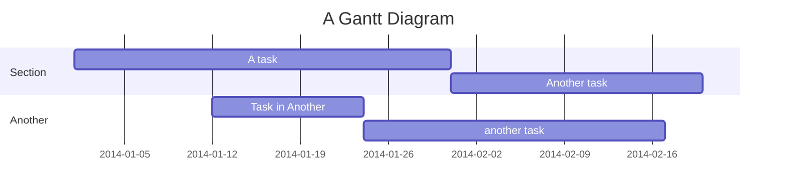
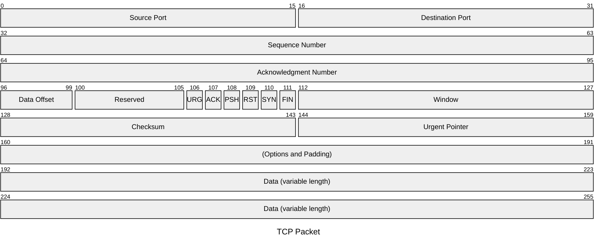

# (idea) Gantt

## 思考内容 (群聊记录)

多条时间线并行（正符/农业/工业/战争/不同国家）……确实挺难画

做成数据库的形式，允许勾选需要哪几条时间线，动态渲染

这方面我认为应该有可以参考的东西，我找找

https://www.allhistory.com/ (主要关注里面的 “全画作” 一项)

不过mermaid的甘特图太窄，我说专业版的专门做甘特图的东西，可能能达到差不多的效果？

有点像多分层的甘特图

一个允许多时间线的甘特图

虽然mermaid的甘特图效果比较糟糕，语法……其实也糟糕，但我想是可以参考的专业的那种甘特图（可以拖拽缩放的）效果才能好

纯md的话，我感觉设计出来还行
每项只需要声明三个内容：
1. 时间段内容（允许md格式、加链接）
2. 时间范围（允许三种格式：首尾/首+持续时间/仅声明开始，即时间点）
3. 作用时间线（允许缺省，为作用于默认时间线。该项主要用于多个时间线的情况）

例如这样：

```
2001-2004, 做A事情, 事业线
2002-2005, 做B事情, 事业线
2003-2008, 丽丽, 感情线
2006-2010, 柳如烟, 感情线（别问为什么同一时间有两条女，问就是左拥右抱
```

# (idea) Gantt v2

(2025-11-13)

## 软件调研

(2025-11-13)

搜索keyword: gantt task calender

(虽然 gantt 不一定表示时间，也可能用来模拟packet，但有些可以参考)

- 其他软件/插件
  - https://github.com/nhn/tui.calendar ⭐12.5k
    多种日历视图x甘特图，视图能力**非常强**
- obsidian 插件调研
  - https://github.com/SsSanzo/obsidian-gantt ⭐22
  - https://github.com/702573N/Obsidian-Tasks-Calendar 885
    这个不行

## 语法调研

### obsidian-gantt

- 分组用空行+行来标注
- 项则是 `label, id, 完成状态 is done, 开始, 持续`

````markdown
```gantt
Option Title My Gantt Chart!
Group This is a Group
Task task 1, t1, , 01/01/2022, 2M
Task task 2, t2, done, after t1, 1M
```

```gantt
Option Title My Gantt Chart!

Group This is a Group
Task task 1, t1, , 01/01/2022, 2M
Task task 2, t2, , after t1, 1M

Group This is another Group
Task task 3, t3, , after t1, 2W
Milestone important milestone, m1, , after t3
```

```gantt
option dependencies On

Group Harry's Tasks
Task My Task,                          t1,           done, 01/01/2022, 2M

Group Karine's Tasks
Task My Other Task #3342,                t2, in-progress,        after t1, 06/30/2022
Task Task With Dependency,  d3,         critical, 2W after t1, 5W, t1
Task Task With Progress      ,  tp1,    pending , 01/01/2022, 3M,      ,0% 
```
````

> Linc评价: 英文日期表示法我并不认可，不如 ISO 8601

### mermaid gantt

- 分组用缩进+section关键字来标注
- 项则是 `内容 :可选二的持续时间, 可选1的开始时间, 必选的持续时间` (这里类似函数参数，但却是反过来的。很反人类)



> Linc评价: 参数太多，而且参数的可选规则反人类

### mermaid packet

默认横向32bit，特点是会自动换行



### DHTMLX Gantt (列表形时间线)

https://docs.dhtmlx.com/gantt/samples/?sample=%2701_initialization/01_basic_init.html%27&filter=%27%27


官网: https://dhtmlx.com/docs/products/dhtmlxGantt/

这是个可付费的

## DHTMLX Gantt

### 收费与版权问题

有免费版，免费版 GPLv2

收费版支持的是: ...

### 其他需求

- 多个时间项是否能显示在同一行中？而不是一定会是在多行里。
  对于制作活动日历的场景，我们可能更希望尽量在同一行中，活动日历图的展示会更加清爽和美观
  - 是的，DHTMLX/gantt 库支持将多个项（子任务）显示在同一行中。这通常通过“拆分任务（Split Tasks）”功能来实现
  - 例子见: https://docs.dhtmlx.com/gantt/samples/?sample=%2702_extensions/23_click_drag_splittask.html%27&filter=%27split%27

### 缺点

- 此处不谈协议与收费版问题
- 是否支持自定义横轴 (自定义时间/非时间)
  - 对于底层数据，不支持。但显示出来的标签可以自由修改

## 语法设计

### 列表状态约定

仅约定，非限制语法，不太想弄过多的语法限制。像我之前开发的 anyblock，其 timeline 时间描述就是自由描述的，不需要约定格式。其他处理的语法，也最多多了个 `| ` 分割符

很多语法设计都需要约定过多的东西。首先我们应该需要判断，哪些是必须的，而哪些不是，尽量简化

- 时间
  - 是否可选: **是**。不标注则我们默认接着上一次的项结尾，而第一个则从最初开始
  - 如何表示: 时间格式
- 持续/结束时间
  - 是否可选: **是**。不标注则默认持续 `1/1` 个单位 (对于日期来说是天)
  - 如何表示: 时间格式
- 完成状态
  - 是否可选: **是**。默认是非任务项/TODO项
  - 如何表示: 列表转的话用 task 语法就行了，仅支持 GFM 标准，即 `[ ]` 或 `[x]`；
    不支持像OFM那样的其他符号，如有需要，使用其他状态表示代替
- 时间线类别:
  - 是否可选: **是**。默认存在匿名的默认时间线
  - 如何表示: 使用同时区的表示法，这样就不用额外多一个属性了

特点: 需便于dv查询并渲染

### 通用语法规则

#### 兼容性原则

可以去兼容: (按优先级)

- task 语法
- anyblock 时间线
- 一些自定义 gantt 语法

#### 日期

支持多种格式，可以简单分为两大种:

一是日期格式:

- REG `(\d{4}-\d{2}-\d{2})(?:\/(\d{4}-\d{2}-\d{2})|(\/)|\/(\d+))?` TODO 支持 ISO 8601
  - `2020-01-13` (没截止时间则默认一天)
    **ISO 8601** 规范，即 `YYYY-MM-DD` 格式，更适合国际化，也更计算机友好。mermaid gantt也是这种格式。我们不采用英语/一些区域的 `DD/MM/YYYY` 表示法，不同国家可能存在歧义，如月/日顺序在不同国家可能不同。
  - `2020-01-13/2020-02-13` (用具体日期确定结束时间)
  - `2020-01-13/` (结束时间未知)
  - `2020-01-13/P8D` (用持续时间确定结束时间) (TODO 允许小数点/分数，暂不支持单位)
  - (*废弃* 旧版使用 `+` 表示，但与ISO 8601 的时区表示有冲突。后改用斜杠 `/` 表示)

二是数字:

- REG `\d(/)` ...

三是其他字符串: (任意表示时间，甚至不是时间也可以，如可以模拟协议图、mermaid packet)

- REG `([^/]+)(?:\/([^/]+)|(\/)|\/(\d+))?`
  - flag不含 `/`。当出现未出现过的时间flag，则会往日期的横轴中依次填充。flag不可重复
  - `string1` (没截止时间则默认一天)
  - `string1/string2` (用具体日期确定结束时间)
  - `string1/` (结束时间未知)
  - `string1/2` (用持续时间确定结束时间) 视为在这个横轴中占据多少格 (TODO 允许小数点/分数，暂不支持单位)
    (*废弃* 旧版使用 `+` 表示，但与ISO 8601 的时区表示有冲突。后改用斜杠 `/` 表示)

#### 时间线

注: 存在默认时间线，不额外标注的话就是默认时间线

时间线的标记法我想了很久，最后想到：可以把时间线看作时间的一部分，类似于时区

例如如果存在不同的时区，我们通常也不会去合并。原因：

- 如果需求是合并
  - 例如 东八区 和 Z区，你不知道要合并到谁那里，这样就又要一个额外的字段去说明
  - 如果要合并，那么应该先换算再合并也能满足这种需求 (除非太懒就是想自动计算)，这种还不用额外字段说明要合并到哪一条
- 如果需求是不合并
  - 那么正好

而时间线也可以比较时区，如历史线可以是区分不同国家历史、文化/战争等方面区分不同的时间线

#### 可选的task/todo标记

...

### 扁平写法

```markdown
[gantt]

- 2001-2006        | 默认时间线
- 2001-2004(事业线) | 做A事情
- 2002-2005(事业线) | 做B事情
- 2003-2008(感情线) | 丽丽
- 2006-2010(感情线) | 柳如烟

或

[gantt]

- [ ] 2001-2006 | 默认时间线
- [x] 2001-2004 | 做A事情, 事业线
- [x] 2002-2005 | 做B事情, 事业线
- [ ] 2003-2008 | 丽丽, 感情线
- [ ] 2006-2010 | 柳如烟, 感情线
```

（别问为什么例子里同一时间有两条女，问就是诚哥

### 语法糖 - 按时间分组

```markdown
[gantt]

- 2001-2004
  - 做A事情, 事业线
- 2002-2005
  - 做B事情, 事业线
- 2003-2008
  - 丽丽, 感情线
- 2006-2010
  - 柳如烟, 感情线

或

[gantt]

- 2001-2004
  - [x] 做A事情, 事业线
- 2002-2005
  - [x] 做B事情, 事业线
- 2003-2008
  - [ ] 丽丽, 感情线
- 2006-2010
  - [ ] 柳如烟, 感情线
```

### 语法糖 - 按时间条分组

```markdown
[gantt]

- 事业线/
  - 2001-2004 | 做A事情
  - 2002-2005 | 做B事情
- 感情线/
  - 2003-2008 | 丽丽
  - 2006-2010 | 柳如烟, 感情线

或

[gantt]

- 事业线/
  - [x] 2001-2004 | 做A事情
  - [x] 2002-2005 | 做B事情
- 感情线/
  - [ ] 2003-2008 | 丽丽
  - [ ] 2006-2010 | 柳如烟, 感情线
```

### 渲染

分组是按上下完全切分，还是按自动分配颜色组

先不支持同一个上下组分颜色组吧，有点麻烦

# (idea) Gantt v3

(2025-11-15)

## 语法定义

### ISO 8601 标准

先介绍 `ISO 8601` 标准的时间，可见: https://en.wikipedia.org/wiki/ISO_8601

相较于可能一些软件/插件所使用的英语/一些区域的 `DD/MM/YYYY` 表示法，不同国家可能存在歧义，如月/日顺序在不同国家可能不同。ISO 8601 是更国际化的表示方法，不会存在歧义。像 mermaid gantt 的时间使用的也是 8601 标准

**(1) 时间点表示**

- 格式: `YYYY-MM-DDThh:mm:ss`
- 示例: `2025-11-13T15:32:13`

**(2) 时间段表示**

- 格式: 用 `/` 分割两个时间点，可以用P来表示持续时间
- 示例: `2025-11-13T15:32:13/2025-11-14`、`2025-11-13T15:32:13/P1DT2H`

**(3) 时区表示**

- 表示 UTC 时间: 在时间末尾添加一个大写字母 **`Z`** (代表 Zulu Time，即协调世界时 UTC)。这是在*服务器和日志记录中最推荐的方式*。
  - 示例: `2025-11-13T15:32:13Z`
- 表示带偏移量的本地时间: 在时间末尾使用 `+hh:mm`，`-hh:mm`，或者简写的 `+hhmm` / `-hhmm` 来表示与 UTC 的时差。
  - 示例 (北京时间, UTC+8): `2025-11-13T23:32:13+08:00` (这与 `...15:32:13Z` 是同一瞬间)
  - 示例 (美国东部时间, UTC-5): `2025-11-13T10:32:13-05:00` (这也与 `...15:32:13Z` 是同一瞬间)

### ISO 8601 ++ (gantt time)

后文统称为 `gantt time` 或 `8601time`，表示由该标准书写的时间点或时间段

我设计的 gantt 对于 ISO 8601 的扩展，尽量不多使用新的属性。都是在原语法的基础上进行扩展:

> [!note]
> 提前总结
> 
> 若 ISO 8601 的时间点格式为: `dateT时间+时区`，
> 则 ISO 8601 ++ 的时间点为: `dataT时间+时区 | dataT时间+时间线名 | "" | String+时间线名`
> 
> 对应了三种扩展

**(1) 多时间线表示**

- 本来想用区别于时间之外的新属性来表示，但后来又想；时区何尝不是一种时间线。把时间线作为时间的属性，而非时间外的属性，可以剩下一个属性区域。故时间线使用时区表示法。
  而且我认为 "指定时间线+时间点"，才构成在时间面/多条时间线中，一个时间点的完整描述。归类为时间的一部分非常合适
- 示例：`1999+美国史` `1999+文化史` `1999+异世界` `1999+月球`
- 渲染：表现为上下颜色分区的多条时间线

**(2) 强制时间段、未知开始/结束时间**

- 对于gantt图来说，基本上不会去在时间轴上标注一个点作为时间点，都是以时间线的方式进行展示。
- 对于非时间段，强制渲染为持续一天
- 对于未知/无 开始/结束时间，我们用空来表示。如未知开始/未知结束，则渲染时那一侧是虚的。

**(3) 字符串时间**

- 格式: 使用 `/` 分割的字符串，字符串不满足 ISO 8601++ 标准
  所有不含 `+` 且不相同的字符串都会作为flag，进入数组，该flag数组与其元素用于表示时间线的轴和轴点
- 示例: `1/2/3/4/5/6`
- 场景: 有时我们想自定义横轴的内容，或者只想用gantt的样式而不是去表示时间线 (例如用gantt去模拟网络包packet)

> [!warning]
> 时区混用问题
> 
> - 由于使用时区来表示 "多时间线"，所以如果你要合并，你需要将时间段进行转换为同一时区。且时间段不支持两边为不同时区，以前者为准
> - 不填Z或其他时区，则定义为 "未知时区的的本地时间"。不可与带时区的时间混用

> [!warning]
> 字符串和8601时间混用问题
> 
> 以第一个出现的时间为准
> 
> - 若是字符串，则后续的8601时间会作为字符串被解析
> - 若是时间，则后续不满足8601格式的时间点会认为是语法错误。跳过该行的解析
> 
> 至于 ""，则两者都支持

### AnyBlock Gantt

采用时间节点

- 格式：采用markdown列表语法，列表项的首行写 gantt time，非首行写该时间的内容
- 示例: 
  ```markdown
  - gantt time
    content...
  ```

**状态表示**

- task/todo状态，由于我们沿用了 markdown 列表表示法，所以你可以使用 gfm 的 task 语法
- 示例: `- [ ] 2000-01-01 | do something`
- 渲染：无 task 正常显示，否则在前面显示个 `[ ]` / `[x]`。等同 `- 2000-01-01 | <checkbox icon> do something`

**anyblock 列表语法糖**

- anyblock 列表有个语法糖，使用 `|` + 空格，来表示列表的内换行或子列表 (在timeline/gantt这种二列表格中，这里是前者)
- 示例:
  ```markdown
  - aaa | bbb
  - 2020-11-11 | do something
  
  等同于
  
  - aaa
    bbb
  - 2020-11-11
    do something
  ```

### 总结

同时兼顾简单和复杂

- 简单使用: 列表项填 `YYYY-MM-DD时间 | 内容`，*非常简单!*
- 复杂使用: 支持 时间段 (结束时间、持续时间)、gfm task、时区、时分秒...等可选功能

## demo

- 2014-10-21 | (时间演示) 休息
- 2014-10-21T8:30:00Z/2014-10-21T8:40:00Z | (时间段演示) 吃早饭
- 2014-10-22T8:30:00+8:00 | (时区演示) 从子午线坐飞机到中国并落地了
- 2014-10-23
  (多行内容演示)
  早上上班
  中午上班
  下午上班
- [ ] 2014-10-24 | (gfm task演示) 任务A，放弃了，不做了
- [x] 2014-10-25 | (gfm task演示) 任务B，已完成
- 2014-10-21+t2/2014-10-23+t3 | (时间线演示) 某地台风

## 测试

task2

[task2table]

- [x] 1
  - [ ] 3
  - [x] 3.2
- [ ] 2
  - [ ] 4
  - [x] 4.2

anyblock timeline with indent (with mulline md 和 with indent 是 list2 系列中，是冲突的。timeline 的选择是 mullint md)

[timeline]

- 2020 | dd
  - 2020-01 | aa
  - 2020-02 | cc
- 2021 | dd

anyblock gantt with indent (这里应采用层级 or with mulline md? 是二列列表还是多级列表? 我感觉多级会好一些。后面可以用来做子任务、也可以用来做依赖关系)

(待开发)

# Gantt实现

实现 gantt 的前段库调研

## gantt库

### mermaid gantt

多时间线只能用模拟，不支持自定义非时间轴，不用

### DHTMLX

https://github.com/DHTMLX/gantt 1.7k, JavaScript, last week

付费，也有免费版

### gantt-schedule-timeline-calendar

https://github.com/neuronetio/gantt-schedule-timeline-calendar

带可视化编辑

### [grappe/gantt](https://github.com/frappe/gantt) ⭐5.7k, js, 3 weeks ago

### Frappe Gantt

## 更底层的绘画库

### ECharts

### D3.js

### AntV G2/G6

## 对比、总结

# Gantt 编写指导、一些可选特性

简易的gantt图最基本的功能就是显示多个时间段，此外有很多可选特性。

根据用途不同，并不是每个gantt图都需要这些特性，也不是每个gantt图工具都支持这些特性

## 箭头线段是什么？

(by gemini 2.5 pro)

gantt图的箭头线段是用来表示什么意思的？为什么需要？为什么有些gantt图也不需要这个东西？mermaid gantt好像也没这个东西

### 箭头线段表示什么？（依赖关系）

在项目管理中，很多任务不是孤立的，它们之间存在着先后顺序或逻辑关联。箭头就是这种关联的可视化表达。最常见的依赖关系有四种：

- 完成-开始 (Finish-to-Start, FS)
  - 表示 **任务A必须完成后，任务B才能开始** (最常见的一种)
  - 例子: 必须先“砌好墙”，然后才能“粉刷墙壁”。箭头的方向是从“砌墙”指向“刷墙”。
- 开始-开始 (Start-to-Start, SS)
  - 表示 **任务A开始后，任务B才能开始**。它们可以同时开始，或者B在A之后某个时间点开始。
  - 例子: “编写代码”和“编写代码文档”可以同时开始。
- 完成-完成 (Finish-to-Finish, FF)
  - 表示 **任务A完成后，任务B才能完成**。它们可以同时完成，或者B在A完成之后才完成。
  - 例子: “系统测试”必须在“开发所有功能”都完成后才能宣告完成。
- 开始-完成 (Start-to-Finish, SF)
  - 表示 **任务A开始后，任务B才能完成** (最不常用的一种)
  - 例子: 新旧系统交接班。新系统“上线运行”（任务A）开始后，旧系统的“维护支持”（任务B）才能结束。

### 为什么有些甘特图没有箭头？

主要有以下几个原因：

- **高阶报告或简单展示** 
  有时甘特图只是用作一个高阶的时间轴（Timeline），向不关心执行细节的管理者或客户展示“什么时间段在做什么事”，而不是“这些事之间的逻辑关系是怎样的”。在这种情况下，为了图表简洁，会省略箭头。
- **任务确实没有依赖关系** 
  对于一些非常简单的项目，可能就是一张任务清单，各个任务之间没有严格的先后顺序，可以并行处理。比如一个市场活动，“设计海报”、“联系场地”、“准备讲稿”这几件事可以同时进行，互相不影响。
- **工具限制或使用者不了解** 
  一些简单的图表工具（比如用Excel画的简易甘特图）可能不支持或很难画出依赖关系。或者，制作图表的人本身不了解或不重视任务依赖关系的重要性。

## 标记线是什么？

有的gantt图，会在一个时间段中有个游标/颜色间隔，去区分这个时间段的左右两边。那个是什么特性？

好像说是 **任务进度**

在 `DHTMLX/gantt` 中，这是通过任务对象上的 `progress` 属性来实现的

## 今日线

略

## 高亮区域

略

# ISO 8601 库

先介绍 `ISO 8601` 标准的时间，可见: https://en.wikipedia.org/wiki/ISO_8601

具体场景案例:

- mermaid gantt 的时间使用的也是 8601 标准
- Markdown Yaml 区很多软件所识别其中的日期格式也是 ISO 8601
- 计算机中，日志等场景常用的日期表示方法
- 国家化一些的表示方法
  - 相较于可能一些软件/插件所使用的英语/一些区域的 `DD/MM/YYYY` 表示法，不同国家可能存在歧义，如月/日顺序在不同国家可能不同。ISO 8601 是更国际化的表示方法，不会存在歧义

然后一些其他的优点前文也写了，此处不再赘述

## 原生 Date 对象的不足

在 JavaScript/Node.js 生态中，处理日期和时间，特别是 ISO 8601 格式的字符串，有几个非常出色且流行的库。

首先，所有主流的现代日期库都能很好地处理 ISO 8601 标准，因为它已经是事实上的数据交换标准。`new Date('2025-11-22T11:49:06Z')` 这种原生方式就可以解析，但原生 `Date` 对象的 API 在处理时区、日期计算和格式化方面非常不便，因此我们通常会选择一个库。

## npm 库调研

(2025-11-22)

综合来看，我会从以下几个维度来比较 `Day.js`, `date-fns` 和 `Luxon` 这三个目前最主流的库。`Moment.js` 曾是王者，但现在已进入维护状态，不推荐在新项目中使用。

| 特性               | Day.js                                                             | date-fns                                                                     | Luxon                                                          |
| ---------------- | ------------------------------------------------------------------ | ---------------------------------------------------------------------------- | -------------------------------------------------------------- |
| 大小 (Gzipped)     | **~2KB** (极小)                                                      | **~1-20KB** (按需引入)                                                           | ~7.6KB (中等)                                                    |
| API 风格           | 链式调用 (类似 Moment.js)                                                | 函数式 (纯函数)                                                                    | 链式调用 (面向对象)                                                    |
| 可变性 (Mutability) | 不可变 (Immutable)                                                    | 不可变 (Immutable)                                                              | 不可变 (Immutable)                                                |
| Tree-Shaking     | 核心库 + 插件                                                           | **极佳** (核心优势)                                                                | 支持                                                             |
| 时区支持             | 通过插件                                                               | 通过插件 (date-fns-tz)                                                           | **原生内置** (核心优势)                                                |
| 依赖               | 零依赖                                                                | 零依赖                                                                          | 零依赖                                                            |
| 学习曲线             | 平缓 (熟悉 Moment.js 更易上手)                                             | 平缓 (但需适应函数式风格)                                                               | 稍陡 (概念更严谨)                                                     |
| link             | [fumeapp/dayjs](https://github.com/fumeapp/dayjs) ⭐124, a year ago | [date-fns/date-fns](https://github.com/date-fns/date-fns) ⭐36.3k, a year ago | [moment/luxon](https://github.com/moment/luxon) ⭐16.2k, last month |

其中，我目前需求需要处理 ISO 8601 Duration 持续时间。*只有第三个支持*，所以我选用了第三个

### Day.js

`Day.js` 是一个极简的 JavaScript 日期库，它拥有与 `Moment.js` 高度相似的 API，但体积只有其一小部分。如果你熟悉 `Moment.js`，迁移成本几乎为零。

优点:

- **极致轻量**: gzip 后仅 2KB 左右，对前端项目打包体积非常友好。
- **API 友好**: 链式调用非常直观，写起来很流畅。
- **插件化**: 核心库非常小，功能通过插件按需扩展，例如 `utc`, `timezone`, `relativeTime` 等。

缺点:

- 相比 `date-fns`，Tree-shaking 效果稍逊一筹（因为链式 API 的特性）。
- 需要额外插件来支持时区等高级功能。

示例:

```JavaScript
import dayjs from 'dayjs';
// 默认就能解析 ISO 8601
const isoString = '2025-11-22T11:49:06.123Z';
const date = dayjs(isoString);

// 操作
const nextMonth = date.add(1, 'month');

// 格式化
const formatted = nextMonth.format('YYYY-MM-DD HH:mm:ss');
console.log(formatted); // "2025-12-22 11:49:06"
```

### 总结与最终建议

- 追求极致性能和简洁 API -> **`Day.js`**。它是目前综合来看的“性价比”之选，尤其适合中小型项目。
- 现代前端框架，追求代码模块化和可维护性 -> **`date-fns`**。它是技术上的最优解之一，特别是在 Webpack/Vite 等构建工具加持下。
- 重度依赖时区和国际化功能 -> **`Luxon`**。当你的应用需要精确处理全球不同用户的本地时间时，它是最可靠的选择。


