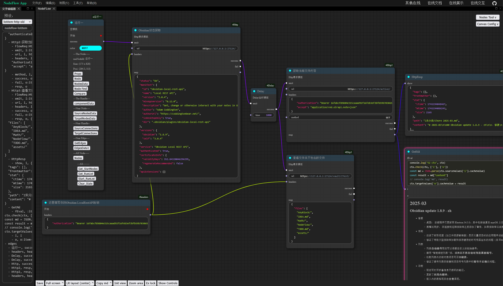

# Run NodeFlow

NodeFlow 功能上可以分为两大作用：

- 节点式笔记
    - 用于记录节点式笔记，或者记录 comfyui/blender/ue4 等其他节点流软件的节点状况
    - 该功能完全依赖于视觉，节点没有运行功能
- 功能工作流
    - 一些节点项，会为节点提供一些额外的功能。这些功能节点可以被运行起来
    - 开发设计上让该功能尽可能通用。目前着重于文本笔记、网络请求流程、AI文本等工作流场景的建设

在这该文件夹内，重点介绍 NodeFlow 作为功能工作流的应用

